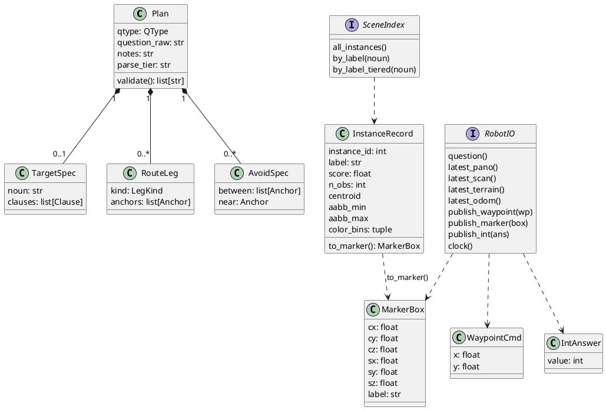

# 1. Context and Contracts

What the challenge scores, the six-topic wire contract, and the frozen Python
types the whole `core/` package is written against.

## ELI10

The challenge is an open-book exam with three question types and a
10-minute clock per question. Our robot only gets to see and say things
through nine fixed "mailboxes" (ROS topics) — it cannot cheat by reading a
hidden map. Inside our own code we do not talk about those mailboxes
directly: everything is translated into a small set of plain Python shapes
(`Question`, `Plan`, `MarkerBox`, ...) up front, so the logic that decides
answers never has to know ROS exists.

## What gets scored

Per [docs/challenge_brief.md](../docs/challenge_brief.md), each question is
one of three types, each with its own answer channel and point value:

| Type | Answer topic | Message | Points |
|---|---|---|---|
| Numerical | `/numerical_response` | `Int32` | 0–1 |
| Object reference | `/selected_object_marker` | `Marker` (bbox) | 0–2 |
| Instruction following | `/way_point_with_heading` | `Pose2D` waypoints | 0–6 |

Instruction-following is worth 6x a numerical question, so it dominates
expected score per question — `docs/challenge_brief.md` says so directly
("prioritise it").

Per-scene distribution, per `docs/upstream_notes.md` §6 (`questions.json`
schema, corroborated by `docs/io_contract_crosscheck.md`): 1 numerical + 2
object reference + 2 instruction-following = 5 questions/scene, so a
scene's max is `(1*1)+(2*2)+(2*6) = 17` points, times 3 held-out test
scenes = 51. The exact test-scene mix is unverified — the brief only says
test questions are "similar to those provided".

Timing: the whole system is **relaunched per question** — no map or state
carries over between questions (`docs/challenge_brief.md` "The Task";
`docs/upstream_notes.md` gotcha 1). Each launch gets 10 minutes (600 s) of
combined exploration + answering; overtime is penalised, early finish is a
tiebreak bonus. This 600 s ceiling is encoded in code as
`QUESTION_BUDGET_S = 600.0`
([core/interfaces.py](../src/core/interfaces.py) line 257) — see
[02-core-loop.md](02-core-loop.md) and
[03-time-budgeting.md](03-time-budgeting.md) for how the FSM actually
spends it (the FSM's own internal answer gates are pulled in tighter than
this neutral constant — see 03 for why).

## The six-topic I/O contract

`docs/upstream_notes.md` §3 is this repo's distilled, source-verified
account of the "six allowed system-output topics" plus the three answer
topics we may publish. Exact strings/types/rates, restated here because
`core/interfaces.py`'s docstring calls this out as the thing it mirrors
"without importing ROS":

| Topic | Type | Rate | Frame |
|---|---|---|---|
| `/challenge_question` | `std_msgs/String` | 1 Hz (republished) | – |
| `/camera/image` | `sensor_msgs/Image` | 10 Hz | `camera`, 1920x640 |
| `/registered_scan` | `sensor_msgs/PointCloud2` | 5 Hz | `map` |
| `/terrain_map` | `sensor_msgs/PointCloud2` | 5 Hz | `map`, 5 m local |
| `/terrain_map_ext` | `sensor_msgs/PointCloud2` | 5 Hz | `map`, 20 m local |
| `/state_estimation` | `nav_msgs/Odometry` | 100–200 Hz | `map` -> `sensor` |

A seventh sensor topic, `/sensor_scan` (raw lidar, `sensor_at_scan` frame),
is legal per the challenge README (`docs/upstream_notes.md` §3) but **has
no `RobotIO` getter** — `interfaces.py`'s `RobotIO` protocol (line 230)
exposes `latest_pano`, `latest_scan`, `latest_terrain(extended)`,
`latest_odom`, and `question`, and nothing else reads sensor input. It is
available but unwired.

Our three answer topics (AI -> system), same source:

| Topic | Type | Notes |
|---|---|---|
| `/numerical_response` | `std_msgs/Int32` | not used to drive the robot, eval-only read |
| `/selected_object_marker` | `visualization_msgs/Marker` | CUBE, `map` frame; center doubles as a nav goal |
| `/way_point_with_heading` | `geometry_msgs/Pose2D` | streamed one at a time; `theta` always 0 |

Manual waypoints/teleop are prohibited and LLM/VLM/online API calls are
explicitly allowed by the rules (`docs/challenge_brief.md` "Allowed I/O at
test time"). `docs/upstream_notes.md` §5b is blunt about the consequence:
the challenge's own base launch does **not** start the TARE/FAR global
planners, so our module must supply its own exploration/waypoint logic —
see [07-navigation-and-exploration.md](07-navigation-and-exploration.md).

## The frozen core contract

[core/interfaces.py](../src/core/interfaces.py) is the one file
`src/README.md` marks "frozen v1" and says to "change only via
architecture review" ([src/README.md](../src/README.md) line 11). Every
other `core/` module codes against these types, never against ROS
messages directly. Sensor/output dataclasses (`@dataclass(frozen=True)`
unless noted; metres/radians/seconds unless noted):

- `OdomState(t, x, y, z, yaw)` — from `/state_estimation`
  ([interfaces.py](../src/core/interfaces.py) line 18).
- `PanoFrame(t, image, odom)` — `image` is `(640, 1920, 3)` uint8 RGB;
  `odom` is the nearest odometry sample to `t` (line 29).
- `LidarScan(t, points)` — `points` is `(N, 3)` float32, map frame, from
  `/registered_scan` (line 42).
- `TerrainPatch(t, points, extended, FREE_MAX=0.15)` — `points` is
  `(N, 4)` float32 `[x, y, z, intensity]`; `intensity` is obstacle height
  above local ground in metres; `intensity < FREE_MAX` (0.15 m) is
  traversable; `extended=True` marks a `/terrain_map_ext` sample (line 50).
- `Question(text, t_received)` — the latched first receipt of
  `/challenge_question` (line 66).
- `WaypointCmd(x, y)` — published to `/way_point_with_heading`. Note there
  is **no `theta` field** — the constraint that heading is ignored this
  year is encoded by omitting it from the type entirely, not by a runtime
  check (line 77).
- `MarkerBox(cx, cy, cz, sx, sy, sz, label="")` — axis-aligned box for
  `/selected_object_marker`; scored by GT overlap, center also used as a
  nav goal (line 87).
- `IntAnswer(value)` — published to `/numerical_response` (line 104).
- `ColorBin(name, rgb, fraction)` — one dominant-colour bin of an
  instance (VLA-3D 15-scheme quantisation), with a validating
  `__post_init__` and a `.luma` property (Rec. 601 luminance); added for
  issues #11/#12 so colour matching can apply cutoffs the scheme name
  alone cannot express — a near-black object that quantises to `gray` is
  only separable from lighter grays by luminance, and a minor off-hue bin
  is only separable from a dominant one by `fraction`
  ([interfaces.py](../src/core/interfaces.py) line 114). Not present in
  the archived 11 Jul snapshot of this contract.
- `InstanceRecord(instance_id, label, score, n_obs, centroid, aabb_min,
  aabb_max, points, caption, aliases, color_bins)` — one tracked object in
  the fused instance map; `n_obs >= 3` is called out in the docstring as
  the threshold for confident answers (line 160). `color_bins` (issues
  #11/#12, line 170) is optional/defaulted so mocks and any perception
  path that skips colour quantisation are unaffected. Has `.extents` and
  `.to_marker()` (builds a `MarkerBox` from the trimmed AABB, line 176).
- `MatchTier(IntEnum)` — `EXACT=0 < SYNONYM=1 < HEAD_NOUN=2 < TYPO=3`,
  ordered best-first label-match provenance (line 182). Lives in
  `interfaces.py` rather than in the perception module that produces it so
  the `SceneIndex` Protocol can name it without a core -> perception
  import cycle.
- `SceneIndex` (`Protocol`, `@runtime_checkable`): `all_instances()`,
  `by_label(noun)` — typo/plural/synonym-tolerant lookup, e.g.
  `"refridgerator"` resolving to fridge instances (line 202) — and
  `by_label_tiered(noun) -> Sequence[tuple[InstanceRecord, MatchTier]]`
  (line 206), which pairs each hit with its `MatchTier`. The docstring
  explains why this is on the Protocol and not left to the concrete
  `BasicSceneIndex` (issue #24): anchor resolution
  (`geometry.toolbox._match_anchor_noun`) needs tier provenance to keep a
  modified anchor's exact/synonym referent from being satisfied by a
  differently-modified head-noun cousin (issue #13); promoting it into the
  Protocol makes its absence a structural/type error for any future
  conforming index instead of a silent regression.

`RobotIO` (`Protocol`, `@runtime_checkable`,
[interfaces.py](../src/core/interfaces.py) line 230) is "the single seam
between core logic and the outside world" — its own docstring's words.
Getters never block and return `None` before first receipt:

```
question() -> Question | None
latest_pano() -> PanoFrame | None
latest_scan() -> LidarScan | None
latest_terrain(extended: bool = False) -> TerrainPatch | None
latest_odom() -> OdomState | None
publish_waypoint(wp: WaypointCmd) -> None
publish_marker(box: MarkerBox) -> None
publish_int(ans: IntAnswer) -> None
clock() -> Clock
```

`Clock` is a one-method `Protocol` (`now() -> float`,
[interfaces.py](../src/core/interfaces.py) line 225); nothing in `core/`
reads wall-clock time directly — every deadline is computed off an
injected `Clock`, which is what makes `core/fsm` deterministic under a
`FakeClock` in tests (see [03-time-budgeting.md](03-time-budgeting.md)).

Budget constants live in the same file: `QUESTION_BUDGET_S = 600.0`
(line 257), `FORCED_ASSEMBLY_S = 510.0` and `WATCHDOG_FLOOR_S = 570.0`
(lines 258–259, the neutral interface-level gates), and a per-`QType`
`EXPLORE_BUDGET_S` dict (line 269: `NUMERICAL: 210.0,
OBJECT_REFERENCE: 240.0, INSTRUCTION_FOLLOWING: 270.0`). The FSM's actual
runtime defaults for the two answer gates are pulled in tighter than the
510/570 shown here — see [03-time-budgeting.md](03-time-budgeting.md).

## The typed plan DSL

[core/plan_schema.py](../src/core/plan_schema.py) is the output contract
of the checkpoint-1 parse: a question string in, a `Plan` out. The module
docstring cites the design constraints it was built against
(`docs/question_analysis.md`, verified 10 Jul 2026): all training
relations are allocentric object-to-object (dominant predicates `on`(48),
`closest_to`(37), `near`(33), `between`(17), `with`(11)); 100% of
instruction-following questions are multi-constraint and ordered;
attributes are rare (10 mentions total) but must round-trip; the parser
must tolerate typos like "refridgerator" (line 1). The schema is
deliberately closed — enum predicates, no free-form geometry — so a novel
phrasing degrades to the nearest predicate plus a `notes` escape hatch
rather than silent free text.

`Plan(qtype, question_raw, target, route, avoid, notes, parse_tier)`
([plan_schema.py](../src/core/plan_schema.py) around line 95). Exactly one of
`target` (`NUMERICAL` / `OBJECT_REFERENCE`) or `route`
(`INSTRUCTION_FOLLOWING`) is populated, enforced by `Plan.validate()`.
`parse_tier` defaults `"api"` and is an audit field recording which rung
of the parse ladder produced this plan (see the parsing chapter,
04-parsing.md).

Supporting types (same file): `Anchor(noun, raw, attributes,
disambiguator)` (line 39) — a referenced object, optionally disambiguated
by a nested `Clause`; `Clause(pred, anchors, negated)` (line 53) — one
spatial constraint; `TargetSpec(noun, raw, attributes, clauses)`
(line 63) — what to count or select; `RouteLeg(kind, anchors)` (line 79)
with `LegKind` in `{GOTO, VIA_NEAR, CORRIDOR_BETWEEN}` (line 72);
`AvoidSpec(between, near)` (line 87) — a whole-traversal penalty region.
`Pred` (line 25) has ten members: `ON, IN, NEAR, NEXT_TO, BETWEEN, ABOVE,
UNDER, CLOSEST_TO, FARTHEST_FROM, WITH`.

`Plan.validate() -> list[str]`
([plan_schema.py](../src/core/plan_schema.py) line 108) never raises; it
returns structural problems as strings, empty list meaning valid, and
checks form only (semantic checking is a later checkpoint's job). Checks,
confirmed by reading the validation body: a `NUMERICAL`/`OBJECT_REFERENCE`
plan with no `target` fails with `"... requires target"`; one carrying a
`route` fails with `"... must not carry a route"`; an
`INSTRUCTION_FOLLOWING` plan must have >=1 route leg, must not carry a
`target`, and its last leg must be `GOTO`; each `CORRIDOR_BETWEEN` leg or
`BETWEEN` clause must carry exactly 2 anchors; each `AvoidSpec` must set
exactly one of `between`/`near`.

`to_json()` / `from_json()` (lines 144–149) round-trip through
`dataclasses.asdict` with an `_enum_value` hook that serialises an `Enum`
to its `.value` and raises `TypeError` on anything else (line 152).
`PlanSchemaError` (line 158) is a distinct `ValueError` subclass raised by
`_enum_from` (line 170) when an enum field's JSON value doesn't match any
member; the message names the offending field, the bad value, and the
full valid-value set derived programmatically from the enum (never a
hand-maintained list that can drift) — issue #45's fix, because the parse
ladder's repair round feeds this message verbatim back to the model, and a
small model can act on `"field 'pred': invalid value 'furthest_from'
(valid: on, in, near, ...)"` far better than a bare
`"'furthest_from' is not a valid Pred"` repr. A small explicit alias table,
`_PRED_ALIASES` (line 190: `"furthest_from" -> Pred.FARTHEST_FROM`,
`"nearest_to" -> Pred.CLOSEST_TO`), is applied before the enum lookup so
the plain-English synonyms small/local models commonly emit for the two
superlative predicates are accepted without round-tripping through the
repair path at all.

## Coordinate rules

Stated once, at the top of `interfaces.py`: "All spatial quantities are in
the `map` frame, metres/radians/seconds, unless noted." `src/README.md`
repeats it as a repo-wide convention (line 25) and adds the
waypoint-heading rule explicitly: "`Pose2D.theta` is always published 0."

That rule is enforced twice, at different layers:

- **Type level:** `WaypointCmd` simply has no `theta` field (`x, y`
  only) — there is nothing to set wrong.
- **Wire level:** the ROS adapter is responsible for setting
  `msg.theta = 0.0` on the outgoing `geometry_msgs/Pose2D` — see the
  runtimes/deployment chapter (09) for the adapter's own accounting of
  this.

Other coordinate notes worth carrying forward: `PanoFrame`'s docstring
states "column 0 is at vehicle yaw + pi (wrap); azimuth decreases
left-to-right such that image centre column looks along the vehicle
heading" but flags itself with "Verify against sim in Phase 2" —
unverified, provisional, carried here as-is rather than asserted as fact
([interfaces.py](../src/core/interfaces.py) lines 32–33).
`TerrainPatch.FREE_MAX = 0.15` m is a class-level default described as
"tunable, see nav config" (line 62) — check
[07-navigation-and-exploration.md](07-navigation-and-exploration.md)
before assuming 0.15 m is what actually runs.

## The core/adapter split

Per [src/README.md](../src/README.md): "Pure-Python core (`core/`),
OS-independent, developed and tested on Windows against mocks/replays; the
ROS 2 adapter (`ros_adapter/`) is written later and only ever *executed*
on Ubuntu." The README's ownership table (line 9 onward) assigns one
module per concern — `core/interfaces.py` (frozen v1), `core/plan_schema.py`,
`core/parsing/`, `core/geometry/`, `core/nav/`, `core/fsm/`,
`core/perception/`, `core/mocks/`, `tests/`, `ros_adapter/` — with the
explicit rule "one module = one owner; do not edit outside your module."
Conventions repeated there (line 22 onward): Python 3.12, numpy only in
the hot path, no ROS imports anywhere under `core/`; every public function
carries type hints plus a one-line docstring stating units/frames;
determinism means no wall-clock or RNG in `core/` logic except via
injected `Clock`/seeded generators; tests run offline, no network, no GPU.

The test suite is itself split into a fast default tier (`pytest`, `~40 s`,
skips anything marked `@pytest.mark.slow`) and a full gate
(`pytest -m ""`, `~6 min` serial or `~2.5 min` with `pytest-xdist`'s
`-n auto`) run before a milestone commit
([src/README.md](../src/README.md) "Test tiers" section). The slow tier is
where simulated FSM ticking and multi-scene batteries dominate runtime;
several integration cases compress the FSM's time-budget gates through a
scaled clock (`tests/integration/_scaled.py`) so structural assertions
stay meaningful while the tick count collapses roughly 20x.

## Two independent `RobotIO` implementations exist today

`core/mocks/mock_io.py`'s `MockRobotIO` (backed by a seeded synthetic
scene and a manually-advanced fake clock, used by the offline test harness
and `core/runner/__main__.py`), and the Phase-2 `ros_adapter/adapter_node.py`
(the ROS-backed implementation, executed only on Ubuntu). See
[09-runtimes-and-deployment.md](09-runtimes-and-deployment.md) for what is
actually exercised end to end as of 19 Jul 2026 versus still a draft.

## Core data model


