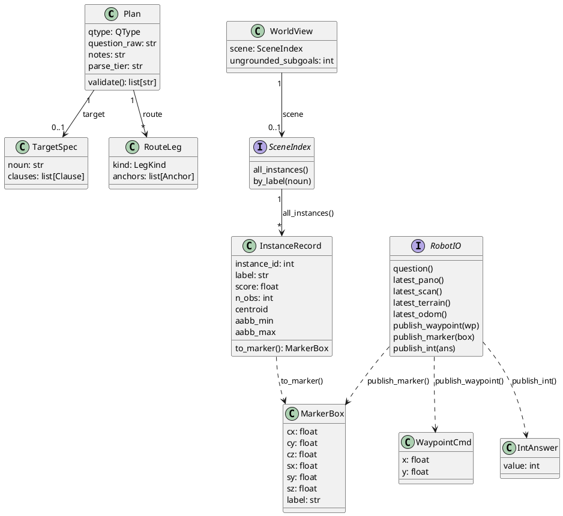

# 1. Context and Contracts

What the challenge scores, the six-topic wire contract, and
the frozen Python types the whole `core/` package is written
against.

## ELI10

The challenge is an open-book exam with three question types
and a 10-minute clock per question. Our robot only gets to
see and say things through nine fixed "mailboxes" (ROS
topics) - it cannot cheat by reading a hidden map. Inside our
own code we do not talk about those mailboxes directly:
everything is translated into a small set of plain Python
shapes (`Question`, `Plan`, `MarkerBox`, ...) up front, so the
logic that decides answers never has to know ROS exists.

## What gets scored

Per `docs/challenge_brief.md`, each question is one of three
types, each with its own answer channel and point value:

| Type | Answer topic | Message | Points |
|---|---|---|---|
| Numerical | `/numerical_response` | `Int32` | 0-1 |
| Object reference | `/selected_object_marker` | `Marker` (bbox) | 0-2 |
| Instruction following | `/way_point_with_heading` | `Pose2D` waypoints | 0-6 |

Instruction-following is worth 6x a numerical question, so it
dominates expected score per question.

Per-scene distribution, verified against `questions.json` by
`docs/io_contract_crosscheck.md`: 1 numerical + 2 object
reference + 2 instruction-following = 5 questions/scene, so a
scene's max is `(1*1)+(2*2)+(2*6) = 17` points, times 3 held-out
test scenes = 51. The exact test-scene mix is unverified - the
brief only says test questions are "similar to those provided".

Timing: the whole system is **relaunched per question** - no
map or state carries over between questions
(`docs/challenge_brief.md:16`). Each launch gets 10 minutes
(600 s) of combined exploration + answering; overtime is
penalised, early finish is a tiebreak bonus. This 600 s ceiling
is encoded in code as `QUESTION_BUDGET_S = 600.0`
([interfaces.py](../src/core/interfaces.py) around line 184) -
see [03-time-budgeting.md](03-time-budgeting.md) for how the
FSM spends it.

## The six-topic I/O contract

`ros_adapter/adapter_node.py` calls itself the node that
"subscribes the six allowed system-output topics" - that is
this repo's name for the six legal *input* topics. Exact
strings, types, and rate, per `docs/upstream_notes.md` §3 and
the adapter's own header comment:

| Topic | Type | Rate | Frame |
|---|---|---|---|
| `/challenge_question` | `std_msgs/String` | 1 Hz (republished) | - |
| `/camera/image` | `sensor_msgs/Image` | 10 Hz | `camera`, 1920x640 |
| `/registered_scan` | `sensor_msgs/PointCloud2` | 5 Hz | `map` |
| `/terrain_map` | `sensor_msgs/PointCloud2` | 5 Hz | `map`, 5 m local |
| `/terrain_map_ext` | `sensor_msgs/PointCloud2` | 5 Hz | `map`, 20 m local |
| `/state_estimation` | `nav_msgs/Odometry` | 100-200 Hz | `map` -> `sensor` |

A seventh sensor topic, `/sensor_scan` (raw lidar,
`sensor_at_scan` frame), is legal per the challenge README but
**has no `RobotIO` getter** - `interfaces.py`'s `RobotIO`
protocol exposes `latest_pano`, `latest_scan`,
`latest_terrain(extended)`, `latest_odom`, and `question`, and
nothing else reads sensor input. It is available but unwired.

Our three answer topics (AI -> system), same sources:

| Topic | Type | Notes |
|---|---|---|
| `/numerical_response` | `std_msgs/Int32` | not used to drive the robot, eval-only read |
| `/selected_object_marker` | `visualization_msgs/Marker` | CUBE, `map` frame; center doubles as a nav goal |
| `/way_point_with_heading` | `geometry_msgs/Pose2D` | streamed one at a time; `theta` always 0 |

QoS, from `adapter_node.py`'s header: the five high-rate
sensor streams use `SENSOR_DATA` (best-effort, keep-last
depth 5); `/challenge_question` uses `RELIABLE` +
`TRANSIENT_LOCAL` so a late-joining node still gets the
latched question; the three publishers are reliable, depth 5,
matching the reference dummy's profile.

Manual waypoints/teleop are prohibited and LLM/VLM/online API
calls are explicitly allowed by the rules
(`docs/challenge_brief.md`).

## The frozen core contract

[core/interfaces.py](../src/core/interfaces.py) is the one
file `src/README.md` marks "frozen v1" and says to "change
only via architecture review". Every other `core/` module
codes against these types, never against ROS messages
directly. Sensor/output dataclasses (all `frozen=True`,
metres/radians/seconds unless noted):

- `OdomState(t, x, y, z, yaw)` - from `/state_estimation`.
- `PanoFrame(t, image, odom)` - `image` is `(640, 1920, 3)`
  uint8 RGB; `odom` is the nearest odometry sample to `t`.
- `LidarScan(t, points)` - `points` is `(N, 3)` float32, map
  frame, from `/registered_scan`.
- `TerrainPatch(t, points, extended, FREE_MAX=0.15)` -
  `points` is `(N, 4)` float32 `[x, y, z, intensity]`;
  `intensity` is obstacle height above local ground in
  metres; `intensity < FREE_MAX` (0.15 m) is traversable.
  `extended=True` marks a `/terrain_map_ext` sample.
- `Question(text, t_received)` - the latched first receipt of
  `/challenge_question`.
- `WaypointCmd(x, y)` - published to
  `/way_point_with_heading`. Note there is **no `theta`
  field** - the constraint that heading is ignored this year
  is encoded by omitting it from the type entirely, not by a
  runtime check.
- `MarkerBox(cx, cy, cz, sx, sy, sz, label="")` - axis-aligned
  box for `/selected_object_marker`; scored by GT overlap,
  center also used as a nav goal.
- `IntAnswer(value)` - published to `/numerical_response`.
- `InstanceRecord(instance_id, label, score, n_obs, centroid,
  aabb_min, aabb_max, points, caption, aliases)` - one tracked
  object in the fused instance map; `n_obs >= 3` is called out
  in the docstring as the threshold for a confident answer.
  Has `.extents` and `.to_marker()` (builds a `MarkerBox` from
  the trimmed AABB).
- `SceneIndex` (`Protocol`): `all_instances()`,
  `by_label(noun)` - typo/plural/synonym-tolerant lookup, e.g.
  `"refridgerator"` resolving to fridge instances.

`RobotIO` (`Protocol`, `@runtime_checkable`) is "the single
seam between core logic and the outside world" - its own
docstring's words. Getters never block and return `None`
before first receipt:

```
question() -> Question | None
latest_pano() -> PanoFrame | None
latest_scan() -> LidarScan | None
latest_terrain(extended: bool = False) -> TerrainPatch | None
latest_odom() -> OdomState | None
publish_waypoint(wp: WaypointCmd) -> None
publish_marker(box: MarkerBox) -> None
publish_int(ans: IntAnswer) -> None
clock() -> Clock
```

`Clock` is a one-method `Protocol` (`now() -> float`); nothing
in `core/` reads wall-clock time directly (see Design
rationale below).

Budget constants live in the same file: `QUESTION_BUDGET_S =
600.0`, `FORCED_ASSEMBLY_S = 510.0` (T-90, begin best-effort
assembly), `WATCHDOG_FLOOR_S = 570.0` (T-30, publish a floor
answer unconditionally), and a per-`QType`
`EXPLORE_BUDGET_S` dict (`NUMERICAL: 210.0`,
`OBJECT_REFERENCE: 240.0`, `INSTRUCTION_FOLLOWING: 270.0`).
These are consumed by the FSM, not this file's concern in
detail - see [03-time-budgeting.md](03-time-budgeting.md).

Two independent `RobotIO` implementations exist today: `core/
mocks/mock_io.py`'s `MockRobotIO` (backed by a seeded
`SyntheticScene` and a manually-advanced `FakeClock`, used by
the offline test harness and `runner/__main__.py`), and
`core/replay/replay_io.py`'s `ReplayRobotIO` (backed by a
recorded bag and a `ReplayClock`). The ROS-backed
implementation, `ros_adapter/adapter_node.py`, calls itself
"the ONLY ROS-dependent module in this repo" and is explicitly
an "UNTESTED DRAFT (Phase 2)" that "cannot run on the Windows
dev box: rclpy is unavailable there" - it is real code, not a
stub, but it has not been exercised end to end at the time of
writing.

## The typed plan DSL

[core/plan_schema.py](../src/core/plan_schema.py) is the
output contract of the checkpoint-1 parse: a question string
in, a `Plan` out. The schema is deliberately closed - enum
predicates, no free-form geometry - so a novel phrasing
degrades to the nearest predicate plus a `notes` escape hatch
rather than silent free text.

`Plan(qtype, question_raw, target, route, avoid, notes,
parse_tier)`. Exactly one of `target` (`NUMERICAL` /
`OBJECT_REFERENCE`) or `route` (`INSTRUCTION_FOLLOWING`) is
populated, enforced by `Plan.validate()`. `parse_tier` is an
audit field: `"api" | "api2" | "local" | "regex"`, recording
which rung of the parse ladder produced this plan (see
[04-parsing-and-checkpoints.md](04-parsing-and-checkpoints.md)).

Supporting types: `Anchor(noun, raw, attributes,
disambiguator)` - a referenced object, optionally
disambiguated by a nested `Clause`; `Clause(pred, anchors,
negated)` - one spatial constraint; `TargetSpec(noun, raw,
attributes, clauses)` - what to count or select;
`RouteLeg(kind, anchors)` with `LegKind` in `{GOTO, VIA_NEAR,
CORRIDOR_BETWEEN}`; `AvoidSpec(between, near)` - a
whole-traversal penalty region. `Pred` has ten members: `ON,
IN, NEAR, NEXT_TO, BETWEEN, ABOVE, UNDER, CLOSEST_TO,
FARTHEST_FROM, WITH`.

`Plan.validate() -> list[str]` never raises; it returns
structural problems as strings, empty list meaning valid, and
checks form only (semantic checking is a later checkpoint's
job). Checks confirmed by
[tests/test_plan_schema.py](../src/tests/test_plan_schema.py):
a `NUMERICAL`/`OBJECT_REFERENCE` plan with no `target` fails
with `"... requires target"`; one carrying a `route` fails with
`"... must not carry a route"`; an `INSTRUCTION_FOLLOWING` plan
must have `>=1` route leg, must not carry a `target`, and its
last leg must be `GOTO`; each `CORRIDOR_BETWEEN` leg or
`BETWEEN` clause must carry exactly 2 anchors; each `AvoidSpec`
must set exactly one of `between`/`near`. `to_json()` /
`from_json()` round-trip through `dataclasses.asdict` with an
enum-to-value hook, confirmed by the same test file's
roundtrip tests.

## Coordinate rules

Stated once, at the top of `interfaces.py`: "All spatial
quantities are in the `map` frame, metres/radians/seconds,
unless noted." `src/README.md` repeats it as a repo-wide
convention and adds the waypoint-heading rule explicitly:
"`Pose2D.theta` is always published 0."

That rule is enforced twice, at different layers:

- **Type level:** `WaypointCmd` simply has no `theta` field
  (`x, y` only) - there is nothing to set wrong.
- **Wire level:** `ros_adapter/adapter_node.py`, converting a
  `WaypointCmd` to the outgoing `geometry_msgs/Pose2D`, sets
  `msg.theta = 0.0` with the comment "heading ignored this
  year (gotcha 4)" (around line 420).

Other coordinate notes worth carrying forward: `PanoFrame`'s
docstring states "column 0 is at vehicle yaw + pi (wrap);
azimuth decreases left-to-right such that image centre column
looks along the vehicle heading" but flags itself with
"Verify against sim in Phase 2" - unverified, provisional,
carried here as-is rather than asserted as fact.
`TerrainPatch.FREE_MAX = 0.15` m is a class-level default
described as "tunable, see nav config" - the traversability
cutoff is not hardcoded in one place only; check
[07-navigation-and-exploration.md](07-navigation-and-exploration.md)
before assuming 0.15 m is what actually runs.

## Core data model



## Design rationale

`core/` is a deterministic pure-Python package: `grep -rl
rclpy src/core` returns nothing, confirming `src/README.md`'s
claim "no ROS imports anywhere under core/". Time and
randomness are both injected rather than read from the
environment: every timing consumer (`core/fsm/budget.py`,
`core/fsm/events.py`, `core/parsing/ladder.py`,
`core/checkpoints/_runtime.py`) takes a `Clock` and calls
`.now()`, never `time.time()`; the offline harness supplies a
`FakeClock` (`core/mocks/mock_io.py`) or `ReplayClock`
(`core/replay/replay_io.py`). Randomness in `core/` is
confined to `core/mocks/synthetic_scene.py`, whose
`SyntheticScene` docstring states it is "a pure function of
`seed`" via `np.random.default_rng(self.seed)` - not scattered
through the reasoning code.

This buys two things concretely: the whole `core/` test suite
(`python -m pytest` from `src/`) runs on the Windows dev
machine against mocks and replays with no ROS install, and the
ROS adapter can be written later, touching nothing else - its
own docstring states the dependency direction is one-way,
"ros_adapter -> core", so `pytest` on the core suite "stays
ROS-free".

## References

- [core/interfaces.py](../src/core/interfaces.py) - the
  frozen contract: sensor/output dataclasses, `RobotIO`,
  `Clock`, budget constants.
- [core/plan_schema.py](../src/core/plan_schema.py) - the
  `Plan` DSL and its validation.
- [core/fsm/controller.py](../src/core/fsm/controller.py) -
  `WorldView` and the injected `parse`/`explore`/`verify`/
  `probe` callables.
- [core/mocks/mock_io.py](../src/core/mocks/mock_io.py),
  [core/replay/replay_io.py](../src/core/replay/replay_io.py) -
  the two non-ROS `RobotIO` implementations.
- [ros_adapter/adapter_node.py](../src/ros_adapter/adapter_node.py) -
  the one ROS-dependent module; topic subscriptions/QoS in its
  header comment.
- [tests/test_plan_schema.py](../src/tests/test_plan_schema.py) -
  `Plan.validate()` and roundtrip behaviour.
- [../src/README.md](../src/README.md) - module layout and
  repo-wide conventions.
- [../docs/challenge_brief.md](../docs/challenge_brief.md) -
  authoritative scoring/timing/I-O rules.
- [../docs/upstream_notes.md](../docs/upstream_notes.md) -
  full topic contract with source line references.
- [../docs/io_contract_crosscheck.md](../docs/io_contract_crosscheck.md) -
  independent corroboration, per-scene scoring arithmetic.
- [03-time-budgeting.md](03-time-budgeting.md),
  [04-parsing-and-checkpoints.md](04-parsing-and-checkpoints.md) -
  deep dives on the budget constants and parse ladder
  introduced above.
