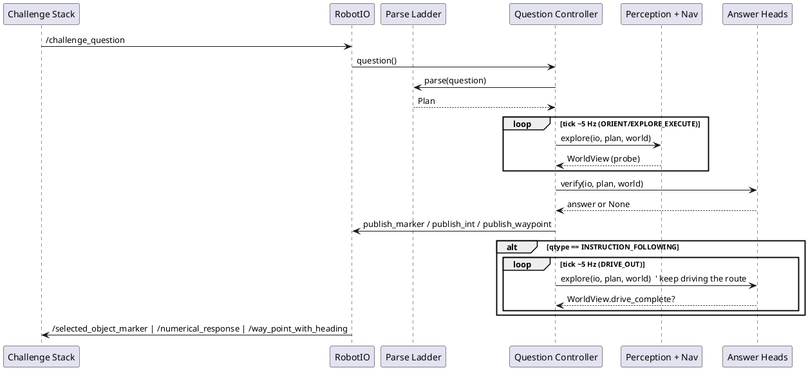

# 2. Core loop: the question lifecycle FSM

`QuestionController` drives one question end to end through a fixed state
sequence, ticked externally at roughly 5 Hz, with a watchdog overlay that
guarantees exactly one legal answer inside the question budget.

## ELI10

Think of a quiz contestant with a countdown clock and a "phone-a-friend"
who is always holding a legal, if boring, guess ready to shout out. The
contestant works through the normal steps (read the question, look
around, work it out, answer), but if the clock gets dangerously close to
zero the host grabs the mic and reads out whatever guess is currently on
hand — never silence, never two answers. For instruction-following
questions there is one more wrinkle: handing in the first answer doesn't
end the round — the contestant keeps walking the route while the clock
still runs, because the walk itself is worth points.

## Composition and tick rate

[`run_question`](../src/core/runner/single.py) is the only place in the
repo that constructs and drives a `QuestionController` in the live
composition path. It builds the four injected callables with
`build_callables(...)` from
[core/heads/factory.py](../src/core/heads/factory.py) (imported at
`single.py` line 25), constructs `ctrl = QuestionController(**callables)`
(`single.py` line 320) and ticks it in a loop until `ctrl.state is
State.DONE`.

The tick rate is a parameter, `tick_hz: float = 5.0`
([core/runner/single.py](../src/core/runner/single.py) line 258), giving
`dt = 1 / tick_hz = 0.2 s` per tick (line 287) — matching
`QuestionController`'s own class docstring claim that `tick(io)` "is
called externally at ~5 Hz"
([core/fsm/controller.py](../src/core/fsm/controller.py) line 122).

Because the clock the FSM reads is whatever `io.clock()` returns, and
`run_question` advances that clock by `dt` per loop iteration regardless
of wall time, a question with the full simulated budget completes in far
under a second of real time when driven against a mock or replay `io`.

## Tick anatomy

`QuestionController.tick(io)`
([core/fsm/controller.py](../src/core/fsm/controller.py) lines 228–258)
runs these steps, in this exact order, every call:

1. **DONE short-circuit.** If `self.state is State.DONE`, call
   `self._finish()` (dumps the flight recording once, then is a no-op)
   and return. Tick is idempotent once DONE.
2. **Intake.** If `self.question is None`, call `self._intake(io)`. If it
   is still `None` afterwards (no question has arrived yet), return — the
   controller stays `IDLE` and nothing below runs.
3. **World refresh.** `self.world = _safe_probe(self._probe, io,
   self._note_swallowed)` (line 240) — re-reads the live world every
   tick, in every state, even `PARSING`.
4. **Floor refresh.** `self.floors.update(self.world.scene, self.plan,
   self.world.partial)` (line 241) — recomputes all three degraded
   fallback answers from the freshest scene, every tick, in every state.
5. **Watchdog overlay.** If `budget.watchdog_floor`, call
   `self._watchdog_publish(io, reason="watchdog_floor>=570s")` (line 245)
   and **return immediately** — no per-state handler runs this tick. (The
   `>=570s` string in the log reason is a label carried from the neutral
   interface constant; the FSM's actual default gate is tighter — see
   [03-time-budgeting.md](03-time-budgeting.md).)
6. **Forced-assembly overlay.** If `budget.forced_assembly` and the
   current state is not `VERIFY`, `ANSWER`, `DRIVE_OUT`, or `DONE`, call
   `self._to(State.VERIFY, "forced_assembly>=510s")` (lines 247–253).
   This mutates `self.state` in place but does **not** return — step 7
   below then looks up the handler for the *new* state, so the `VERIFY`
   handler runs in the same tick as the forced transition. `DRIVE_OUT` is
   explicitly excluded from the forced-assembly re-entry set (comment at
   line 250: "already answered + driving out (IF-F4); do not
   re-assemble") — once an instruction-following question has answered
   and started driving, forced-assembly can no longer yank it back into
   `VERIFY`.
7. **Per-state dispatch.** `handler = self._HANDLERS.get(self.state)`; if
   found, call `handler(self, io)` (lines 256–258). `_HANDLERS` (lines
   350–357) has entries for `PARSING`, `ORIENT`, `EXPLORE_EXECUTE`,
   `VERIFY`, `ANSWER`, `DRIVE_OUT` only — `IDLE` and `DONE` are handled by
   steps 1–2 above and never look themselves up in this dict.

## States

States are declared in `State(str, Enum)`
([core/fsm/controller.py](../src/core/fsm/controller.py) lines 55–64):
`IDLE`, `PARSING`, `ORIENT`, `EXPLORE_EXECUTE`, `VERIFY`, `ANSWER`,
`DRIVE_OUT`, `DONE`.

Normal flow for `NUMERICAL`/`OBJECT_REFERENCE`:

```
IDLE -> PARSING -> ORIENT -> EXPLORE_EXECUTE -> VERIFY -> ANSWER -> DONE
```

For `INSTRUCTION_FOLLOWING` the module docstring (lines 6–14) documents
one extra state before `DONE`:

```
... -> VERIFY -> ANSWER -> DRIVE_OUT -> DONE
```

"because for IF the drive IS the answer (IF-F4)." `ANSWER` still publishes
exactly one waypoint (latched, unchanged from the other two qtypes), but
instead of going straight to `DONE` the FSM enters `DRIVE_OUT` and keeps
ticking the answer heads — breadcrumbs, re-grounding, replans — so a
partially-grounded route's later legs are still attempted with the
remaining budget (ordered-leg partial credit is real, per
`docs/question_analysis.md`'s "100% of IF questions are multi-constraint
and ordered" finding cited in `plan_schema.py`). `DRIVE_OUT` is not present
in the archived 11 Jul snapshot of this FSM — it landed in the hardening
wave (`git log`: "Hardening wave: H6-H15 + ... + IF driven-sim + DRIVE_OUT
continue-drive").

### IDLE

Entry: initial state. Per tick: only `_intake` runs (step 2 above); no
handler is registered for `IDLE`. Exit: the moment a question is latched,
`_intake` itself calls `self._to(State.PARSING, "question received")` —
`IDLE` never survives past the tick that first sees a question.

### PARSING — `_tick_parsing`, lines 261–283

Entry: from `IDLE`, same tick as intake.
Per tick: if `self.plan is None` and `self.ledger.allow("parse")` is true
(cap `CHECKPOINT_MAX["parse"] = 2`, see
[03-time-budgeting.md](03-time-budgeting.md)), call `_safe_call(self._parse,
self.question, on_error=self._note_swallowed)` (line 263).
`_safe_call` (lines 480–486) wraps the call in a bare `try/except
Exception:` that reports the swallow to `_note_swallowed` and returns
`None`. `self.ledger.record("parse", 0.0, "api")` is called
**unconditionally** after the attempt (line 264) — a parse that raised
still consumes one of the two parse-cap slots.

If the parse succeeded, its `qtype` is adopted as authoritative over the
pre-parse heuristic (lines 268–281): `_infer_qtype` at intake is only a
seed used to size the exploration budget before a plan exists; once a
real `Plan.qtype` is available and differs from the seed, `self.qtype`
(and `self.budget.qtype`) are corrected and a `"qtype_corrected"` event is
logged. The comment names the failure mode this prevents (`SYS-F7`): a
motion-verbed object-reference question otherwise gets a `WaypointCmd`
floor on the wrong answer topic if the regex seed misclassified it as
instruction-following (or vice versa).

Exit: **unconditional** — the handler always finishes with
`self._to(State.ORIENT, "parse attempted")` (line 283), whether or not
parsing produced a plan. The comment states the rationale directly:
"Parse runs concurrently with orientation; move on regardless (floor
covers a dark parse)."

### ORIENT — `_tick_orient`, lines 285–288

Entry: from `PARSING`, same tick.
Per tick: no injected operation is called here at all. The handler only
checks `self.budget.in_orientation` (`elapsed() < ORIENTATION_S = 60.0`,
see [03-time-budgeting.md](03-time-budgeting.md)).
Exit: once `in_orientation` is `False` (elapsed >= 60 s),
`self._to(State.EXPLORE_EXECUTE, "orientation window closed")`.

### EXPLORE_EXECUTE — `_tick_explore`, lines 290–296

Entry: from `ORIENT` once the 60 s window closes.
Per tick: `_safe_explore(self._explore, io, self.plan, self.world,
self._note_swallowed)` is called **every** tick with no ledger gate —
exploration has no per-checkpoint cap, unlike parse and verify.
`_safe_explore` (lines 489–494) wraps the call in `try/except Exception:`
that reports the swallow and otherwise does nothing further — any side
effects the callable had already committed (for example a waypoint
already published to `io`) are not rolled back.
Exit: two independent conditions, checked in order:
`self._early_answer_ready()` (see below) -> `_to(State.VERIFY,
"early-answer gate open")`; else `self.budget.past_explore_budget(self.qtype)`
(elapsed past the qtype's soft explore budget) -> `_to(State.VERIFY,
"explore budget spent")`.

### VERIFY — `_tick_verify`, lines 298–305

Entry: from `EXPLORE_EXECUTE`, or forced directly here from any of
`PARSING`/`ORIENT`/`EXPLORE_EXECUTE` by the forced-assembly overlay.
Per tick: if `self.ledger.allow("verification")` (cap
`CHECKPOINT_MAX["verification"] = 1`), call `_safe_verify(self._verify,
io, self.plan, self.world, self._note_swallowed)`.
`_safe_verify` (lines 497–503) wraps the call the same way as the other
`_safe_*` seams. `self.ledger.record("verification", 0.0, "api")` is
called **unconditionally** whenever `allow` was true, even if the call
raised — the single verification slot is consumed regardless of outcome.
Only a non-`None` result is stored to `self._pending_answer` (a plain
attribute, not initialised in `__init__` — it only exists once this line
has run at least once).
Exit: **unconditional** — `self._to(State.ANSWER, "verify complete")` runs
every time, whether or not `allow("verification")` was true and whether
or not verify produced anything.

### ANSWER — `_tick_answer`, lines 307–327

Entry: from `VERIFY`, always.
Per tick: reads `ans = getattr(self, "_pending_answer", None)`. If `None`
(verify never ran, was blocked by the ledger, or raised), falls back to
`ans = self.floors.get(self.qtype)` and logs `"answer_from_floor"` with
detail `"verify yielded nothing"`. Calls `self._publish(io, ans,
reason="answer_state")`. If that publish did **not** flip
`self._answer_published` (the `ans` object was of an unrecognised type —
see Answer egress below), the handler discards `self._pending_answer`,
fetches a **fresh** floor answer, logs `"answer_from_floor"` again with
detail `"pending answer undispatchable; using floor"`, and publishes that
instead.
Exit: qtype-dependent (lines 324–327) — for `INSTRUCTION_FOLLOWING`,
`self._to(State.DRIVE_OUT, "answered; continue driving the route
(IF-F4)")`; for `NUMERICAL`/`OBJECT_REFERENCE`,
`self._to(State.DONE, "answered")` exactly as before `DRIVE_OUT` existed.

### DRIVE_OUT — `_tick_drive_out`, lines 329–348 (IF only)

Entry: from `ANSWER`, only when `self.qtype is
QType.INSTRUCTION_FOLLOWING`.
Per tick: the answer waypoint was already published in `ANSWER` (the
publish latch is untouched). `_tick_drive_out` calls `_safe_explore` again
— the same callable used during `EXPLORE_EXECUTE` — so the instruction
head keeps streaming the next breadcrumb, re-grounding late-appearing
anchors, extending the route over newly grounded legs, and replanning on
stalls. The handler then re-reads the world *after* driving this tick
(`self.world = _safe_probe(...)`, line 346) so route completion is
observed the moment it happens rather than lagging a tick and emitting
one breadcrumb past arrival — the docstring is explicit that this is
deliberate ordering, not an oversight.
Exit: `if self.world.drive_complete: self._to(State.DONE, "route drive
complete")` (lines 347–348). `WorldView.drive_complete` (see below) is set
by the instruction head via the `probe` callable once the route arrives at
its terminal or is exhausted with no replan budget left. The watchdog
overlay (checked before this handler on every tick, per the tick anatomy
above) remains the hard backstop: a hung drive still gets forced to `DONE`
once the watchdog gate fires, and `DRIVE_OUT` cannot shadow or delay it.

### DONE

Entry: from `ANSWER` (non-IF) or `DRIVE_OUT` (IF), or forced directly here
from any non-terminal state by the watchdog overlay
(`_watchdog_publish`, lines 394–397, which publishes a floor answer then
calls `self._to(State.DONE, reason)` itself).
Per tick: handled by step 1 of `tick()`, not by `_HANDLERS`.
`self._finish()` (lines 400–404) logs a `"done"` event with detail
`f"published={self._answer_published}"` and dumps `self.events.dump()`
into `self._flight_recording`, guarded by `self._dump_done` so this only
happens once even if `tick` is called many more times after `DONE`.

## Question intake — `_intake`, lines 204–225

`_intake(io)` calls `io.question()`. If it returns `None`, nothing happens
(still `IDLE`). Otherwise:

- **First receipt** (`self.question is None`): latch `self.question = q`,
  resolve `self.qtype = _infer_qtype(q)`, construct `self.budget =
  BudgetState(io.clock(), self.qtype, forced_assembly_s=...,
  watchdog_floor_s=...)` and immediately `self.budget.latch(getattr(q,
  "t_received", None))` — `BudgetState.latch` is itself idempotent (only
  sets `t0` if it's still `None`), so this is the one and only point `t0`
  is ever set, and it prefers the question's own `t_received` timestamp
  over `clock.now()` when present. Construct
  `self.ledger = CallLedger(self.budget)`, log `"question_latched"`, and
  transition to `PARSING`.
- **Same-text republish** (`q.text == self.question.text`): falls through
  both `if`/`elif` branches — silently ignored, no log entry, no
  re-latch. This is the documented defence against
  `/challenge_question`'s 1 Hz republish (module docstring line 26; see
  also `docs/upstream_notes.md` gotcha 3).
- **Different-text mid-run** (`q.text != self.question.text`): logs
  `"question_ignored"` with the unexpected text, but does **not** switch
  questions — `self.question` is left unchanged. The code comment calls
  this "an upstream error".

`tests/fsm/test_controller.py::test_question_republish_same_text_ignored`
and `::test_different_text_midrun_is_ignored_not_switched` pin both
branches ([tests/fsm/test_controller.py](../src/tests/fsm/test_controller.py)
lines 218 and 232).

## Early answering — `_early_answer_ready`, lines 360–371

Checked once per `EXPLORE_EXECUTE` tick, before the explore budget check.
The gate is asymmetric by design and total over the three `QType` values:

- `NUMERICAL`: returns `self.world.stability.stable` —
  `StabilitySignal.stable`
  ([core/fsm/controller.py](../src/core/fsm/controller.py) lines 78–80) is
  `winner_margin >= 0.25 and min_contrib_n_obs >= 3`. `winner_margin` is
  the fractional lead of the modal count over the runner-up;
  `min_contrib_n_obs` is the minimum observation count across instances
  contributing to that count.
- `INSTRUCTION_FOLLOWING`: always `False` — the code comment is explicit:
  "only the budget/forced path ends IF; never bank early with a gap."
- `OBJECT_REFERENCE`: always `False` — falls through to the soft explore
  budget or the forced-assembly overlay.

`test_numerical_early_answer_when_stable`
([tests/fsm/test_controller.py](../src/tests/fsm/test_controller.py) line
247) reaches `DONE` before the `NUMERICAL` explore budget elapses;
`test_numerical_no_early_answer_when_margin_unstable` (line 265) and
`::test_numerical_no_early_answer_when_nobs_too_low` (line 279) confirm
each half of the `stable` conjunction independently gates the fire.
`test_if_never_early_with_ungrounded_subgoal` (line 291) pins the IF side.

## Answer egress

Publication is funnelled through one method, `_publish(io, ans, reason)`
([core/fsm/controller.py](../src/core/fsm/controller.py) lines 374–392),
called from `_tick_answer` (up to twice) and `_watchdog_publish`, and
nowhere else.

`_publish` first checks the exactly-once latch: if `self._answer_published`
is already `True`, it logs `"publish_suppressed"` and returns without
touching `io`. Otherwise it calls `_dispatch(io, ans)` (lines 451–467),
which `isinstance`-checks `ans` against exactly three types and routes to
the matching `RobotIO` sink:

| Type | Sink | Topic |
|---|---|---|
| `IntAnswer` | `io.publish_int` | `/numerical_response` |
| `MarkerBox` | `io.publish_marker` | `/selected_object_marker` |
| `WaypointCmd` | `io.publish_waypoint` | `/way_point_with_heading` |

Any other type — `None`, a `dict`, a bare tuple, a numpy scalar, or any
object `_dispatch` does not recognise — returns `False` without calling
any `io` method. `_publish` then logs `"publish_dropped"` and, critically,
**does not** set `self._answer_published`. This is what lets
`_tick_answer`'s second fallback attempt (or a later watchdog tick) still
publish a legal answer instead of the run going silent;
`test_verify_undispatchable_type_still_publishes_exactly_one_floor`
([tests/fsm/test_controller.py](../src/tests/fsm/test_controller.py) line
376) covers this parametrised across bad-answer types and all three
`QType`s.

Only a successful dispatch sets `self._answer_published = True` and logs
`"published"`. Because `_dispatch` never checks `ans` against
`self.qtype`, a verify callable that returns an answer of a type
mismatched with the controller's own `qtype` still publishes successfully
— nothing in `controller.py` cross-checks answer type against qtype at
publish time; the type-vs-topic match is entirely the injected heads'
responsibility.

## The injected logger (issue #60)

`QuestionController.__init__` accepts an optional `logger: LogFn | None`
([core/fsm/controller.py](../src/core/fsm/controller.py) line 135,
`LogFn = Callable[[str, str], None]` at line 118). Before this landed, the
three `_safe_*` seams (`_safe_probe`, `_safe_call`/`_safe_explore`,
`_safe_verify`) swallowed every exception with a bare `except Exception:
pass` (or `return None`) and **no log entry at all** — issue #60's title
states the consequence directly: "in-container no-drive undiagnosable".

The fix, `_note_swallowed(seam, exc)` (lines 179–193): every `_safe_*` call
site now takes an `on_error=self._note_swallowed` callback. On a caught
exception, `_note_swallowed` increments a per-seam counter
(`self._swallow_counts`) and forwards to the injected `logger` (via
`self._emit("warn", ...)`, lines 174–177) on the **first** occurrence of a
given seam's failure and then every 50th repeat — so a persistently
failing seam is reported once immediately (with a full formatted
traceback) and periodically thereafter, rather than either vanishing
silently or spamming the log every tick at 5 Hz. State transitions
(`_to`, lines 195–201) are separately forwarded to the logger at `"info"`
level on every transition.

`logger=None` (the default) preserves the original total silence exactly —
"pure-core tests stay byte-identical" per the module comment (line 144) —
so nothing about the FSM's deterministic test behaviour changed; only a
caller that wires a real logger (the ROS adapter) gets visibility.

## Overview


