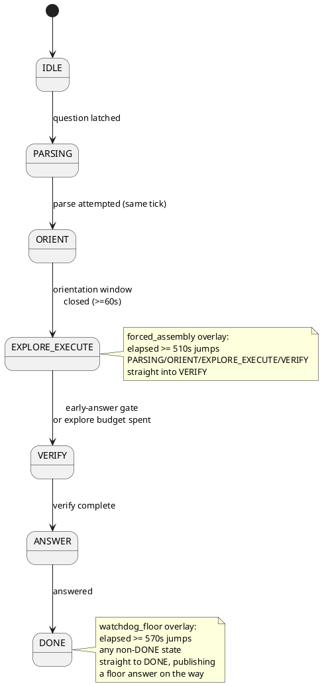
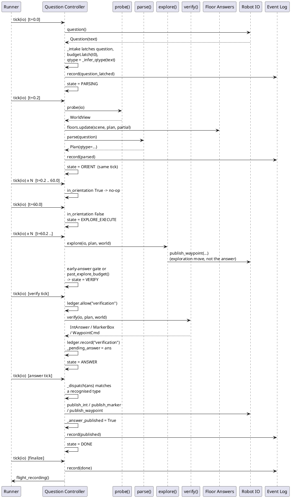

# Core loop: the question lifecycle FSM

`QuestionController` drives one question end to end through a
fixed state sequence, ticked externally at roughly 5 Hz, with a
watchdog overlay that guarantees exactly one legal answer inside
the 600 s question budget.

## ELI10

Think of a quiz contestant with a countdown clock and a
"phone-a-friend" who is always holding a legal, if boring,
guess ready to shout out. The contestant works through the
normal steps (read the question, look around, work it out,
answer), but if the clock gets dangerously close to zero the
host grabs the mic and reads out whatever guess is currently on
hand - never silence, never two answers.

## Composition and tick rate

[`run_question`](../src/core/runner/single.py) is the only place
in the repo that constructs and drives a `QuestionController`.
It builds the four injected callables with
`build_callables(idx, ...)` from
[`core/heads/factory.py`](../src/core/heads/factory.py), then
constructs `ctrl = QuestionController(**callables)`
(`single.py` around line 320) and ticks it in a loop until
`ctrl.state is State.DONE`.

The tick rate is a parameter, `tick_hz: float = 5.0`
(`single.py` around line 258), giving `dt = 1 / tick_hz = 0.2 s`
per tick - which matches the controller module's own docstring
claim that `tick(io)` "is called externally at ~5 Hz"
([`controller.py`](../src/core/fsm/controller.py) line 95). No
`ros_adapter` package exists yet in `src/core/`
(unverified - would need to re-check after Phase 2 ROS wiring
lands), so `run_question`'s default is the only concrete
production tick-rate claim in the repository today. Test helper
`run_until_done` in
[`test_controller.py`](../src/tests/fsm/test_controller.py)
ticks at 2 Hz (`step=0.5`) purely for test speed; it is not
evidence of a production rate.

Because the clock the FSM reads is whatever `io.clock()`
returns, and `run_question` advances that clock by `dt` per
loop iteration regardless of wall time, a question with the
full 600 s sim budget completes in far under a second of real
time when driven against a mock or replay `io`.

## Tick anatomy

`QuestionController.tick(io)` (`controller.py` lines 161-190)
runs these steps, in this exact order, every call:

1. **DONE short-circuit.** If `self.state is State.DONE`, call
   `self._finish()` (dumps the flight recording once, then is a
   no-op) and return. Tick is idempotent once DONE.
2. **Intake.** If `self.question is None`, call
   `self._intake(io)`. If it is still `None` afterwards (no
   question has arrived yet), return - the controller stays
   `IDLE` and nothing below runs.
3. **World refresh.** `self.world = _safe_probe(self._probe,
   io)` - re-reads the live world every tick, in every state,
   even `PARSING`.
4. **Floor refresh.** `self.floors.update(self.world.scene,
   self.plan, self.world.partial)` - recomputes all three
   degraded fallback answers from the freshest scene, every
   tick, in every state.
5. **Watchdog overlay.** If `budget.watchdog_floor` (elapsed
   >= `WATCHDOG_FLOOR_S = 570.0`,
   [`interfaces.py`](../src/core/interfaces.py) line 186), call
   `self._watchdog_publish(io, reason="watchdog_floor>=570s")`
   and **return immediately** - no per-state handler runs this
   tick.
6. **Forced-assembly overlay.** If `budget.forced_assembly`
   (elapsed >= `FORCED_ASSEMBLY_S = 510.0`, `interfaces.py`
   line 185) and the current state is not `VERIFY`, `ANSWER`,
   or `DONE`, call `self._to(State.VERIFY,
   "forced_assembly>=510s")`. This mutates `self.state` in
   place but does **not** return - step 7 below then looks up
   the handler for the *new* state, so the `VERIFY` handler
   runs in the same tick as the forced transition.
7. **Per-state dispatch.** `handler =
   self._HANDLERS.get(self.state)`; if found, call
   `handler(self, io)`. `_HANDLERS` has entries for `PARSING`,
   `ORIENT`, `EXPLORE_EXECUTE`, `VERIFY`, `ANSWER` only - `IDLE`
   and `DONE` are handled by steps 1-2 above and never look
   themselves up in this dict.

## State-by-state walkthrough

States are declared in `State(str, Enum)`, `controller.py`
lines 39-46: `IDLE`, `PARSING`, `ORIENT`, `EXPLORE_EXECUTE`,
`VERIFY`, `ANSWER`, `DONE`.

### IDLE

Entry: initial state. Per tick: only `_intake` runs (step 2
above); no handler is registered for `IDLE`. Exit: the moment a
question is latched, `_intake` itself calls `self._to(
State.PARSING, "question received")` - `IDLE` never survives
past the tick that first sees a question.

### PARSING - `_tick_parsing`, lines 193-201

Entry: from `IDLE`, same tick as intake, or after an earlier
question re-dedup left the plan unset.
Per tick: if `self.plan is None` and
`self.ledger.allow("parse")` (cap `CHECKPOINT_MAX["parse"] = 2`,
[`budget.py`](../src/core/fsm/budget.py) line 98, and the
`LEDGER_RESERVE_S = 45.0` time reserve, `budget.py` line 23),
call `_safe_call(self._parse, self.question)`.
`_safe_call` (lines 367-371) wraps the call in a bare
`try/except Exception: return None`. `self.ledger.record("parse",
0.0, "api")` is called **unconditionally** after the attempt -
a parse that raised still consumes one of the two parse-cap
slots. Only if the result is not `None` is it stored to
`self.plan` and a `"parsed"` event logged.
Exit: **unconditional** - the handler always finishes with
`self._to(State.ORIENT, "parse attempted")`, whether or not
parsing produced a plan. The comment at line 200 states the
rationale directly: "Parse runs concurrently with orientation;
move on regardless (floor covers a dark parse)."

### ORIENT - `_tick_orient`, lines 203-206

Entry: from `PARSING`, same tick.
Per tick: no injected operation is called here at all. The
handler only checks `self.budget.in_orientation` (`elapsed() <
ORIENTATION_S = 60.0`, `budget.py` lines 20 and 68-71).
Exit: once `in_orientation` is `False` (elapsed >= 60 s),
`self._to(State.EXPLORE_EXECUTE, "orientation window closed")`.

### EXPLORE_EXECUTE - `_tick_explore`, lines 208-214

Entry: from `ORIENT` once the 60 s window closes, or forced
back to `VERIFY` early by the forced-assembly overlay (so
`EXPLORE_EXECUTE` never resumes after that).
Per tick: `_safe_explore(self._explore, io, self.plan,
self.world)` is called **every** tick with no ledger gate -
exploration has no per-checkpoint cap, unlike parse and verify.
`_safe_explore` (lines 374-378) wraps the call in
`try/except Exception: pass` - a raised exception is silently
swallowed with **no log entry at all**, and any side effects the
callable had already committed (for example a waypoint already
published to `io`) are not rolled back.
Exit: two independent conditions, checked in order:
`self._early_answer_ready()` (see below) -> `_to(State.VERIFY,
"early-answer gate open")`; else
`self.budget.past_explore_budget(self.qtype)` (elapsed past the
qtype's `EXPLORE_BUDGET_S` entry) -> `_to(State.VERIFY,
"explore budget spent")`.

### VERIFY - `_tick_verify`, lines 216-223

Entry: from `EXPLORE_EXECUTE`, or forced directly here from any
of `PARSING`/`ORIENT`/`EXPLORE_EXECUTE` by the forced-assembly
overlay.
Per tick: if `self.ledger.allow("verification")` (cap
`CHECKPOINT_MAX["verification"] = 1`, `budget.py` line 101),
call `_safe_verify(self._verify, io, self.plan, self.world)`.
`_safe_verify` (lines 381-385) wraps the call in
`try/except Exception: return None`.
`self.ledger.record("verification", 0.0, "api")` is called
**unconditionally** whenever `allow` was true, even if the call
raised - the single verification slot is consumed regardless of
outcome. Only a non-`None` result is stored to
`self._pending_answer` (a plain attribute, not initialised in
`__init__` - it only exists once this line has run at least
once).
Exit: **unconditional** - `self._to(State.ANSWER,
"verify complete")` runs every time, whether or not
`allow("verification")` was true and whether or not verify
produced anything.

### ANSWER - `_tick_answer`, lines 225-238

Entry: from `VERIFY`, always.
Per tick: reads `ans = getattr(self, "_pending_answer", None)`.
If `None` (verify never ran, was blocked by the ledger, or
raised), falls back to `ans = self.floors.get(self.qtype)` and
logs `"answer_from_floor"` with detail `"verify yielded
nothing"`. Calls `self._publish(io, ans, reason="answer_state")`.
If that publish did **not** flip `self._answer_published` (the
`ans` object was of an unrecognised type - see Answer egress
below), the handler discards `self._pending_answer`, fetches a
**fresh** floor answer, logs `"answer_from_floor"` again with
detail `"pending answer undispatchable; using floor"`, and
publishes that instead.
Exit: **unconditional** - `self._to(State.DONE, "answered")`
runs regardless of which of the two publish attempts (if
either) actually succeeded.

### DONE

Entry: from `ANSWER`, or forced directly here from any
non-terminal state by the watchdog overlay
(`_watchdog_publish`, lines 283-286, which publishes a floor
answer then calls `self._to(State.DONE, reason)` itself).
Per tick: handled by step 1 of `tick()`, not by `_HANDLERS`.
`self._finish()` (lines 289-293) logs a `"done"` event with
detail `f"published={self._answer_published}"` and dumps
`self.events.dump()` into `self._flight_recording`, guarded by
`self._dump_done` so this only happens once even if `tick` is
called many more times after `DONE`.

## Question intake - `_intake`, lines 142-158

`_intake(io)` calls `io.question()`. If it returns `None`,
nothing happens (still `IDLE`). Otherwise:

- **First receipt** (`self.question is None`): latch
  `self.question = q`, resolve `self.qtype = _infer_qtype(q)`,
  construct `self.budget = BudgetState(io.clock(), self.qtype)`
  and immediately `self.budget.latch(getattr(q, "t_received",
  None))` - `BudgetState.latch` (`budget.py` lines 39-47) is
  itself idempotent (`if self._t0 is None: ...`), so this is the
  one and only point `t0` is ever set, and it prefers the
  question's own `t_received` timestamp over `clock.now()` when
  present. Construct `self.ledger = CallLedger(self.budget)`,
  log `"question_latched"`, and transition to `PARSING`.
- **Same-text republish** (`q.text == self.question.text`):
  falls through both `if`/`elif` branches - silently ignored, no
  log entry, no re-latch. This is the documented defence against
  `/challenge_question`'s 1 Hz republish
  (`controller.py` module docstring, line 17).
- **Different-text mid-run** (`q.text != self.question.text`):
  logs `"question_ignored"` with the unexpected text, but does
  **not** switch questions - `self.question` is left unchanged.
  The code comment calls this "an upstream error."

`tests/fsm/test_controller.py::test_question_republish_same_text_ignored`
and `::test_different_text_midrun_is_ignored_not_switched` pin
both branches.

## Early answering - `_early_answer_ready`, lines 249-260

Checked once per `EXPLORE_EXECUTE` tick, before the explore
budget check. The gate is asymmetric by design and is total
over the three `QType` values:

- `NUMERICAL`: returns `self.world.stability.stable` -
  `StabilitySignal.stable` (lines 61-63) is `winner_margin >=
  0.25 and min_contrib_n_obs >= 3`. `winner_margin` is the
  fractional lead of the modal count over the runner-up;
  `min_contrib_n_obs` is the minimum observation count across
  instances contributing to that count.
- `INSTRUCTION_FOLLOWING`: always `False` - the code comment is
  explicit: "only the budget/forced path ends IF; never bank
  early with a gap." (`WorldView.ungrounded_subgoals` is not
  even read by this gate; it only matters to the heads that
  populate `WorldView`, see
  [06-answer-heads.md](06-answer-heads.md).)
- `OBJECT_REFERENCE`: always `False` - falls through to the
  soft explore budget or the forced-assembly overlay.

`test_numerical_early_answer_when_stable` reaches `DONE` before
`clk.now() < 210.0` (`EXPLORE_BUDGET_S[QType.NUMERICAL]`,
`interfaces.py` line 197) - strictly earlier than the soft
budget that would otherwise have forced the same transition.
`test_numerical_no_early_answer_when_margin_unstable` and
`::_when_nobs_too_low` confirm each half of the `stable`
conjunction independently gates the fire.

## Answer egress

Publication is funnelled through one method,
`_publish(io, ans, reason)` (lines 263-281), called from three
sites: `_tick_answer` (up to twice), `_watchdog_publish`, and
nowhere else.

`_publish` first checks the exactly-once latch: if
`self._answer_published` is already `True`, it logs
`"publish_suppressed"` and returns without touching `io`.
Otherwise it calls `_dispatch(io, ans)` (lines 340-356), which
`isinstance`-checks `ans` against exactly three types and routes
to the matching `RobotIO` sink:

| Type | Sink | Topic (`interfaces.py`) |
|---|---|---|
| `IntAnswer` | `io.publish_int` | `/numerical_response` |
| `MarkerBox` | `io.publish_marker` | `/selected_object_marker` |
| `WaypointCmd` | `io.publish_waypoint` | `/way_point_with_heading` |

Any other type - `None`, a `dict`, a bare tuple, a numpy scalar,
or any object `_dispatch` does not recognise - returns `False`
without calling any `io` method. `_publish` then logs
`"publish_dropped"` and, critically, **does not** set
`self._answer_published`. This is what lets `_tick_answer`'s
second fallback attempt (or a later watchdog tick) still publish
a legal answer instead of the run going silent; parametrised
test `test_verify_undispatchable_type_still_publishes_exactly_one_floor`
covers `dict`, `tuple`, `numpy.int64`, and a bespoke wrapper
class, for all three `QType`s.

Only a successful dispatch sets `self._answer_published = True`
and logs `"published"`. Because `_dispatch` never checks `ans`
against `self.qtype`, a verify callable that returns an answer
of a type mismatched with the controller's own `qtype` still
publishes successfully - see the divergence note below.

## The flight recorder

[`events.py`](../src/core/fsm/events.py) is a fixed-capacity
ring buffer: `EventLog(capacity: int = 512)` wraps a
`collections.deque(maxlen=capacity)`, so the oldest record is
silently dropped once the buffer is full
(`test_ring_buffer_drops_oldest` pins this at `capacity=3`).
Every record is a frozen `LogRecord(t, state, event, detail)` -
`t` is question-clock seconds (`self.budget.elapsed()` at the
moment of `self._log(...)`, or `0.0` before `budget` exists),
`state` is the FSM state name at emission, `event` a short tag,
`detail` free text.

Event tags actually emitted by `QuestionController`:
`question_latched`, `question_ignored`, `transition`, `parsed`,
`answer_from_floor` (used at two call sites in `_tick_answer`,
distinguished only by `detail`), `publish_suppressed`,
`publish_dropped`, `published`, `done`.

Two concrete consumers already exist in the repo:

- `test_happy_path_visits_states_in_order` filters
  `r.event == "transition"` and checks the ordered `detail`
  substrings (`"->parsing"`, `"->orient"`, ...) appear in
  sequence - the recommended way to read state history, since
  some transitions (parse-then-orient) happen within one tick
  and are otherwise invisible to a caller only polling
  `ctrl.state`.
- `single.py`'s `_floor_used()` (lines 108-121) scans
  `flight_log` for an `"answer_from_floor"` event, or a
  `"published"` event whose `detail` contains the substring
  `"watchdog"` (matching `_watchdog_publish`'s
  `reason="watchdog_floor>=570s"` string), to report
  `RunResult.floor_used` - whether the published answer came
  from a live verify or from the degraded floor path.

A debugging teammate should call `ctrl.flight_recording()` (or
`ctrl.events.dump()` before `DONE`) and either grep the
`transition` trail for the state sequence, or scan for
`publish_dropped` / `answer_from_floor` to see whether the
verify path or the floor path produced the final answer.

## Orientation ownership and the qtype divergence

**Who owns `ORIENT`.** `_tick_orient` calls no injected
operation - it is a pure 60 s wait on
`self.budget.in_orientation`. The injected `explore` callable is
only ever invoked from `_tick_explore`, i.e. after `ORIENT` has
already ended. Separately,
[`core/heads/explore_step.py`](../src/core/heads/explore_step.py)'s
module docstring describes an "opening 4-point diamond sweep"
that seeds the occupancy grid - implemented in
[`core/nav/exploration.py`](../src/core/nav/exploration.py)'s
`ExplorationPolicy.step()`, gated by its own `sweep_s` (default
`SWEEP_S = 60.0`, line 29) against its own `_elapsed()` clock,
which anchors its `t0` "the first time we're stepped" (not the
question's `t0`). Because `ExplorationPolicy.step()` is only
reachable through `ExploreHead.advance()`, which is only reached
via the `explore` callable, which the controller only calls once
in `EXPLORE_EXECUTE`, the nav-level "orientation sweep" actually
runs from roughly question-clock t=60 s to t=120 s - immediately
**after** the FSM's own `ORIENT` state, not during it.
`ORIENTATION_S` (`budget.py`) and `SWEEP_S`
(`core/nav/exploration.py`) are two separate constants that
happen to share the value `60.0`; nothing in the code ties them
together. For a `MockRobotIO` run the scene is fully populated
before the drive loop starts (`_derive_scene_index` reads
`io.scene` once), so `ORIENT` there has no map-building effect
at all; for a replay run with `detections_path` set, perception
fusion is driven by `single.py`'s own loop
(`perception.maybe_process(io)`, called every iteration
unconditionally, before `ctrl.tick(io)`) - independently of FSM
state, not by `ORIENT`. See
[07-navigation-and-exploration.md](07-navigation-and-exploration.md)
for the sweep/frontier mechanics.

**qtype: two independent classifiers.** The controller latches
`self.qtype = _infer_qtype(q)` (`controller.py` lines 324-337)
once, at intake, from the raw question text alone, before any
plan exists. This value seeds `BudgetState(io.clock(),
self.qtype)` and is never reassigned - not even after
`self.plan` (with its own `plan.qtype`) is set in
`_tick_parsing`. It governs `EXPLORE_BUDGET_S[qtype]`, the
`_early_answer_ready` branch, and every `self.floors.get(qtype)`
floor lookup (both in `_tick_answer` and
`_watchdog_publish`) for the rest of the run.

Separately, `core/parsing/regex_tier.py`'s `classify_qtype()`
(lines 29-34) - a **different** pair of regexes
(`_NUMERICAL_RE`, `_INSTRUCTION_RE`) than `_infer_qtype`'s
(`_NUMERICAL_PHRASES`/`_NUMERICAL_WORD_RE`,
`_INSTRUCTION_VERBS_RE`) - decides the parsed `Plan.qtype`. That
is the value `core/heads/factory.py`'s `HeadState.bind()` (lines
77-106) actually switches on to construct the
`NumericalHead`/`ObjectRefHead`/`InstructionHead`, and the value
`_final_answer()` (lines 191-202) switches on to decide which
head's result `verify()` returns.

So two independently-written functions classify the same
question text for two different consumers: the controller's
budget/floor plumbing, and the heads' behaviour. `_dispatch`
does not check `ans` against `self.qtype` (see Answer egress
above), so a verify answer built under `Plan.qtype`'s
classification still publishes even if it disagrees with
`self.qtype`; only the **floor** path is pinned to the
controller's own guess. `tests/fsm/test_infer_qtype_upstream.py`
regression-tests `_infer_qtype` alone against the upstream
75-question ground truth (skipped if the upstream checkout is
absent); no test in the repo exercises both classifiers on the
same text to check they agree. Unverified - whether any training
question text actually makes `_infer_qtype` and `classify_qtype`
disagree; the divergence is structural, not empirically
demonstrated to misfire.

## Design rationale

- The watchdog is deliberately an overlay checked inline in
  `tick()`, not a `State` member (module docstring, line 6) -
  it must be able to fire from *any* state including one where a
  handler is mid-call-cycle, and `test_watchdog_fires_at_570_in_
  every_state` exercises it from `PARSING`, `ORIENT`,
  `EXPLORE_EXECUTE`, and `VERIFY` by directly jamming
  `ctrl.state`.
- The exactly-once latch is set on successful *dispatch*, not on
  a non-`None` verify return, specifically so a verify callable
  returning a malformed type cannot poison the run into silence
  - the test suite calls this out by name
  (`test_verify_undispatchable_type_still_publishes_exactly_one_
  floor`, comment-labelled "defect 1" in
  `test_controller.py`).
- Parse is allowed to fail or be skipped (ledger-exhausted)
  without blocking progress, because every downstream floor
  answer is computed straight from the live scene and tolerates
  `plan is None` (`floors.py`'s `_target_noun` returns `None` on
  `plan=None`) - "the floor covers a dark parse."

## Diagrams

## References

- [`src/core/fsm/controller.py`](../src/core/fsm/controller.py) -
  `QuestionController`, `State`, `StabilitySignal`, `WorldView`,
  `_infer_qtype`, `_dispatch`.
- [`src/core/fsm/events.py`](../src/core/fsm/events.py) -
  `EventLog`, `LogRecord`.
- [`src/core/fsm/budget.py`](../src/core/fsm/budget.py) -
  `BudgetState`, `CallLedger`, `ORIENTATION_S`,
  `LEDGER_RESERVE_S`, `CHECKPOINT_MAX` (detail in
  [03-time-budgeting.md](03-time-budgeting.md)).
- [`src/core/fsm/floors.py`](../src/core/fsm/floors.py) -
  `FloorAnswers`, `PartialResults` (detail in
  [06-answer-heads.md](06-answer-heads.md)).
- [`src/core/heads/factory.py`](../src/core/heads/factory.py) -
  `build_callables`, `HeadState.bind`, `_final_answer` (detail
  in [06-answer-heads.md](06-answer-heads.md)).
- [`src/core/parsing/regex_tier.py`](../src/core/parsing/regex_tier.py) -
  `classify_qtype`, `parse_regex` (detail in
  [04-parsing-and-checkpoints.md](04-parsing-and-checkpoints.md)).
- [`src/core/nav/exploration.py`](../src/core/nav/exploration.py) -
  `ExplorationPolicy`, `SWEEP_S` (detail in
  [07-navigation-and-exploration.md](07-navigation-and-exploration.md)).
- [`src/core/runner/single.py`](../src/core/runner/single.py) -
  `run_question`, the controller's only construction site.
- [`src/tests/fsm/test_controller.py`](../src/tests/fsm/test_controller.py),
  [`src/tests/fsm/test_events.py`](../src/tests/fsm/test_events.py),
  [`src/tests/fsm/test_infer_qtype_upstream.py`](../src/tests/fsm/test_infer_qtype_upstream.py),
  [`src/tests/fsm/_fakes.py`](../src/tests/fsm/_fakes.py) - the
  behavioural pins cited throughout this file.
