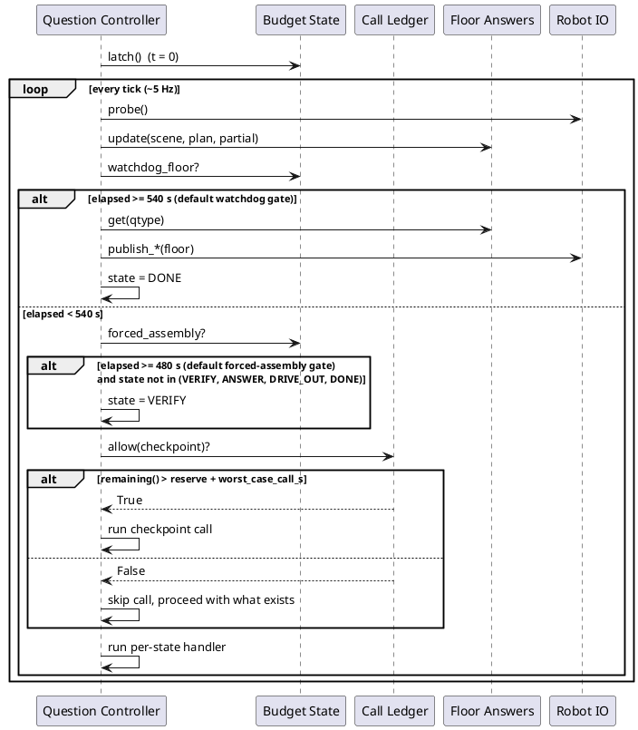

# 3. Time budgeting: the question clock and its defenses

How a question's time budget is tracked, spent by checkpoint calls, and
defended by a floor answer that is never allowed to go silent.

## ELI10

Each question gets a kitchen timer set to 10 minutes. A clock watches it
(`BudgetState`). A notepad tracks how many "phone a friend" calls have
been used and stops new ones once the timer gets low, leaving enough
slack for one more call to actually finish (`CallLedger`). And no matter
what happens, there is always a scribbled answer ready to hand in the
moment the timer rings (`FloorAnswers`) — it just gets better the longer
the robot has been looking. Because our own clock starts a little later
than the evaluator's official clock, all of our internal alarms are set a
bit earlier than the nominal 10 minutes, as a safety margin.

## The two clocks: neutral constants vs. effective gates

`core/interfaces.py` defines three "neutral" budget constants that are not
tied to any particular hedge:

- `QUESTION_BUDGET_S = 600.0`
  ([core/interfaces.py](../src/core/interfaces.py) line 257).
- `FORCED_ASSEMBLY_S = 510.0` (T-90) and `WATCHDOG_FLOOR_S = 570.0` (T-30)
  (lines 258–259).

`core/fsm/budget.py` defines a **second**, tighter pair that is what the
FSM actually runs with by default:

```python
DEFAULT_FORCED_ASSEMBLY_S: float = 480.0  # T-120
DEFAULT_WATCHDOG_FLOOR_S: float = 540.0  # T-60
```

([core/fsm/budget.py](../src/core/fsm/budget.py) lines 25–26). The module
comment explains why (SYS-F6): "the evaluator's clock starts at system
startup while ours starts at question receipt... so boot + DDS discovery
can cost us 10-60 s." Pulling the forced-assembly and watchdog gates in by
30 s each hedges that skew so the whole floor path still clears against
the evaluator's actual clock, not just our own. This is a real behavioural
difference from the archived 11 Jul snapshot, which documented the FSM
running against the neutral 510/570 pair directly — the current code
still imports and uses those two interface constants only as the
fallback default *signature* values inside `BudgetState.__init__`
(line 53–54: `forced_assembly_s: float = FORCED_ASSEMBLY_S,
watchdog_floor_s: float = WATCHDOG_FLOOR_S`), while
`QuestionController.__init__` passes `DEFAULT_FORCED_ASSEMBLY_S` /
`DEFAULT_WATCHDOG_FLOOR_S` explicitly as its own defaults
([core/fsm/controller.py](../src/core/fsm/controller.py) lines 133–134),
so live construction of the controller (`run_question`,
`build_callables`-based composition) actually gets the tighter pair unless
a caller overrides it.

`BudgetState.__init__` enforces a gate-ordering invariant on whatever
values it is given (`core/fsm/budget.py` lines 62–73): it raises
`ValueError` unless
`max(EXPLORE_BUDGET_S.values()) < forced_assembly_s < watchdog_floor_s <
QUESTION_BUDGET_S`. With the tighter defaults that is
`270.0 < 480.0 < 540.0 < 600.0` — still a valid ordering, just compressed
into a smaller trailing window than the neutral 510/570 pair leaves. This
invariant is confirmed by
`test_gate_ordering_invariant_holds_for_defaults` and
`test_gate_ordering_invariant_rejects_bad_gates`
([tests/fsm/test_budget.py](../src/tests/fsm/test_budget.py) lines 122 and
141), and the effective-defaults wiring itself is pinned by
`test_budget_gate_defaults_are_interface_constants` and
`test_controller_effective_gate_defaults_are_pulled_in` (lines 89 and 96).

## The timeline (effective/default gates)

All times are seconds since `BudgetState.latch()`, which fires exactly
once at first `Question` receipt (idempotent; an explicit `t_received`
wins over `clock.now()` on that first call,
[core/fsm/budget.py](../src/core/fsm/budget.py) lines 81–89).

| t (s) | boundary | constant | value | defining file |
|---|---|---|---|---|
| 0 | `t0` latched; `PARSING` begins | – | – | `core/fsm/budget.py` `BudgetState.latch`; `core/fsm/controller.py` `_intake` |
| 0–60 | `in_orientation` True; controller sits in `ORIENT`, no explore step runs | `ORIENTATION_S` | 60.0 | `core/fsm/budget.py` line 28 |
| 60 | `ORIENT` -> `EXPLORE_EXECUTE` | `ORIENTATION_S` | 60.0 | `core/fsm/budget.py` `in_orientation` (line 111); `core/fsm/controller.py` `_tick_orient` (line 285) |
| 210 / 240 / 270 (qtype-dependent) | soft explore budget crossed; `EXPLORE_EXECUTE` -> `VERIFY` (unless already ended by the NUMERICAL early-answer gate) | `EXPLORE_BUDGET_S[qtype]` | NUMERICAL 210.0, OBJECT_REFERENCE 240.0, INSTRUCTION_FOLLOWING 270.0 | `core/interfaces.py` lines 269–273 |
| 480 (default) | `forced_assembly` True; any state other than `VERIFY`/`ANSWER`/`DRIVE_OUT`/`DONE` is forced into `VERIFY` | `DEFAULT_FORCED_ASSEMBLY_S` | 480.0 | `core/fsm/budget.py` line 25 |
| ~495 (= 480 + 45 − 30, approx.; see admission bound below) | ledger reserve + worst-case-call headroom crossed; `CallLedger.allow(...)` refuses every checkpoint from here on, capped or not | `LEDGER_RESERVE_S` + `worst_case_call_s` | 45.0 + 40.0 = 85.0 (i.e. once `remaining() <= 85`, elapsed >= 515) | `core/fsm/budget.py` lines 31, 38, 204–218 |
| 540 (default) | `watchdog_floor` True; floor answer published unconditionally and state forced to `DONE`, checked before any per-state handler runs | `DEFAULT_WATCHDOG_FLOOR_S` | 540.0 | `core/fsm/budget.py` line 26 |
| 600 | nominal question deadline; `remaining()` goes negative past this, but nothing in `core/fsm` gates on 600 directly — the watchdog already guarantees publication well before it | `QUESTION_BUDGET_S` | 600.0 | `core/interfaces.py` line 257 |

The 210/240/270 explore-budget row and 600 s ceiling are unchanged from
the neutral interface constants; the 480/540 forced-assembly/watchdog row
is the tightened default described above, not the archived snapshot's
510/570.

## BudgetState: the clock's API

`BudgetState` ([core/fsm/budget.py](../src/core/fsm/budget.py) lines
41–144) wraps an injected `Clock` (`Clock.now()` seconds) so every query
is deterministic under a `FakeClock` in tests. It answers exactly these
questions:

- `latch(t0=None) -> float` (line 81) — latch `t0` once; idempotent.
- `latched -> bool` (line 91), `t0 -> float | None` (line 95).
- `elapsed() -> float` (line 99) — `now() - t0`, or `0.0` before latch.
- `remaining() -> float` (line 105) — `QUESTION_BUDGET_S - elapsed()`; may
  go negative.
- `in_orientation -> bool` (line 111) — `elapsed() < ORIENTATION_S`.
- `explore_budget(qtype=None) -> float` (line 115) — the soft per-type
  budget, defaulting to `self.qtype` or the max of `EXPLORE_BUDGET_S` if
  no qtype is known yet.
- `past_explore_budget(qtype=None) -> bool` (line 122).
- `forced_assembly_s` / `watchdog_floor_s` properties (lines 127, 132) —
  expose the *effective* gates this particular `BudgetState` was
  constructed with (not the neutral interface constants), so a caller can
  introspect what is actually in force.
- `forced_assembly -> bool` (line 137) — `elapsed() >= self._forced_assembly_s`.
- `watchdog_floor -> bool` (line 142) — `elapsed() >= self._watchdog_floor_s`.

**Who calls it, and when.** `QuestionController._intake` constructs the
`BudgetState` (passing its own `_forced_assembly_s`/`_watchdog_floor_s`,
which default to `DEFAULT_FORCED_ASSEMBLY_S`/`DEFAULT_WATCHDOG_FLOOR_S`)
and calls `latch()` at first question receipt
([core/fsm/controller.py](../src/core/fsm/controller.py) lines 212–218).
Every `tick()` thereafter reads `watchdog_floor` and `forced_assembly`
before running the per-state handler (the watchdog overlay, lines
244–253). `_tick_orient` reads `in_orientation`; `_tick_explore` reads
`past_explore_budget(self.qtype)`. `CallLedger.allow()` reads
`remaining()` to enforce the reserve (next section).

## The call ledger

`CallLedger` ([core/fsm/budget.py](../src/core/fsm/budget.py) lines
168–228) holds a `BudgetState` plus per-checkpoint counts. Callers ask
`allow(checkpoint) -> bool` before spending a call, then
`record(checkpoint, duration, tier)` after it returns (`record` always
succeeds; it is bookkeeping, not a gate).

Hard call caps, `CHECKPOINT_MAX` (lines 149–156):

| checkpoint | cap |
|---|---|
| parse | 2 |
| miss_recovery | 1 |
| anchor_confirm | 3 |
| verification | 1 |
| frontier_select | 1 |
| self_consistency | 2 |

`test_ledger_caps_from_architecture`
([tests/fsm/test_budget.py](../src/tests/fsm/test_budget.py) line 154)
pins this table.

### The admission bound (SYS-F8 / OR-F7)

`allow(checkpoint)` (lines 204–218) is stricter than a bare reserve check.
It returns `False` when either:

- the checkpoint's own cap is already met, or
- `self._budget.remaining() <= LEDGER_RESERVE_S + self._worst_case_call_s`.

`LEDGER_RESERVE_S = 45.0` (line 31) is the same reserve the archived
snapshot documented. `worst_case_call_s` (constructor parameter, default
`DEFAULT_WORST_CASE_CALL_S = 2.0 * 20.0 = 40.0`, lines 33–38, 181, 190)
is new: the per-call worst-case wall cost the ledger must be able to
absorb **on top of** the reserve before admitting one more discretionary
call. The module comment spells out the failure this closes: "a call
admitted at `remaining == reserve` could otherwise run its full timeout
(plus a repair round) and land the watchdog past the deadline." The
default `40.0` is `2x` the per-call timeout — one primary call plus one
repair round — both bounded by `core.llm.timeout.DEFAULT_CALL_TIMEOUT_S =
20.0` ([core/llm/timeout.py](../src/core/llm/timeout.py) line 33). So with
the library defaults, `allow()` starts refusing once
`remaining() <= 45.0 + 40.0 = 85.0`, i.e. once `elapsed() >= 515.0` — 25 s
*before* the default `540.0` watchdog gate, giving the last-admitted call
its full worst-case runway to finish (or time out) with room to spare
before the floor fires. `test_ledger_reserve_blocks_when_time_low`
([tests/fsm/test_budget.py](../src/tests/fsm/test_budget.py) line 176)
covers the reserve edge.

**What a rejected call returns, and what callers do.** `allow()` returns a
plain `bool`; there is no exception path. In `QuestionController`,
`_tick_parsing` only calls `self._parse` when `ledger.allow("parse")` is
`True` — on rejection it skips straight to `_to(State.ORIENT, ...)` with
`self.plan` still `None`
([core/fsm/controller.py](../src/core/fsm/controller.py) line 262).
`_tick_verify` only calls `self._verify` when
`ledger.allow("verification")` is `True` — on rejection `ans` stays `None`
and the state still advances to `ANSWER`, where a `None` pending answer
falls back to `self.floors.get(self.qtype)` (line 300).
`test_ledger_exhaustion_blocks_verify_but_floor_still_answers`
([tests/fsm/test_controller.py](../src/tests/fsm/test_controller.py) line
196) confirms this end to end: the verification cap is pre-consumed, the
injected `verify` callable is never invoked, and the run still ends with
exactly one published answer.

**What is actually wired through the shared ledger.** Only `parse` and
`verification` are gated via `ledger.allow(...)` / `ledger.record(...)`
inside `controller.py` itself. Whether the other four named caps
(`anchor_confirm`, `miss_recovery`, `frontier_select`,
`self_consistency`) are enforced the same way inside the answer heads
that own them is a per-head concern — see
[06-answer-heads.md](06-answer-heads.md) and
[07-navigation-and-exploration.md](07-navigation-and-exploration.md)
rather than this chapter, since `core/fsm` itself only consults the
ledger at the two call sites named above.

## Floors: the always-ready degraded answer

`FloorAnswers` ([core/fsm/floors.py](../src/core/fsm/floors.py) lines
134–249) guarantees a legal, publishable answer for every `QType` at any
tick, computed fresh from whatever the map currently holds. `update()`
(lines 141–152) and `get()` (lines 243–249) are total: `update()` wraps
its real work in a bare `try/except Exception: pass` "last line of
defence" so a scene, plan, or partial-results object that misbehaves
leaves the previous legal floor answer in place rather than raising into
the FSM.

**Refresh cadence.** `QuestionController.tick()` calls
`self.floors.update(self.world.scene, self.plan, self.world.partial)` on
every tick once budget/ledger exist — i.e. at the FSM's ~5 Hz cadence,
unconditionally, before the watchdog overlay is even checked
([core/fsm/controller.py](../src/core/fsm/controller.py) line 241).

**Per-type floor, if the system knows nothing at all** (empty scene, no
plan, no partial results) — `_FloorCache`'s defaults
([core/fsm/floors.py](../src/core/fsm/floors.py) lines 57–62):

- NUMERICAL: `IntAnswer(MODAL_COUNT)` where `MODAL_COUNT = 2` (line 33),
  described as "the most-common integer answer in the training
  distribution".
- OBJECT_REFERENCE: a `MarkerBox` at the origin, `1x1x1` (`_UNIT = 1.0`,
  line 34).
- INSTRUCTION_FOLLOWING: `WaypointCmd(0.0, 0.0)` — the origin.

**How the floor improves as the run progresses**, each type walks its own
preference ladder:

- NUMERICAL (`_numerical`, lines 167–175): `partial.count` (an exact count
  from the numerical head, if it has run) > count of scene instances
  matching the parsed target noun (`scene.by_label(noun)`) >
  `MODAL_COUNT`.
- OBJECT_REFERENCE (`_object_reference`, lines 177–217), six rungs: (1)
  `partial.best_marker` — an explicit override, e.g. a verified result;
  (2) `partial.best_candidate` — the ranking head's current top pick,
  clamped via `clamp_record_marker`; (3) the largest **answer-eligible**
  instance matching the target noun (`is_answer_eligible`, filtering out
  under-observed/low-score ghosts — issue #43a: an instance with `n_obs <
  2` or peak score `< 0.30` stays in the scene index for recall but is
  skipped here so the floor doesn't mark a ghost); (4) an **anchor-guided**
  rung (issue #42) — if the target noun has no scene match but the plan
  carries an anchor noun (e.g. "table" in "the teapot on the table") with
  grounded instances, mark the best (largest) anchor instance instead of
  jumping straight to a blind largest-any-label guess, since the target
  usually sits on/at its anchor; (5) any instance at all (the largest, for
  a defensible box); (6) a `1x1x1` box at the centroid of the
  most-observed instance (`n_obs` max), or the origin if the scene is
  empty (`_unit_marker_at_most_observed`, lines 219–224).
- INSTRUCTION_FOLLOWING (`_instruction_following`, lines 226–240):
  `partial.first_anchor_pt` (the best-grounded first sub-goal anchor) >
  the mean centroid of all scene instances > origin.

Each rung is evidence already sitting in `WorldView.partial` or
`SceneIndex` — the floor never issues its own checkpoint call; it only
reads state the heads have already produced this tick.

## Deadline precedence

Three deadlines can end a question: normal completion (explore budget
exhausted or an early-answer gate fires -> `VERIFY` -> `ANSWER` -> `DONE`
or `DRIVE_OUT` -> `DONE` for IF), forced assembly (default T-120, 480 s),
and the watchdog (default T-60, 540 s). `tick()` enforces the ordering by
checking the watchdog first, then forced assembly, then falling through to
the normal per-state handler — all in the same method, every tick
([core/fsm/controller.py](../src/core/fsm/controller.py) lines 244–258):

```python
if self.budget is not None and self.budget.watchdog_floor:
    self._watchdog_publish(io, reason="watchdog_floor>=570s")
    return
if self.budget is not None and self.budget.forced_assembly and self.state not in (
    State.VERIFY, State.ANSWER, State.DRIVE_OUT, State.DONE,
):
    self._to(State.VERIFY, "forced_assembly>=510s")
handler = self._HANDLERS.get(self.state)
if handler is not None:
    handler(self, io)
```

(The literal log-reason strings still read `>=570s`/`>=510s` — labels
carried from the neutral interface constants — even though the gates the
`if` conditions actually test against are the tighter 540/480 defaults
described above; the reason string is a fixed label, not a re-derivation
of the live threshold.)

Because the watchdog check runs first and `return`s immediately, it
preempts a same-tick forced-assembly transition or state handler once the
watchdog gate fires. Publication is latched: `_publish` no-ops if
`_answer_published` is already `True`, so a late watchdog tick after a
normal answer cannot double-publish.

The test suite exercises the overlap cases directly:

- `test_watchdog_fires_at_floor_in_every_state`
  ([tests/fsm/test_controller.py](../src/tests/fsm/test_controller.py)
  line 125) freezes the FSM in each state and jumps the clock past the
  watchdog gate for every `QType` — exactly one legal floor answer is
  published and the state ends `DONE`.
- `test_forced_assembly_forces_verify_at_gate` (line 176) pins the FSM in
  `EXPLORE_EXECUTE` past the forced-assembly gate and confirms it is
  pushed toward `VERIFY`/`ANSWER`/`DONE`, still publishing exactly once.
- `test_verify_undispatchable_never_starves_watchdog_floor` (line 405)
  jams a poisoned (undispatchable) pending answer into `VERIFY` and jumps
  past the watchdog gate: the watchdog still fires and publishes exactly
  one legal floor answer, proving a garbage verify result cannot suppress
  the floor.
- `test_publish_once_latches_across_answer_and_watchdog` (line 312) runs a
  question to a normal `DONE`, then forces a late tick well past the
  watchdog gate again — publish count stays at 1.
- `test_if_drive_out_watchdog_floor_terminates_a_hung_drive` (line 625) is
  the `DRIVE_OUT`-specific case: an instruction-following question that
  answers and enters `DRIVE_OUT` but never reports `drive_complete` still
  gets forced to `DONE` by the watchdog rather than driving forever.

## Related: prewarm timing is a deployment concern, not a `core/fsm` one

The task brief for this chapter flags a 19 Jul 2026 change, "prewarm
timeout 20s -> 60s" (`dff9a57`). That change does **not** touch
`core/fsm/budget.py` — it lives entirely in the deployment/launch layer:
`docker/ai_module_fork/ai_module/launch_with_llm.sh` raises
`WARMUP_TIMEOUT_S` from `20` to `60` ("measured dev-box cold load is
~25-40s (2026-07-19, RTX 4060 Laptop); 20s produced a spurious 'prewarm
failed' warning while the load finished anyway"), and the same commit
makes `ros_adapter/adapter_node.py` log the actual configured ladder tier
names instead of a generic message. Neither `BudgetState` nor
`CallLedger` reads this warmup value — it gates whether the LLM ladder is
considered "up" before the ROS node starts serving questions, upstream of
anything the question-budget clock measures. See
[09-runtimes-and-deployment.md](09-runtimes-and-deployment.md) for the
adapter/launch-script side of this.


