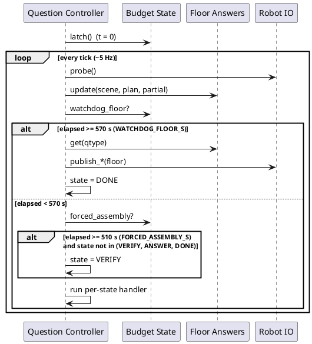

# Time budgeting: the 600 s clock and its defenses

How a question's 600 s wall budget is tracked, spent by
checkpoint calls, and defended by a floor answer that is never
allowed to go silent.

## ELI10

Each question gets a kitchen timer set to 10 minutes. A clock
watches it (`BudgetState`). A notepad tracks how many "phone a
friend" calls have been used and stops new ones once the timer
gets low (`CallLedger`). And no matter what happens, there is
always a scribbled answer ready to hand in the moment the timer
rings (`FloorAnswers`) - it just gets better the longer the
robot has been looking.

## The 600 s timeline

All times are seconds since `BudgetState.latch()`, which fires
exactly once at first `Question` receipt (idempotent; an
explicit `t_received` wins over `clock.now()` on that first
call).
See [src/core/fsm/budget.py](../src/core/fsm/budget.py) around line 39 - BudgetState.latch.

| t (s) | boundary | constant | value | defining file |
|---|---|---|---|---|
| 0 | `t0` latched; `PARSING` begins | - | - | `core/fsm/budget.py` `BudgetState.latch`; `core/fsm/controller.py` `_intake` |
| 0-60 | `in_orientation` True; controller sits in `ORIENT`, no waypoint published | `ORIENTATION_S` | 60.0 | `core/fsm/budget.py:20` |
| 60 | `ORIENT` -> `EXPLORE_EXECUTE` | `ORIENTATION_S` | 60.0 | `core/fsm/budget.py` `in_orientation`; `core/fsm/controller.py:205` `_tick_orient` |
| 60-~120 (worst case) | `ExplorationPolicy`'s own diamond sweep runs, independent of the controller's orientation wait (see worst-case section below) | `SWEEP_S` | 60.0 | `core/nav/exploration.py:29` |
| 210 / 240 / 270 (qtype-dependent) | soft explore budget crossed; `EXPLORE_EXECUTE` -> `VERIFY` (unless already ended by the NUMERICAL early-answer gate) | `EXPLORE_BUDGET_S[qtype]` | NUMERICAL 210.0, OBJECT_REFERENCE 240.0, INSTRUCTION_FOLLOWING 270.0 | `core/interfaces.py:196-200` |
| 510 | `forced_assembly` True; any state other than `VERIFY`/`ANSWER`/`DONE` is forced into `VERIFY` | `FORCED_ASSEMBLY_S` | 510.0 | `core/interfaces.py:185` |
| 555 (= 600 - 45) | ledger reserve crossed; `CallLedger.allow(...)` refuses every checkpoint from here on, capped or not | `LEDGER_RESERVE_S` | 45.0 | `core/fsm/budget.py:23` |
| 570 | `watchdog_floor` True; floor answer published unconditionally and state forced to `DONE`, checked before any per-state handler runs | `WATCHDOG_FLOOR_S` | 570.0 | `core/interfaces.py:186` |
| 600 | nominal question deadline; `remaining()` goes negative past this, but nothing in `core/fsm` gates on 600 directly - the 570 s watchdog already guarantees publication 30 s earlier | `QUESTION_BUDGET_S` | 600.0 | `core/interfaces.py:184` |

**Tunable vs hardcoded.** Every constant in the table above is
mirrored as a field of `BudgetTunables` in
`core/calibration.py`, which exists so a Phase-2 sweep can
enumerate and diff them in one place. But per
`docs/calibration.md` (rows `budget.question_budget_s` through
`budget.orientation_s`), all seven of the clock-gate constants -
`QUESTION_BUDGET_S`, `FORCED_ASSEMBLY_S`, `WATCHDOG_FLOOR_S`,
`ORIENTATION_S`, `LEDGER_RESERVE_S`, and the three
`EXPLORE_BUDGET_S` entries - are still consumed as bare module
constants with no injection seam: "module constant - **wiring
TODO (Phase 2)**". `core.calibration.default_calibration()`
mirrors their values for documentation/serialization today; it
does not feed them back into `BudgetState` or `interfaces.py`.
The six per-checkpoint call caps (`cap_parse` etc., see below)
are the exception - they ARE wireable today via
`CallLedger(caps=...)`.
See [docs/calibration.md](../docs/calibration.md) around line 125 - budget (core.calibration.BudgetTunables).

`SWEEP_S` in `core/nav/exploration.py` is a separate constant
from `ORIENTATION_S`, not a shared reference - they merely both
equal 60.0 today. `docs/calibration.md` mirrors `SWEEP_S` as
`nav.sweep_s`, marked wireable via constructor arg
(`ExplorationPolicy.sweep_s`), but the live call site
(`core/heads/explore_step.py:134`) never overrides it, so it
always falls back to the module default.

## BudgetState: the clock's API

`BudgetState` wraps an injected `Clock` (`Clock.now()` seconds)
so every query is deterministic under a `FakeClock` in tests. It
answers exactly these questions:

- `latch(t0=None) -> float` - latch `t0` once; idempotent.
- `latched -> bool`, `t0 -> float | None`.
- `elapsed() -> float` - `now() - t0`, or `0.0` before latch.
- `remaining() -> float` - `QUESTION_BUDGET_S - elapsed()`; may
  go negative.
- `in_orientation -> bool` - `elapsed() < ORIENTATION_S`.
- `explore_budget(qtype=None) -> float` - the soft per-type
  budget, defaulting to `self.qtype` or the max of
  `EXPLORE_BUDGET_S` if no qtype is known yet.
- `past_explore_budget(qtype=None) -> bool`.
- `forced_assembly -> bool` - `elapsed() >= FORCED_ASSEMBLY_S`.
- `watchdog_floor -> bool` - `elapsed() >= WATCHDOG_FLOOR_S`.

See [src/core/fsm/budget.py](../src/core/fsm/budget.py) around line 26 - BudgetState.

**Who calls it, and when.** `QuestionController._intake`
constructs the `BudgetState` and calls `latch()` at first
question receipt.
See [src/core/fsm/controller.py](../src/core/fsm/controller.py) around line 150 - QuestionController._intake.
Every `tick()` thereafter reads `watchdog_floor` and
`forced_assembly` before running the per-state handler (the
watchdog overlay). `_tick_orient` reads `in_orientation`;
`_tick_explore` reads `past_explore_budget(self.qtype)`.
`CallLedger.allow()` reads `remaining()` to enforce the reserve
(next section). One seam is declared but not fed from this
clock in the live composition: `HeadState.remaining_s` (CP4's
"90 s re-resolve rule" in `core/heads/object_ref.py`) is never
passed a value at either live call site
(`core/runner/single.py:315` or
`src/ros_adapter/adapter_node.py:293` both omit `remaining_s=`),
so CP4 sees its `None` default (treated as +inf) rather than
`BudgetState.remaining()`.

## The call ledger

`CallLedger` holds a `BudgetState` plus per-checkpoint counts.
Callers ask `allow(checkpoint) -> bool` before spending a call,
then `record(checkpoint, duration, tier)` after it returns
(`record` always succeeds; it is bookkeeping, not a gate).

Hard call caps, `CHECKPOINT_MAX`:

| checkpoint | cap |
|---|---|
| parse | 2 |
| miss_recovery | 1 |
| anchor_confirm | 3 |
| verification | 1 |
| frontier_select | 1 |
| self_consistency | 2 |

See [src/core/fsm/budget.py](../src/core/fsm/budget.py) around line 97 - CHECKPOINT_MAX.

`allow(checkpoint)` returns `False` when `remaining() <
LEDGER_RESERVE_S` (45.0 s, i.e. once `elapsed() > 555.0`) -
regardless of whether that checkpoint's own cap is exhausted -
or when the named cap is already met. A checkpoint absent from
`CHECKPOINT_MAX` is uncapped by name but still subject to the
reserve cutoff.
See [src/core/fsm/budget.py](../src/core/fsm/budget.py) around line 137 - CallLedger.allow.

**What a rejected call returns, and what callers do.**
`allow()` returns a plain `bool`; there is no exception path. In
`QuestionController`, `_tick_parsing` only calls `self._parse`
when `ledger.allow("parse")` is `True` - on rejection it skips
straight to `_to(State.ORIENT, ...)` with `self.plan` still
`None`. `_tick_verify` only calls `self._verify` when
`ledger.allow("verification")` is `True` - on rejection
`ans` stays `None` and the state still advances to `ANSWER`,
where a `None` pending answer falls back to
`self.floors.get(self.qtype)`.
See [src/core/fsm/controller.py](../src/core/fsm/controller.py) around line 194 - QuestionController._tick_parsing.
See [src/core/fsm/controller.py](../src/core/fsm/controller.py) around line 216 - QuestionController._tick_verify.
Test `test_ledger_exhaustion_blocks_verify_but_floor_still_answers`
confirms this end to end: the verification cap is pre-consumed,
the injected `verify` callable is never invoked
(`calls["verify"] == 0`), and the run still ends with exactly
one published marker.
See [src/tests/fsm/test_controller.py](../src/tests/fsm/test_controller.py) around line 190 - test_ledger_exhaustion_blocks_verify_but_floor_still_answers.

**What is actually wired through the shared ledger.** Only
`parse` and `verification` are gated via `ledger.allow(...)` /
`ledger.record(...)` inside `controller.py` itself. The other
four named caps exist as documented intent but are enforced
differently, or not at all, in the live head modules:

- `anchor_confirm` fires once per route leg via a local
  `_confirmed` set in `InstructionHead._confirm_leg` - not via
  `ledger.allow("anchor_confirm")`. A plan with more than 3 legs
  is not capped by the ledger's `cap_anchor_confirm = 3`.
  See [src/core/heads/instruction.py](../src/core/heads/instruction.py) around line 314 - InstructionHead._confirm_leg.
- `miss_recovery` fires once per question via a local
  `_cp2_fired` flag in `ExploreHead._maybe_recover_miss` - not
  via the ledger.
  See [src/core/heads/explore_step.py](../src/core/heads/explore_step.py) around line 185 - ExploreHead._maybe_recover_miss.
- `frontier_select` (`ExploreHead._maybe_cp5_frontier`) has no
  once-only guard at all in the head - it is re-evaluated on
  every `EXPLORE_EXECUTE` tick that lands on a `FRONTIER`
  decision in a scene the head judges multi-room. The ledger's
  `cap_frontier_select = 1` is not consulted here.
  See [src/core/heads/explore_step.py](../src/core/heads/explore_step.py) around line 151 - ExploreHead._maybe_cp5_frontier.
- `self_consistency` has zero call sites anywhere in `core/` -
  its cap is defined and pinned by a test
  (`test_ledger_caps_from_architecture`) but nothing in the
  implementation calls it.

## Floors: the always-ready degraded answer

`FloorAnswers` guarantees a legal, publishable answer for every
`QType` at any tick, computed fresh from whatever the map
currently holds. `update()` and `get()` are total: they never
raise, even against an empty scene, a `None` plan, or a scene
whose methods throw.
See [src/core/fsm/floors.py](../src/core/fsm/floors.py) around line 110 - FloorAnswers.

**Refresh cadence.** `QuestionController.tick()` calls
`self.floors.update(self.world.scene, self.plan,
self.world.partial)` on every tick once budget/ledger exist -
i.e. at the FSM's ~5 Hz cadence, unconditionally, before the
watchdog overlay is even checked.
See [src/core/fsm/controller.py](../src/core/fsm/controller.py) around line 174 - QuestionController.tick.

**Per-type floor, if the system knows nothing at all** (empty
scene, no plan, no partial results):

- NUMERICAL: `IntAnswer(MODAL_COUNT)` where `MODAL_COUNT = 2`,
  the most-common integer answer in the training distribution.
  See [src/core/fsm/floors.py](../src/core/fsm/floors.py) around line 31 - MODAL_COUNT.
- OBJECT_REFERENCE: a `MarkerBox` at the origin, `1x1x1`
  (`_UNIT = 1.0`).
  See [src/core/fsm/floors.py](../src/core/fsm/floors.py) around line 33 - _UNIT.
- INSTRUCTION_FOLLOWING: `WaypointCmd(0.0, 0.0)` - the origin.

**How the floor improves as the run progresses**, each type
walks its own preference ladder (`FloorAnswers._numerical`,
`_object_reference`, `_instruction_following`):

- NUMERICAL: `partial.count` (an exact count from the numerical
  head, if it has run) > count of scene instances matching the
  parsed target noun > `MODAL_COUNT`.
- OBJECT_REFERENCE: `partial.best_marker` (an explicit
  override, e.g. a verified result) > `partial.best_candidate`
  (the ranking head's current top pick) > the largest instance
  matching the target noun > the largest instance in the scene
  at all > a `1x1x1` box at the centroid of the most-observed
  instance (`n_obs` max) > origin box if the scene is empty.
- INSTRUCTION_FOLLOWING: `partial.first_anchor_pt` (the
  best-grounded first sub-goal anchor) > the mean centroid of
  all scene instances > origin.

Each rung is evidence already sitting in `WorldView.partial` or
`SceneIndex` - the floor never issues its own checkpoint call;
it only reads state the heads have already produced this tick.

## Deadline precedence

Three deadlines can end a question: normal completion (explore
budget exhausted or an early-answer gate fires -> `VERIFY` ->
`ANSWER` -> `DONE`), forced assembly (T-90, 510 s), and the
watchdog (T-30, 570 s). `tick()` enforces the ordering by
checking the watchdog first, then forced assembly, then falling
through to the normal per-state handler - all in the same
method, every tick:

```python
if self.budget.watchdog_floor:
    self._watchdog_publish(io, reason="watchdog_floor>=570s")
    return
if self.budget.forced_assembly and self.state not in (
    State.VERIFY, State.ANSWER, State.DONE,
):
    self._to(State.VERIFY, "forced_assembly>=510s")
handler = self._HANDLERS.get(self.state)
if handler is not None:
    handler(self, io)
```
See [src/core/fsm/controller.py](../src/core/fsm/controller.py) around line 176 - QuestionController.tick.

Because the watchdog check runs first and `return`s
immediately, it preempts a same-tick forced-assembly transition
or state handler once `elapsed() >= 570`. Publication is
latched: `_publish` no-ops if `_answer_published` is already
`True`, so a late watchdog tick after a normal answer cannot
double-publish.
See [src/core/fsm/controller.py](../src/core/fsm/controller.py) around line 263 - QuestionController._publish.

The test suite exercises the overlap cases directly:

- `test_watchdog_fires_at_570_in_every_state` freezes the FSM
  in each of `PARSING`, `ORIENT`, `EXPLORE_EXECUTE`, `VERIFY`
  and jumps the clock past 570 s for every `QType` - exactly one
  legal floor answer is published and the state ends `DONE`.
  See [src/tests/fsm/test_controller.py](../src/tests/fsm/test_controller.py) around line 125 - test_watchdog_fires_at_570_in_every_state.
- `test_forced_assembly_forces_verify_at_510` pins the FSM in
  `EXPLORE_EXECUTE` at 511 s and confirms it is pushed toward
  `VERIFY`/`ANSWER`/`DONE`, still publishing exactly once.
  See [src/tests/fsm/test_controller.py](../src/tests/fsm/test_controller.py) around line 171 - test_forced_assembly_forces_verify_at_510.
- `test_verify_undispatchable_never_starves_watchdog_floor`
  jams a poisoned (undispatchable) pending answer into `VERIFY`
  and jumps to 571 s: the watchdog still fires and publishes
  exactly one legal floor answer, proving a garbage verify
  result cannot suppress the floor.
  See [src/tests/fsm/test_controller.py](../src/tests/fsm/test_controller.py) around line 399 - test_verify_undispatchable_never_starves_watchdog_floor.
- `test_publish_once_latches_across_answer_and_watchdog` runs a
  question to a normal `DONE`, then forces a late tick at 590 s
  in `EXPLORE_EXECUTE` again - publish count stays at 1.
  See [src/tests/fsm/test_controller.py](../src/tests/fsm/test_controller.py) around line 306 - test_publish_once_latches_across_answer_and_watchdog.



## Worst-case orientation cost: paid twice

The design doc (`docs/architecture.md` §5 step 1) describes a
single 0-60 s orientation sweep. The implementation runs two
independent 60 s windows back to back before frontier-driven
exploration ever begins, because two different clocks each own
a sweep:

1. **The controller's `ORIENT` state** (0-60 s, `elapsed() <
   ORIENTATION_S`) does nothing but wait - `_tick_orient` has no
   `else` branch that drives a waypoint; it only checks
   `in_orientation` and transitions to `EXPLORE_EXECUTE` once it
   is `False`.
   See [src/core/fsm/controller.py](../src/core/fsm/controller.py) around line 203 - QuestionController._tick_orient.
2. Only once `EXPLORE_EXECUTE` starts does the controller call
   the injected `explore` callable, which reaches
   `ExploreHead._explore`. On its first call, this lazily builds
   `ExplorationPolicy(start_xy=pose, affinity=self._affinity())`
   - **without passing `t0`**.
   See [src/core/heads/explore_step.py](../src/core/heads/explore_step.py) around line 133 - ExploreHead._explore.
   `ExplorationPolicy._elapsed` then anchors its own `t0` to
   whatever `t` (the odom timestamp) it first sees: "Anchor the
   clock the first time we're stepped so `sweep_s` measures wall
   time since exploration began, regardless of the absolute
   question clock."
   See [src/core/nav/exploration.py](../src/core/nav/exploration.py) around line 80 - ExplorationPolicy._elapsed.
   From that point the policy drives its own 4-point diamond
   sweep (`sweep_waypoints`) for up to `SWEEP_S = 60.0` more
   seconds before it will consider a frontier at all.

Net effect on the question clock: no waypoint is published for
the first ~60 s (`ORIENT`), then the diamond-sweep primitive
runs for up to another ~60 s inside `EXPLORE_EXECUTE` before any
frontier-directed movement starts - a worst case of ~120 s of
the 600 s budget spent purely on sweep-equivalent behavior, not
the ~60 s the design doc describes. Test
`test_frontier_after_sweep_window` documents the anchoring
explicitly in its own comment ("anchor sweep clock at t=0")
against a freshly-constructed `_ExploreIO`, i.e. the sweep's
zero point is the first `advance()` call, not the question's
`t0`.
See [src/tests/heads/test_explore_step.py](../src/tests/heads/test_explore_step.py) around line 43 - test_frontier_after_sweep_window.

This is not cut short under time pressure either:
`ExplorationPolicy.step` accepts a `budget_state` dict whose
`force_frontier` key skips the sweep, but
`ExploreHead._explore` calls `self._policy.step(self.grid, pose,
t)` with no `budget_state` argument at all - the seam exists in
`core/nav/exploration.py` but nothing in the live composition
path feeds it. Only the controller's own `forced_assembly` (510
s) or `watchdog_floor` (570 s) overlay can still cut the run
short from outside, by forcing the state to `VERIFY` or
publishing the floor regardless of what `ExplorationPolicy` is
doing.
See [src/core/heads/explore_step.py](../src/core/heads/explore_step.py) around line 135 - ExploreHead._explore (policy.step call site).

## Design rationale

Two deadlines rather than one exist because they do different
jobs: `forced_assembly` (510 s) still lets one real
`verification` call run and try to produce a non-floor answer,
while `watchdog_floor` (570 s) exists purely to guarantee legal
output no matter what state the FSM is stuck in. `LEDGER_RESERVE_S`
(45 s) sits strictly between the two closing gaps
(`600 - 45 = 555`), so the reserve cutoff cannot itself block the
one `verification` call `forced_assembly` is trying to enable at
510 s - it only starts refusing *new* discretionary calls in the
15 s window between 555 s and the 570 s hard floor.

## References

- `core/fsm/budget.py` - `BudgetState`, `CallLedger`,
  `CHECKPOINT_MAX`, `ORIENTATION_S`, `LEDGER_RESERVE_S`.
- `core/fsm/floors.py` - `FloorAnswers`, `PartialResults`,
  `MODAL_COUNT`.
- `core/fsm/controller.py` - `QuestionController.tick`, the
  watchdog/forced-assembly overlay, `_tick_orient`,
  `_tick_explore`, `_tick_verify`, `_tick_answer`, `_publish`.
- `core/interfaces.py` - `QUESTION_BUDGET_S`,
  `FORCED_ASSEMBLY_S`, `WATCHDOG_FLOOR_S`, `EXPLORE_BUDGET_S`.
- `core/nav/exploration.py` - `ExplorationPolicy`, `SWEEP_S`,
  `sweep_waypoints`.
- `core/heads/explore_step.py` - `ExploreHead`, the live
  `ExplorationPolicy` call site.
- `core/calibration.py`, `docs/calibration.md` - the
  tunable-constant ledger and per-field wiring status.
- `src/tests/fsm/test_budget.py`,
  `src/tests/fsm/test_controller.py`,
  `src/tests/fsm/test_floors.py`,
  `src/tests/nav/test_exploration.py`,
  `src/tests/heads/test_explore_step.py` - the behaviors cited
  above.
- [02-core-loop.md](02-core-loop.md) - the question lifecycle
  FSM this budget drives.
- [06-answer-heads.md](06-answer-heads.md) - how the per-type
  heads produce the `PartialResults` the floor reads.
