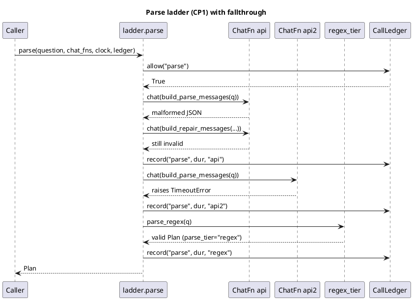

# 4. Parsing and Checkpoints

How a question string becomes a typed `Plan`, and the five
named points (CP1-CP5) where an LLM/VLM is allowed to reason
about the world.

## ELI10

Think of checkpoint 1 as a translator with three backup
translators standing behind it: a cloud model, a second cloud
model, a local model, and finally a rulebook that never quits.
Whichever one succeeds writes its name on the translation
(`parse_tier`) so you can always tell who did the work. The
other four checkpoints (CP2-CP5) are the same idea applied
mid-mission - "does this crop really show a fridge?", "did I
miss a constraint?" - each with its own rulebook fallback so a
dead network degrades the answer, never crashes it.

## The parse ladder

[core/parsing/ladder.py](../src/core/parsing/ladder.py) -
`parse(question, chat_fns, clock, ledger=None,
time_cap_s=45.0, tier_names=("api","api2","local"))`. It never
raises and always returns a validating `Plan`.

Tiers, in order, each stamped into `Plan.parse_tier`:

1. **`api`** - first `ChatFn` in `chat_fns`.
2. **`api2`** - second `ChatFn`.
3. **`local`** - third `ChatFn`.
4. **`regex`** - the deterministic floor
   ([core/parsing/regex_tier.py](../src/core/parsing/regex_tier.py)),
   always run if every LLM tier is absent, exhausted, or
   time-capped.

Per-tier logic (`ladder.parse`, `_attempt`): call the `ChatFn`,
extract the first balanced `{...}` object from the reply via
`_extract_json` (tolerates code fences / preamble text),
decode into a `Plan` with `Plan.from_json`, then run
`Plan.validate()`. Success (`plan is not None and not errors`)
stamps `parse_tier` and returns immediately - **no further
tiers run**. Any of these fail the tier:

- the `ChatFn` itself raising (dead provider, e.g.
  `ProviderUnavailable`, `TimeoutError`) - caught by a bare
  `except Exception` in `_attempt`.
- no JSON object found, or unbalanced braces.
- JSON that doesn't decode into a `Plan` (missing required
  keys, bad enum value).
- a structurally valid `Plan` that fails `Plan.validate()`
  (e.g. a `numerical` plan with no `target`).

On failure, exactly **one repair round** is attempted (if the
tier's time budget isn't already spent):
`build_repair_messages(question, raw, errors)` re-sends the
system prompt plus the previous output and its validation
errors. If the repair also fails validation, the tier is
recorded as exhausted and the ladder falls to the next tier.

Fallthrough triggers, concretely:

- **Any exception or invalid Plan** after the repair round -
  advance to the next tier index.
- **`_expired()`** - `clock.now() - t0 >= time_cap_s` (default
  `DEFAULT_TIME_CAP_S = 45.0`, wall-clock across the *whole*
  ladder, not per tier). Checked before each tier's first
  attempt and again before its repair round; a tier already in
  flight is not interrupted, but no further tier or repair
  starts once expired.
- **`ledger.allow("parse")` returns `False`** - checked once,
  before the tier loop starts. If the caller's `CallLedger`
  says the parse checkpoint's budget/floor-reserve is spent,
  every `ChatFn` is skipped entirely and the ladder goes
  straight to regex. `_ledger_allows` duck-types this: a
  ledger missing a callable `allow`, or one whose `allow`
  raises, is treated as "allowed" (fail open) so a broken
  ledger can never block parsing.

**Total parse failure** (all LLM tiers absent, dead, or
time-capped) yields the regex tier's output verbatim -
`parse_regex(qtext)` with `plan.parse_tier = "regex"`. This is
never an error state from the caller's point of view: the
function contract is "never raises, always returns a valid
`Plan`".

Ledger bookkeeping: `_record_tier` calls
`ledger.record("parse", duration_seconds, tier)` once per
*attempted* tier (including the regex floor), duration
measured via the injected `Clock` from tier start to tier end.
This is best-effort and swallows every exception - a
recording failure can never break parsing.

### The regex floor

[core/parsing/regex_tier.py](../src/core/parsing/regex_tier.py)
- `parse_regex(question) -> Plan`, total, never raises
(`try/except Exception` wraps the whole parse; any internal
failure falls to `_fallback`, which emits a minimal
always-valid `Plan` carrying `notes = "fallback plan (...)"`).

Pipeline: `classify_qtype` (word-boundary regexes -
`_NUMERICAL_RE` matches `how many` / `count`; `_INSTRUCTION_RE`
matches movement verbs `go to`, `take the path`, `stop at`,
etc.; anything else is `object_reference`) then per-qtype
parsers (`_parse_numerical`, `_parse_object_reference`,
`_parse_instruction`) that hand noun phrases to
[core/parsing/vocab.py](../src/core/parsing/vocab.py)
(`match_noun` - articles/quantifiers stripped, attributes
peeled from `ATTRIBUTES`, phrase lookup in `PHRASES`/
`SINGLE_NOUNS`, typo/synonym canonicalisation via `SYNONYMS`)
and a right-branching relation grammar
(`_REL_TOKENS` ordered longest-pattern-first, `_parse_clause`
recurses into nested disambiguators). Corridor/avoid
segmentation (`_LEG_RE`, `_AVOID_RE`, `_split_pair`) handles
`instruction_following` route legs and whole-traversal
`avoid` specs; a route that doesn't already end in `GOTO` is
coerced (`_parse_instruction`'s tail-fix logic).

Note the docstring's own qualifier: "Novel phrasing degrades to
a structurally valid, best-effort Plan with a note" - the regex
tier does not implement full compositional grammar, it
implements exactly what the 75 training questions need
(confirmed by `docs/question_analysis.md`'s citation in the
module header) plus best-effort generalisation.



## Prompt templates

[core/parsing/prompts.py](../src/core/parsing/prompts.py) -
provider-agnostic: builds plain `{"role", "content"}` message
lists, imports no provider SDK. `ChatFn = Callable[[list[dict]],
str]` is the injection seam every tier's adapter must satisfy.

`SYSTEM_PROMPT` is built once at import time from `_RULES`
(ten numbered rules: qtype classification cues, target-vs-route
population, canonical-noun/attribute split, disambiguator
nesting, `with`/`under` polarity, route leg kind mapping,
avoid-clause extraction, allocentric-only relations, the
`notes` escape hatch, and the `parse_tier` field) plus
`PLAN_JSON_SCHEMA` (a hand-derived JSON-Schema mirror of
`plan_schema.py`'s dataclasses - `Plan`/`TargetSpec`/`Clause`/
`Anchor`/`RouteLeg`/`AvoidSpec`) plus four in-context examples
(`EXAMPLES`): one `numerical`, one `object_reference`, and two
`instruction_following` (corridor + avoid, each penalty-scored
so each gets its own worked example per the module docstring).

`build_parse_messages(question)` -> `[system, user]` where the
user message is `USER_PROMPT_TEMPLATE.format(question=...)`.
`build_repair_messages(question, previous_output, errors)` ->
`[system, user]` where the user message
(`REPAIR_PROMPT_TEMPLATE`) restates the question, the failed
output, and every validation error string, and asks for a
corrected JSON object "preserving the parts that were correct."

Malformed LLM output is handled entirely through
`Plan.validate()` errors fed back into the repair prompt - the
ladder never edits or coerces a bad reply itself. If the repair
reply is still malformed, that's simply a failed tier (see
above); nothing about a malformed reply is logged beyond the
ledger's per-tier duration record.

## Provider abstraction

[core/llm/providers.py](../src/core/llm/providers.py) - three
adapters, all lazy-importing their SDK only when actually
called (so the whole test suite runs with no `openai`/
`anthropic` package installed):

- **`OpenAIChatAdapter`** - OpenAI-compatible
  `/chat/completions` (covers OpenAI proper, Gemini's
  OpenAI-compat endpoint, and any local server speaking the
  same schema - llama.cpp, vLLM, Ollama - by pointing
  `base_url` at it).
- **`AnthropicChatAdapter`** - Anthropic Messages API; hoists
  the system prompt to the top-level `system` parameter
  (`_split_system`) since Anthropic has no `system` role.
- **`LocalStub`** - no network; replays a canned reply list in
  order and repeats the last one when exhausted. Used by tests
  and available as the offline `kind: "stub"` provider.

Both real adapters also expose a `vision_chat(messages, images)`
entry point (`VisionChatFn`) for the multimodal checkpoints
(CP2/CP3/CP5): images are base64-attached to the last user
message using each provider's own content-part shape
(`image_url` data-URI for OpenAI-compat, `source.base64` block
for Anthropic).

### Selection: env vars

[core/llm/config.py](../src/core/llm/config.py) -
`load_config()` builds an `LlmConfig` from three slots
(`primary` -> ladder tier `"api"`, `secondary` -> `"api2"`,
`local` -> `"local"`), merging an optional
`<repo>/llm_config.json` with environment variables, **env
always winning**. Per slot `SLOT` in `{PRIMARY, SECONDARY,
LOCAL}`:

| Env var | Meaning | Required? |
|---|---|---|
| `VLA_LLM_<SLOT>_KIND` | `"openai"` \| `"anthropic"` \| `"stub"` | enables the slot |
| `VLA_LLM_<SLOT>_BASE_URL` | endpoint base URL | openai kind only |
| `VLA_LLM_<SLOT>_MODEL` | model id | openai/anthropic |
| `VLA_LLM_<SLOT>_API_KEY_ENV` | name of the env var holding the key (indirection) | optional, has a default |
| `VLA_LLM_<SLOT>_STUB_REPLY` | canned reply text | stub kind only |
| `VLA_LLM_CALL_TIMEOUT_S` | per-call timeout, all adapters | optional (default 20) |
| `VLA_LLM_CONFIG` | path to the JSON config file | optional |

Default `api_key_env` per slot (`_DEFAULT_KEY_ENV` in
`config.py`): `primary -> OPENAI_API_KEY`, `secondary ->
ANTHROPIC_API_KEY`, `local -> VLA_LOCAL_API_KEY`. No API key is
ever read from the JSON file or hard-coded - the file/env only
names *which* env var holds the key, and `ProviderSpec.api_key()`
reads it lazily at call time.

A slot is enabled iff a `kind` resolves from either source
(`_resolve_slot`). `build_chat_fns(config)` returns the ordered
`chat_fns` list `ladder.parse` consumes: any `None` slot is
skipped, any slot that raises `ProviderUnavailable` during
construction (e.g. `openai` kind missing `base_url`/`model`) is
also skipped, and each surviving adapter is wrapped with
`with_timeout(adapter, config.call_timeout_s)`.

### Offline path (no API key)

An unconfigured environment - no `VLA_LLM_*_KIND` set and no
`llm_config.json` - yields `LlmConfig(primary=None,
secondary=None, local=None)`, and `build_chat_fns` returns `[]`.
Per `ladder.parse`'s own contract, an empty `chat_fns` list
skips the `for i, fn in enumerate(chat_fns)` loop entirely and
falls straight to `parse_regex` - confirmed by
[tests/parsing/test_ladder.py](../src/tests/parsing/test_ladder.py)'s
`test_no_chat_fns_goes_straight_to_regex`. This is the "dark
network floor" the codebase's own comments refer to
(`ladder.py` module docstring: "the deterministic regex tier is
the floor").

### Timeout / retry

[core/llm/timeout.py](../src/core/llm/timeout.py) -
`with_timeout(fn, timeout_s=DEFAULT_CALL_TIMEOUT_S=20.0)` wraps
every adapter call. `call_with_timeout` runs the call on a
daemon worker thread and raises `TimeoutError` if it doesn't
finish within `timeout_s`; the module docstring explains the
thread choice explicitly: `signal.alarm` only fires on the main
thread and is a no-op for `SIGALRM` on Windows, so a
thread+queue backstop works identically on both the Windows dev
box and the eventual Ubuntu deployment. There is no built-in
retry inside a tier - one failed attempt plus one repair round
is the entire budget for that tier; retrying happens only by
falling through to the *next* tier in the ladder, not by
re-calling the same one.

## Fixtures: the 75 training questions

The 75 training questions themselves live outside `src/`, at
`upstream/CMU-VLN-Challenge-2026/questions/questions.json`
(read-only clone) - loaded by the `all_questions` pytest
fixture in
[tests/parsing/conftest.py](../src/tests/parsing/conftest.py),
which asserts `len(out) == 75`.

[tests/parsing/test_regex_full_set.py](../src/tests/parsing/test_regex_full_set.py)
runs the regex tier over all 75 and asserts three light,
total-coverage properties: every question yields a
`Plan.validate() == []` with `parse_tier == "regex"`
(`test_every_training_question_yields_valid_plan`);
`classify_qtype` agrees with the JSON's own per-scene qtype
label on all 75 (`test_qtype_classification_matches_labels`);
every `instruction_following` route ends in a `GOTO` leg
(`test_instruction_routes_end_in_goto`).

Deeper, structural assertions run against a smaller
hand-authored subset: 46 golden fixtures under
[core/parsing/fixtures/](../src/core/parsing/fixtures/) (one
`{scene, question, plan}` JSON per file, `parse_tier: "golden"`
in the stored `plan`), consumed by
[tests/parsing/test_regex_goldens.py](../src/tests/parsing/test_regex_goldens.py).
That file's own coverage assertion
(`test_goldens_present_and_typed`) pins the golden set's shape:
exactly 15 numerical, at least 8 object_reference, at least 8
instruction_following, at least 20 goldens total. Against these
46, the tests check qtype at 100%, target/leg-anchor noun match
at >=90% (`test_noun_match_at_least_90_percent`), corridor-leg
detection at 100%, avoid-clause detection at 100%, and exact
leg-kind-sequence match. So the 75-question fixture gives
*breadth* (every training question parses to something valid
and correctly typed), and the 46-golden fixture gives *depth*
(the regex tier's actual extracted structure matches a
hand-checked Plan) on a representative two-thirds slice.

## Checkpoints (CP2-CP5)

[core/checkpoints/__init__.py](../src/core/checkpoints/__init__.py)
names checkpoint 1 as the parse ladder above and defines four
more, numbered CP2-CP5 (there is no separate "CP1" module -
that name refers to `core.parsing.ladder`). Every checkpoint
shares one call envelope
([core/checkpoints/_runtime.py](../src/core/checkpoints/_runtime.py)'s
`guarded_call`):

```
if not ledger.allow(name): return None   # NO provider call made
run call() under call_with_timeout(limit)  # limit = VLA_LLM_CALL_TIMEOUT_S, default 20 s
ledger.record(name, duration, tier)        # tier="timeout" on timeout/exception
```

and one decode path
([core/checkpoints/schemas.py](../src/core/checkpoints/schemas.py)'s
`parse_with_repair`): extract JSON (same balanced-brace scanner
as the ladder, re-imported from `core.parsing.ladder`), validate
against a hand-written per-checkpoint validator, one repair
round on failure, then give up - the caller always applies its
own deterministic fallback rather than raising.

| CP | Module | Modality | Cap (`CHECKPOINT_MAX`) | Trigger | Fallback |
|---|---|---|---|---|---|
| CP2 miss_recovery | [miss_recovery.py](../src/core/checkpoints/miss_recovery.py) | vision (4 tiles) | 1 | plan-critical noun has 0 instances AND explored fraction >= `COVERAGE_TRIGGER_FRAC = 0.60` ([explore_step.py](../src/core/heads/explore_step.py)) | `"absent"` - proceed to the resolve fallback ladder unchanged |
| CP3 anchor_confirm | [anchor_confirm.py](../src/core/checkpoints/anchor_confirm.py) | vision (1 crop) | 3 | on arrival at each instruction-following sub-goal | `"confirm"` - trust the map |
| CP4 verification | [verification.py](../src/core/checkpoints/verification.py) | text | 1 | once, before committing an object_reference answer | `"keep"` the toolbox winner |
| CP5 frontier_select | [frontier_select.py](../src/core/checkpoints/frontier_select.py) | vision (1 panorama) | 1 | scene is multi-room (`_scene_is_multi_room`: >=`MULTI_REGION_TRIGGER = 2` disconnected regions OR explored area over `EXPLORED_AREA_TRIGGER_M2`) | `"fallback"` - geometric top frontier |

Caps and the shared `LEDGER_RESERVE_S = 45.0` floor reserve are
enforced by `core.fsm.budget.CallLedger` (`CHECKPOINT_MAX` in
[core/fsm/budget.py](../src/core/fsm/budget.py) around line 97)
- see [03-time-budgeting.md](03-time-budgeting.md) for how the
ledger interacts with the 600 s question clock. One extra name,
`"self_consistency"` (cap 2), exists in `CHECKPOINT_MAX` and in
`core/calibration.py`'s `cap_self_consistency` field but has no
corresponding checkpoint module under `core/checkpoints/` -
a reserved cap with nothing wired to spend it.

Per-checkpoint verdict handling, all confirmed against each
module's `run_*` function:

- **CP2** (`run_miss_recovery`): `present=True` with a usable
  `tile`+`bbox_hint` -> `"provisional"`, casting the bbox
  through fusion with `n_obs=PROVISIONAL_N_OBS=1`, `score =
  confidence * PROVISIONAL_SCORE_FACTOR (0.5)`,
  `min_points=PROVISIONAL_MIN_POINTS=3`. The score cap is
  deliberate (module docstring, "Hallucination cap"): it keeps
  a single VLM hit below the `>=3`-observation early-answer
  gate on its own. `present=False`, no usable tile, or a
  malformed/timed-out reply all fold to `"absent"`.
- **CP3** (`run_anchor_confirm`): `match=True` at any
  confidence -> `"confirm"`. `match=False` with `confidence <
  MISMATCH_MIN_CONFIDENCE (0.6)` -> still `"confirm"` (too weak
  to override the map). Only `match=False` with `confidence >=
  0.6` -> `"demote"`.
- **CP4** (`run_verification`): `"confirm"` -> keep. `"runner_up"`
  -> swap to the runner-up if one exists, else keep.
  `"neither"` with a `missed_constraint` -> re-resolve (append
  the missed constraint, re-run resolve) only if
  `remaining_s >= RE_RESOLVE_MIN_REMAINING_S (90.0)`, else keep.
- **CP5** (`run_frontier_select`): valid in-range `choice` ->
  drive toward `frontiers[choice-1]`. Anything else (skip,
  timeout, malformed, out-of-range) -> `"fallback"`, the
  geometric top frontier.

### Seam gap: CP4's two APIs

`verification.py` documents its own mismatch: the object_ref
head's injected `llm_verify` seam is
`LlmVerifyFn = Callable[[Plan, str, str], bool]` (`(plan,
candidate_summary, pass_matrix_text) -> bool`), narrower than
CP4's real three-way verdict + missed-constraint contract. The
module therefore exposes two builders: `build_verifier(...)`
returns the rich `run(...) -> VerificationOutcome` function for
a future head that consumes the full contract, and
`as_llm_verify_seam(...)` degrades it to today's bool seam
(`confirm -> True`, `runner_up`/`neither -> False`), discarding
the missed-constraint/re-resolve path the narrower seam cannot
express.

### Vision encoding

[core/checkpoints/_vision.py](../src/core/checkpoints/_vision.py)
- CP2/CP3/CP5 all take an injectable `encode_fn(image) -> bytes`.
The default, `default_encode_fn`, serialises via `numpy.save`
into raw `.npy` bytes rather than JPEG, because cv2/PIL are not
project dependencies. The module docstring calls real JPEG
encoding "a Phase-2 wiring step: production bind passes an
`encode_fn` that runs cv2/PIL, no checkpoint code changes" -
i.e. this is a known, explicitly deferred gap, not an oversight.

## Wired vs. unwired: tracing the call sites

Every checkpoint above (`build_miss_recovery`,
`build_anchor_confirm`, `build_verifier`/
`as_llm_verify_seam`, `build_frontier_select`) and the full
parse ladder (`core.parsing.ladder.parse`,
`core.llm.config.build_chat_fns`) are implemented, unit-tested,
and golden-tested. Whether they run in the actual system
depends on what
[core/heads/factory.py](../src/core/heads/factory.py)'s
`build_callables(...)` is called *with*, and grepping every
non-test call site shows the following:

- **`HeadState`** (`factory.py`) carries seven optional
  checkpoint fields: `llm_verify`, `anchor_confirm`, `verifier`,
  `miss_recoverer`, `frontier_selector`, plus the CP-support
  hooks `remaining_s`, `budget_frac`, `tiles_fn`, `fuse_hint`.
  `state.bind(plan)` threads whichever are non-`None` straight
  into `ObjectRefHead`/`InstructionHead`/`ExploreHead`'s own
  constructors - the head-level seams
  (`ObjectRefHead.verifier`/`llm_verify`,
  `InstructionHead.anchor_confirm`,
  `ExploreHead.miss_recoverer`/`frontier_selector`) are real
  and exercised by
  [tests/heads/test_factory_checkpoints.py](../src/tests/heads/test_factory_checkpoints.py).
- **`build_callables`'s own `parse` default** is
  `_default_parse` (`factory.py`, bottom of file): `from
  core.parsing.regex_tier import parse_regex; return
  parse_regex(text)` - a direct call to the regex floor,
  **bypassing `ladder.parse` entirely** unless a caller
  explicitly passes `parse=` an injected ladder-backed function.
- **`ros_adapter/adapter_node.py`** (`_on_tick`, around line
  293) - the ROS-backed live entry point - calls
  `build_callables(self._scene_index)` with **no keyword
  arguments at all**. Every checkpoint seam and the `parse`
  override are therefore `None`/default: `_default_parse`
  (regex only), `llm_verify=None`, `anchor_confirm=None`,
  `verifier=None`, `miss_recoverer=None`,
  `frontier_selector=None`.
- **`core/runner/single.py`**'s `run_question(...)` accepts a
  `chat_fns: dict | None` parameter but only ever forwards two
  of the seven possible keys into `build_callables`:
  `llm_verify=chat_fns.get("llm_verify"),
  anchor_confirm=chat_fns.get("anchor_confirm")` (around line
  315) - `verifier`, `miss_recoverer`, `frontier_selector`, and
  `parse` are never threaded through, so even a caller that
  populates `chat_fns` cannot reach the rich CP2/CP4/CP5 seams
  or the LLM parse tiers through this entry point.
- **`core/runner/__main__.py`** (the CLI, `python -m
  core.runner "..."`) never constructs a `chat_fns` dict at
  all, has no flag for one, and never imports
  `core.llm.config.build_chat_fns` or `core.parsing.ladder`.
  Same for `battery.py`, `gt_battery.py`, and `cvsweep.py` -
  none of them reference `chat_fns`, `build_chat_fns`,
  `load_config`, or `llm_verify`.

**Conclusion, stated plainly:** at the time of writing, every
run of the system through any of its three real (non-test)
entry points - the CLI runner, the battery/cvsweep scripts, and
the ROS adapter - uses the regex floor for parsing and the
deterministic fallback for every one of CP2-CP5. The full
ladder and all four checkpoints are real, tested code, not
dead code, but they are reachable only from tests today. `LOG.md`'s
2026-07-11 session-8 entry names this directly as an open
follow-up: "USER: API keys (`VLA_LLM_*`) -> live CP4/parse
tiers" is listed under "Next session", unresolved as of the
latest entry. Wiring the CLI/adapter to `core.llm.config`
requires a decision about *which* seams to thread in
(`verifier` vs. the narrower `llm_verify`) and is tracked as a
gap, not attempted here - see
[09-gaps-and-risks.md](09-gaps-and-risks.md).

## Design rationale

Two tiers of test coverage exist for a reason visible in the
fixture split above: the 75-question set proves the regex tier
never crashes and always classifies correctly (a hard
requirement, since it is the *only* tier that runs live today),
while the 46-golden subset proves it extracts the right
*structure* on a representative slice without hand-checking all
75 Plan JSONs. Splitting cap enforcement into a ledger
(`CallLedger.allow`) that every checkpoint duck-types
defensively - rather than each module tracking its own count -
means one shared `LEDGER_RESERVE_S = 45.0` floor reserve
protects the watchdog answer path across all five checkpoints
at once, and a missing or broken ledger fails open (never
blocks) rather than silently starving the floor answer.

## References

- [core/parsing/ladder.py](../src/core/parsing/ladder.py) -
  the CP1 tier loop, time cap, ledger duck-typing.
- [core/parsing/regex_tier.py](../src/core/parsing/regex_tier.py),
  [core/parsing/vocab.py](../src/core/parsing/vocab.py) - the
  deterministic floor and its noun vocabulary.
- [core/parsing/prompts.py](../src/core/parsing/prompts.py) -
  system/user/repair prompt templates and `PLAN_JSON_SCHEMA`.
- [core/llm/config.py](../src/core/llm/config.py),
  [core/llm/providers.py](../src/core/llm/providers.py),
  [core/llm/timeout.py](../src/core/llm/timeout.py) - provider
  selection, adapters, timeout wrapper.
- [core/checkpoints/](../src/core/checkpoints/) - `_runtime.py`
  (shared call envelope), `schemas.py` (shared validation +
  repair), `miss_recovery.py`, `anchor_confirm.py`,
  `verification.py`, `frontier_select.py`, `fixtures/` (golden
  cases).
- [core/heads/factory.py](../src/core/heads/factory.py) -
  `build_callables`, `HeadState`, `_default_parse`; the actual
  wiring point for every checkpoint seam.
- [core/fsm/budget.py](../src/core/fsm/budget.py) -
  `CHECKPOINT_MAX`, `LEDGER_RESERVE_S`, `CallLedger`.
- [tests/parsing/test_ladder.py](../src/tests/parsing/test_ladder.py),
  [tests/parsing/test_regex_full_set.py](../src/tests/parsing/test_regex_full_set.py),
  [tests/parsing/test_regex_goldens.py](../src/tests/parsing/test_regex_goldens.py),
  [tests/parsing/conftest.py](../src/tests/parsing/conftest.py),
  [tests/checkpoints/](../src/tests/checkpoints/),
  [tests/heads/test_factory_checkpoints.py](../src/tests/heads/test_factory_checkpoints.py),
  [tests/llm/test_config.py](../src/tests/llm/test_config.py),
  [tests/llm/test_ladder_integration.py](../src/tests/llm/test_ladder_integration.py).
- [../LOG.md](../LOG.md) - 2026-07-11 session-8 entry: checkpoint
  wiring history and the open "API keys -> live tiers" follow-up.
- [02-core-loop.md](02-core-loop.md),
  [03-time-budgeting.md](03-time-budgeting.md),
  [01-context-and-contracts.md](01-context-and-contracts.md) -
  the FSM tick that calls `parse`/`verify`, the budget/ledger
  the caps above draw from, and the `Plan` DSL this checkpoint
  produces.
