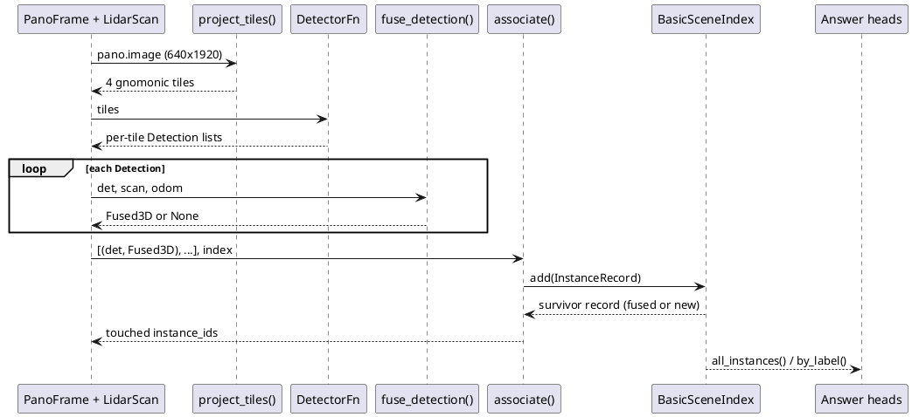
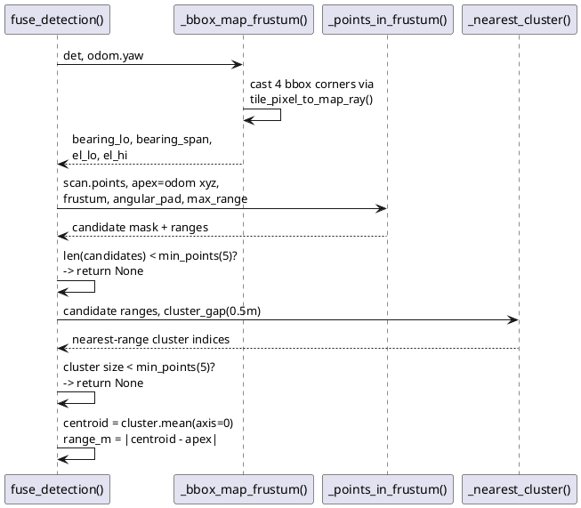

# Perception: panoramas + lidar to a queryable instance map

How one `/camera/image` panorama and one
`/registered_scan` lidar frame become tracked 3D
`InstanceRecord`s that the answer heads query.

## ELI10

The robot's eye is a single wide photo that wraps
all the way around it, plus a lidar "point cloud" of
everything nearby. The pipeline cuts the photo into
four normal-looking snapshots, finds objects in each
snapshot, then throws a cone of lidar points through
each object's outline to find its real 3D position
and size. Objects seen again from a new angle get
matched to the ones already found (same label, close
enough, boxes overlapping enough) instead of being
counted twice.

## Pipeline stages, in order

`PerceptionPipeline.process()` in
[tracker.py](../src/core/perception/tracker.py) glues
every stage below behind a keyframe gate.

### 1. Panorama intake + tiling

[tiling.py](../src/core/perception/tiling.py) reprojects
the 1920x640 equirectangular strip
(`PANO_WIDTH=1920`, `PANO_HEIGHT=640`, `PANO_HFOV=2*pi`,
`PANO_VFOV=120 deg`) into `DEFAULT_N_TILES=4` pinhole
tiles, each `DEFAULT_TILE_HFOV=90 deg` wide, sharing the
full 120 deg VFOV. Neighbours overlap by
`DEFAULT_SEAM_OVERLAP=10 deg` (an informational constant;
the actual overlap comes out of tile spacing
`2*pi/n_tiles` vs `hfov`, not an enforced parameter).
Sign conventions live in three named constants
(`AZIMUTH_SIGN=-1.0`, `COLUMN0_YAW_OFFSET=pi`,
`ELEVATION_SIGN=-1.0`) so a Phase-2 calibration mismatch
against the real sim image is a one-line fix, not a
trig rewrite. Remap grids are `lru_cache(maxsize=8)`d
per `(n_tiles, hfov, vfov, tile_width, tile_height)`, so
`project_tiles()` costs one bilinear gather per tile per
frame. `tile_pixel_to_camera_ray()` /
`tile_pixel_to_map_ray()` are the analytic inverse used
by fusion to cast bbox corners back out to rays.

### 2. Detector

[detector.py](../src/core/perception/detector.py) defines
the seam: `DetectorFn = Callable[[Sequence[np.ndarray]],
list[list[Detection]]]` - tiles in, one `Detection` list
per tile out. `Detection` carries `tile_id`,
`bbox_xyxy`, `label`, `score`, optional `mask`, plus
`center_xy`/`foot_xy` properties fusion does not
currently use (fusion casts all four bbox corners, not
the centre or foot point).

Three implementations exist:

- `FakeDetector` - replays a fixed detection list or a
  per-call `script` (advances one frame per call,
  repeats the last frame once exhausted). Used across
  the perception test suite.
- `GroundingDinoDetector` - the intended real detector,
  model `GDINO_MODEL_ID="IDEA-Research/grounding-dino-base"`,
  `box_threshold=0.35`, `text_threshold=0.25`.
  `build_gdino_prompt()` joins question nouns + vocab
  nouns into `"noun . noun ."` form. torch/groundingdino
  import lazily inside `_lazy_import()` so importing this
  module never needs them.
- `ScriptedPanoDetector` (in
  [scripted.py](../src/core/perception/scripted.py)) -
  replays hand-labelled boxes drawn on the raw pano image
  (`jingfan_labels.json` schema:
  `{"format": "pano_xyxy", "keyframes": {"<kf>":
  [{"label", "attributes", "bbox": [x0,y0,x1,y1],
  "score"}]}}`), converting each pano-pixel box to a
  tile-space `Detection` via `pano_bbox_to_detection()`:
  pick the tile whose `yaw_center` is angularly nearest
  the box's centre-column azimuth
  (`column_to_azimuth`), gnomonically project all four
  corners into that tile via `camera_ray_to_tile_pixel()`
  (the analytic inverse of
  `tile_pixel_to_camera_ray()`), then take the enclosing
  axis-aligned box, clipped to tile bounds.

### Detector reality check

`GroundingDinoDetector.__call__` always raises
`NotImplementedError` - even with torch and
groundingdino installed, because the method's first
line after the lazy-import gate is an unconditional
`raise` (detector.py around line 180). It is not "missing
weights"; inference is simply not written yet. It never
appears in [ros_adapter/adapter_node.py](../src/ros_adapter/adapter_node.py)
or any runner path.

The live composition today is `ScriptedPanoDetector`,
wired only in one place:
`_ScriptedPerception` in
[single.py](../src/core/runner/single.py) around line 197,
constructed only when `run_question(...,
detections_path=...)` is set, which itself requires a
replay `RobotIO` (`--fixtures` in the CLI; see
[__main__.py](../src/core/runner/__main__.py) around
line 105 for the guard). Default synthetic runs
(`_synthetic_io` -> `MockRobotIO`) never touch the
detector/fusion/tracker stack at all -
`_derive_scene_index()` in single.py around line 98
builds a `BasicSceneIndex` straight from
`SyntheticScene.instances()`, which are pre-built
`InstanceRecord`s with `n_obs=3` set directly
([synthetic_scene.py](../src/core/mocks/synthetic_scene.py)
around line 170). The ground-truth battery does the
same ([groundtruth/loader.py](../src/core/groundtruth/loader.py)
around line 77 and 226): GT instances are synthesized
with `n_obs=3`, never detected or fused.

The rclpy adapter node also does not wire the
pipeline: [adapter_node.py](../src/ros_adapter/adapter_node.py)
around line 228 sets `self._scene_index =
BasicSceneIndex([])` - a permanently empty index - with
an inline comment "confirm on Ubuntu: swap
`BasicSceneIndex([])` for the live perception scene
index". `PerceptionPipeline` is imported nowhere in
`ros_adapter/`. Real-model integration still needs: (1)
`GroundingDinoDetector.__call__` implemented against
loaded weights, (2) the adapter node building a
`PerceptionPipeline` and calling `.process()` per frame
instead of holding an empty index.

### 3. Lidar frustum fusion

[fusion.py](../src/core/perception/fusion.py)'s
`fuse_detection(det, scan, odom, cfg)` lifts one 2D
`Detection` to a 3D `Fused3D` (`centroid`, `points`,
`n_points`, `range_m`), or returns `None`. Steps:

1. **Frustum from the bbox.** `_bbox_map_frustum()`
   casts all four bbox corners through
   `tile_pixel_to_map_ray()` to map-frame
   `(bearing, elevation)`. It finds the smallest arc
   covering all four bearings (trying each corner as the
   low edge, robust to the +-pi wrap) - this is the
   detection's angular span, not a naive min/max (which
   breaks across the seam).
2. **Angular gate.** `_points_in_frustum()` puts the
   frustum apex at the vehicle odom position
   (`apex = [odom.x, odom.y, odom.z]` - the docstring
   calls this an approximation of the camera optical
   centre). Every lidar point's bearing/elevation/range
   is computed relative to that apex; a point is a
   candidate if its bearing falls in the bbox span padded
   by `angular_pad=deg2rad(3.0)` on each side, its
   elevation falls in the bbox's elevation band (same
   pad), and its range is in `(1e-6, max_range=15.0]`.
3. **Depth clustering.** `_nearest_cluster()` sorts
   candidate points by range and splits the sorted list
   wherever a consecutive gap exceeds
   `cluster_gap=0.5` m; the first (nearest) segment is
   the object. The module docstring describes this as
   "1D histogram / simple range-DBSCAN" and the config
   carries a `depth_bin=0.25` m field for that, but
   `depth_bin` is never read anywhere in the module - the
   real algorithm is the gap-split above, not a
   histogram.
4. **Accept/reject.** If fewer than `min_points=5`
   points survive the angular gate, or the nearest
   cluster itself has fewer than `min_points`, fusion
   returns `None`. Otherwise the cluster's mean is the
   centroid and `range_m = |centroid - apex|`.

### 4. Tracking / cross-frame association

[tracker.py](../src/core/perception/tracker.py) runs two
independent gates, not one:

- `associate(fused_dets, index, cfg)` proposes matches:
  for every `(detection, existing instance)` pair whose
  labels are compatible
  (`labels_compatible()` - `normalize_label()` plus
  `NOUN_ALIASES` folding so `"television"` matches a
  `"tv"` instance) and whose centroid distance is
  `<= TrackerConfig.gate=0.75` m, it is a candidate.
  Candidates are sorted by ascending distance and
  consumed greedily nearest-first, each detection and
  each instance used at most once. Matched detections
  are rebuilt with the matched instance's `instance_id`;
  unmatched ones get a fresh id from `index.next_id()`.
- Every rebuilt record then goes through
  `BasicSceneIndex.add()`
  ([scene_index.py](../src/core/perception/scene_index.py)),
  which is the actual merge authority:
  `_find_merge_target()` looks for *any* existing
  same-label instance whose 3D AABB IoU exceeds
  `MERGE_IOU=0.3` (strict `>`, not `>=`), independent of
  what `associate()` proposed. If found, `_fuse()`
  concatenates the point clouds, recomputes a
  per-axis 2nd/98th-percentile trimmed AABB
  (`TRIM_LO_PCT=2.0`, `TRIM_HI_PCT=98.0`) and centroid,
  adds `n_obs`, and keeps the max `score`. If not found
  but the proposed `instance_id` collides with an
  existing one (association matched by distance but the
  boxes don't overlap enough), `add()` mints a brand-new
  id instead of overwriting - so a distance-gate match
  that fails the IoU test never silently clobbers an
  unrelated instance.

`BasicSceneIndex.by_label(noun)` (used by the toolbox and
answer heads) is a three-rung ladder: exact canonical
match, then synonym-table match (`_SYNONYM_GROUPS`:
refrigerator/fridge, sofa/couch, television/tv,
picture/photo), then typo tolerance via Levenshtein
distance `<= TYPO_MAX_DIST=2`.

`PerceptionPipeline` also gates *which* frames reach any
of this: `KeyframeConfig` (`every_k=1`,
`min_translation=0.5` m, `min_rotation=deg2rad(30.0)`)
skips a frame unless it is `every_k` frames since the
last keyframe, or the vehicle moved
`>= min_translation`, or turned `>= min_rotation`. A
skipped frame returns `[]` and touches nothing.

## Worked example: real-data white-stool count

Session 8 finale (`LOG.md`) hand-labelled 29 boxes across
2 keyframes of a real jingfan bag
(`data/fixtures/jingfan_labels.json`, git-ignored;
schema per `scripted.py`'s docstring verified above) and
asked *"How many white stools are in the room?"* through
`ScriptedPanoDetector` + real `/registered_scan` data.
Result: 5 stool boxes labelled -> **2** counted, matching
the published `IntAnswer`.

Mapped onto the thresholds above:

- **5 labelled boxes -> 3 survive fusion.** Two boxes had
  fewer than `min_points=5` lidar points inside their
  padded frustum (`fuse_detection` returned `None` for
  each) - rejected before ever reaching the tracker.
- **3 fused `Fused3D`s -> 2 final instances.** Two of the
  three were adjacent stools whose trimmed AABBs
  overlapped with 3D IoU above `MERGE_IOU=0.3`;
  `BasicSceneIndex._fuse()` merged them into one record
  (points concatenated, AABB recomputed, `n_obs`
  incremented). The third stayed separate (IoU with
  either neighbour <= 0.3).
- **2 instances -> answer 2.** `RunResult.instances_tracked
  == 9` for the full scene in that session (all labelled
  classes), and the count head resolved the `"stool"`
  query against just the 2 surviving same-label
  instances.

The synthetic version of this exact flow is pinned in
[test_single_scripted.py](../src/tests/runner/test_single_scripted.py):
`test_scripted_detections_produce_tracked_instances` puts
two separated stool boxes with matching lidar clusters
into a 6-keyframe replay and asserts
`instances_tracked == 2`;
`test_repeated_keyframes_merge_not_multiply` re-labels a
later keyframe with the *same* boxes and asserts the
count stays 2, not 4 - the re-observation raises `n_obs`
on the existing instances instead of creating new ones.

Downstream, `core/heads/numerical.py`'s
`MIN_OBS=3` gate means a count is only reported
"stable" once every contributing instance has been
observed 3+ times (`ctrl.stable` in
[controller.py](../src/core/fsm/controller.py) around
line 63 requires `min_contrib_n_obs >= 3`); see
[06-answer-heads.md](06-answer-heads.md) for how that
threshold shapes exploration and floor fallbacks.

## Design rationale

`docs/architecture.md` §6 specifies "ByteTrack-style
association in NumPy ... prevents double-count" as the
tracking choice. What is implemented is simpler: greedy
nearest-neighbour bipartite matching on centroid
distance (`associate()`), with 3D AABB IoU as the actual
dedup authority (`BasicSceneIndex.add()`) rather than a
ByteTrack-style track state machine. Both `FusionConfig`
and `TrackerConfig` docstrings self-flag their constants
as "non-spec value flagged in the task report" -
`min_points=5`, `gate=0.75` m, and `MERGE_IOU=0.3` are
engineering defaults tuned against the test suite and the
one real bag, not values derived from the challenge spec
or a calibration sweep (`cvsweep.py` sweeps
`counting.min_obs` but not these fusion/tracker
constants).

## References

- Entry point: [tracker.py](../src/core/perception/tracker.py)
  - `PerceptionPipeline`, `associate()`
- [tiling.py](../src/core/perception/tiling.py) - pano
  <-> tile <-> map ray geometry
- [detector.py](../src/core/perception/detector.py) -
  `Detection`, `FakeDetector`, `GroundingDinoDetector`
- [scripted.py](../src/core/perception/scripted.py) -
  `ScriptedPanoDetector`, pano-box replay
- [fusion.py](../src/core/perception/fusion.py) -
  `fuse_detection`, `FusionConfig`
- [scene_index.py](../src/core/perception/scene_index.py)
  - `BasicSceneIndex`, `MERGE_IOU`, label matching
- [interfaces.py](../src/core/interfaces.py) -
  `PanoFrame`, `LidarScan`, `OdomState`, `InstanceRecord`,
  `SceneIndex`
- Tests: `src/tests/perception/` (all six modules),
  [test_single_scripted.py](../src/tests/runner/test_single_scripted.py)
- Wiring: [single.py](../src/core/runner/single.py)
  (`_ScriptedPerception`, `_derive_scene_index`),
  [__main__.py](../src/core/runner/__main__.py)
  (`--detections`/`--fixtures`),
  [adapter_node.py](../src/ros_adapter/adapter_node.py)
  (unwired `BasicSceneIndex([])`)
- Sibling docs: [06-answer-heads.md](06-answer-heads.md),
  [02-core-loop.md](02-core-loop.md),
  [08-runtimes-testing-deployment.md](08-runtimes-testing-deployment.md)
