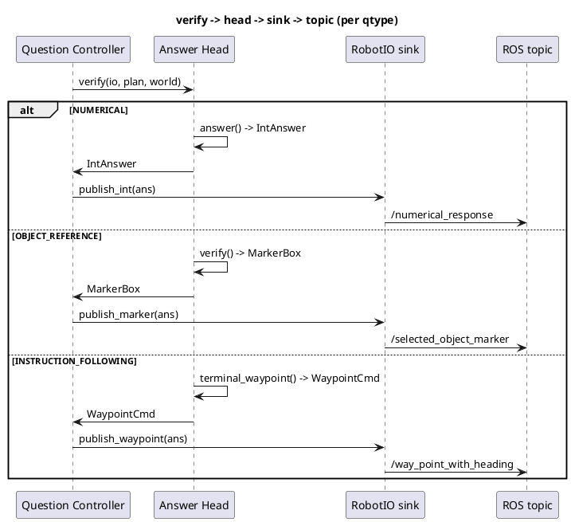

# Answer heads

How each question type accumulates evidence during
EXPLORE_EXECUTE and turns it into the one published
answer.

## ELI10

Think of three specialists riding the robot: a counter,
a pointer, and a driver. The counter tallies matching
objects and freezes its number once it stops changing.
The pointer keeps a running "best guess" box around the
object it thinks you mean and only swaps it if a checker
says it is wrong. The driver just keeps steering; wherever
it stops is the answer. A fourth character, the floor,
never sleeps: every tick it writes down a legal answer
from whatever is on the map so far, in case the specialist
never finishes in time.

## The three heads

All three are built and driven by
[factory.py](../src/core/heads/factory.py): `HeadState.bind()`
constructs exactly one qtype-specific head plus an always-on
`ExploreHead`, keyed off `plan.qtype`.

| qtype | head class | file |
|---|---|---|
| `NUMERICAL` | `NumericalHead` | [numerical.py](../src/core/heads/numerical.py) |
| `OBJECT_REFERENCE` | `ObjectRefHead` | [object_ref.py](../src/core/heads/object_ref.py) |
| `INSTRUCTION_FOLLOWING` | `InstructionHead` | [instruction.py](../src/core/heads/instruction.py) |

`ExploreHead` ([explore_step.py](../src/core/heads/explore_step.py))
is always constructed (`HeadState.bind`,
[factory.py](../src/core/heads/factory.py) around line 96); for
`INSTRUCTION_FOLLOWING` it does nothing but call
`InstructionHead.advance` (`ExploreHead.advance`,
[explore_step.py](../src/core/heads/explore_step.py) around
line 107); for the other two qtypes it drives the exploration
policy (frontier stepping, terrain/overhead-scan integration)
that feeds the map the numerical/object-reference heads read.

### NumericalHead

Reads: `plan.target` (a `TargetSpec`) against the live
`SceneIndex`, via `counting(plan.target, scene, min_obs=1,
th=thresholds)` from
[toolbox.py](../src/core/geometry/toolbox.py).

`advance(scene)` (called once per EXPLORE_EXECUTE tick,
[numerical.py](../src/core/heads/numerical.py) around line 57)
recomputes the set-cardinality count from scratch every tick
and extends a same-count run: if the new count equals the
previous tick's count, `_run_len` increments; otherwise the
run resets to length 1 at the new count. It also tracks
`contrib_min_obs`, the minimum `n_obs` across the instances
that contributed to the count.

Confident-enough-to-answer-early predicate
(`NumericalHead.signal()`,
[numerical.py](../src/core/heads/numerical.py) around line 83,
consumed by `QuestionController._early_answer_ready`,
[controller.py](../src/core/fsm/controller.py) around line
256): the head reports a `StabilitySignal` with
`winner_margin = STABLE_MARGIN` (0.30) once
`_run_len >= STABLE_TICKS` (3) consecutive equal-count ticks,
else `winner_margin = 0.0`. `min_contrib_n_obs` is always the
live `contrib_min_obs`. `StabilitySignal.stable`
([controller.py](../src/core/fsm/controller.py) around line
61) requires `winner_margin >= 0.25 AND min_contrib_n_obs >=
3`; since the head only ever emits margin 0.30 or 0.0, this
collapses to: **same count held for 3 straight ticks AND every
contributing instance has n_obs >= 3** (`STABLE_TICKS = 3`,
`MIN_OBS = 3`,
[numerical.py](../src/core/heads/numerical.py) lines 32-34).
The 3-tick run and the >=3-obs floor are two independent
gates that both have to be true on the same tick.

Final answer (`answer()`,
[numerical.py](../src/core/heads/numerical.py) around line 92):
`IntAnswer(int(self.count))`, or `IntAnswer(0)` if `advance`
never ran (no scene/plan/target).

### ObjectRefHead

Reads: `plan.target` against the live `SceneIndex` via
`resolve(plan.target, scene, thresholds)`
([toolbox.py](../src/core/geometry/toolbox.py)), which returns
a `ResolveResult` with `candidates_ranked` and a per-clause
`pass_matrix`.

`advance(scene)`
([object_ref.py](../src/core/heads/object_ref.py) around line
92) re-runs `resolve` every tick and, if any candidate
ranked, sets `best_candidate = candidates_ranked[0]` and
`best_marker = best_candidate.to_marker()`. There is no
running-count/stability tracking here: the head just keeps the
top-ranked candidate current.

Early-answer: none. `QuestionController._early_answer_ready`
([controller.py](../src/core/fsm/controller.py) around line
254) returns `False` for `OBJECT_REFERENCE` unconditionally -
the docstring says so explicitly ("no aggressive
early-finish"). The head always rides out the
`EXPLORE_BUDGET_S[OBJECT_REFERENCE] = 240.0`
([interfaces.py](../src/core/interfaces.py) around line 198)
soft budget (or forced assembly at 510 s) before VERIFY runs.

Final answer (`verify()`,
[object_ref.py](../src/core/heads/object_ref.py) around line
111): the top-ranked candidate's marker, UNLESS a verification
seam demotes it. Two seams, mutually exclusive
(`__post_init__` auto-detects a legacy 3-arg bool callable
passed as `verifier` and reroutes it to `llm_verify`):

- `verifier` (rich CP4 seam): called once with `winner`,
  `runner_up`, the winner's `pass_matrix` rows, `plan.notes`,
  and a `resolve_again` re-resolve hook. Its
  `.action` in `{"keep", "runner_up", "re_resolve"}` picks the
  final `InstanceRecord`; any exception or malformed reply
  keeps the deterministic top rank
  (`_cp4_winner`, [object_ref.py](../src/core/heads/object_ref.py)
  around line 130).
- `llm_verify` (legacy narrow seam, `(plan, summary,
  matrix) -> bool`): walks `candidates_ranked` in order and
  keeps the first candidate that returns `True`; if every
  candidate is demoted or the callable is `None`/raises, falls
  back to `candidates_ranked[0]`
  (`_verified_winner`, [object_ref.py](../src/core/heads/object_ref.py)
  around line 210).

With both seams `None` the head is fully deterministic: trust
the toolbox rank. `publish_partial(partial)`
([object_ref.py](../src/core/heads/object_ref.py) around line
103) stamps `best_candidate`/`best_marker` into
`PartialResults` every tick regardless of verify, so the floor
always has the freshest pre-verification ranking even before
VERIFY runs.

### InstructionHead

Reads: `plan.route` (a list of `RouteLeg`), each leg's
`Anchor`s resolved via `TB.resolve(...)` against the live
`SceneIndex`; `io.latest_terrain()` / `io.latest_scan()` /
`io.latest_odom()` for the occupancy grid and pose.

`advance(io, scene)`
([instruction.py](../src/core/heads/instruction.py) around
line 107) is the densest per-tick step of the three heads:
integrate terrain + overhead-clearance scan into `self.grid`,
re-ground every leg's anchors (`_ground_legs`), build the
route once all legs have geometry (`_build_route`: stamp
`plan.avoid` capsules hard into a cloned `Costmap`, `plan_through`
over it, wrap the path in a `BreadcrumbFollower`), then
`_drive`: pull the next waypoint from the follower and
`io.publish_waypoint(wp)`. On arrival within `ARRIVAL_TOL_M =
0.8` m of a leg's goal (`_mark_arrivals`,
[instruction.py](../src/core/heads/instruction.py) around line
50/305) the leg is marked confirmed and, if a CP3
`anchor_confirm` seam is wired, consulted; a `"demote"` verdict
retires the current anchor instance and re-plans the leg to
the runner-up (`_rich_confirm_leg`,
[instruction.py](../src/core/heads/instruction.py) around line
327).

A leg is "grounded" iff every one of its anchors resolved to
an `InstanceRecord` with `n_obs >= MIN_GROUND_OBS` (3,
[instruction.py](../src/core/heads/instruction.py) line 51).
`ungrounded_subgoals()`
([instruction.py](../src/core/heads/instruction.py) around
line 369) counts not-yet-grounded legs (all of them, if
grounding was never attempted).

Confident-enough-to-answer-early: **never**.
`_early_answer_ready`
([controller.py](../src/core/fsm/controller.py) around line
258-260) hard-codes `False` for `INSTRUCTION_FOLLOWING` with
the comment "only the budget/forced path ends IF; never bank
early with a gap" - `ungrounded_subgoals` is read into
`WorldView` every tick (via the factory's `_assemble_worldview`,
[factory.py](../src/core/heads/factory.py) around line 217) but
the gate does not consult it at all; it is unconditionally
`False`. The IF answer only fires from the soft
`EXPLORE_BUDGET_S[INSTRUCTION_FOLLOWING] = 270.0` s crossing,
`forced_assembly` at 510 s, or the 570 s watchdog.

Final answer (`terminal_waypoint()`,
[instruction.py](../src/core/heads/instruction.py) around line
391): `WaypointCmd` at `self._terminal_xy` (the last point of
the planned/recovered path), or the last waypoint actually
published (`_last_wp`) if the route was never built. If the
full route is unreachable through the hard avoid-capsules,
`_recover_path` ([instruction.py](../src/core/heads/instruction.py)
around line 234) BFS-finds the nearest costmap-reachable point
to the terminal goal and A*-plans to it (never a raw,
capsule-violating straight segment) - the terminal waypoint
then is that recovered point, not the original goal.

## Submission path per question type

`_final_answer(state)`
([factory.py](../src/core/heads/factory.py) around line 191)
is what `verify` returns to the FSM:

```
NUMERICAL             -> NumericalHead.answer()        -> IntAnswer
OBJECT_REFERENCE       -> ObjectRefHead.verify()         -> MarkerBox | None
INSTRUCTION_FOLLOWING  -> InstructionHead.terminal_waypoint() -> WaypointCmd | None
```

`QuestionController._tick_answer`
([controller.py](../src/core/fsm/controller.py) around line
225) hands whatever `verify` produced (or, if `None`, the
floor) to `_publish`, which calls module-level `_dispatch(io,
ans)` ([controller.py](../src/core/fsm/controller.py) around
line 340). Dispatch is a plain `isinstance` switch on the
answer object, independent of `plan.qtype`:

```
IntAnswer    -> io.publish_int(ans)      -> /numerical_response (Int32)
MarkerBox    -> io.publish_marker(ans)   -> /selected_object_marker (Marker CUBE)
WaypointCmd  -> io.publish_waypoint(ans) -> /way_point_with_heading
```

Topic names and payload shapes are the frozen contracts in
[interfaces.py](../src/core/interfaces.py) (`WaypointCmd`
around line 77, `MarkerBox` around line 88, `IntAnswer` around
line 104); `RobotIO` (around line 157) is the seam both the
mock/replay runtimes and the ROS adapter implement.

**Object-reference final dispatch publishes a marker, never a
navigation waypoint.** `ObjectRefHead.verify()` returns a
`MarkerBox`; `_dispatch` routes `MarkerBox` only to
`io.publish_marker`, and `_dispatch` has no branch that also
calls `publish_waypoint` for a `MarkerBox`. The `MarkerBox`
docstring notes its center "additionally serves as a nav goal"
([interfaces.py](../src/core/interfaces.py) around line 91) -
that is a downstream/scoring-side fact about how the challenge
harness uses the marker, not something the FSM code publishes
separately as a waypoint.



## Publication latching

`QuestionController._answer_published`
([controller.py](../src/core/fsm/controller.py) around line
123) starts `False` and the `_publish` method
(around line 263) only sets it `True` after `_dispatch`
returns `True` - i.e. after an answer object actually reached
a `RobotIO` sink. Every subsequent `_publish` call for that
question is a no-op logged as `publish_suppressed`
(around line 272).

The critical property: **`_dispatch` returning `False` for an
unrecognized type does not set the latch.** If `verify` returns
something that is not an `IntAnswer`/`MarkerBox`/`WaypointCmd`
(a dict, tuple, numpy scalar, or any other object -
`test_verify_undispatchable_type_still_publishes_exactly_one_floor`,
[test_controller.py](../src/tests/fsm/test_controller.py)
around line 370, parametrizes exactly these cases), `_publish`
logs `publish_dropped` and returns without latching. `_tick_answer`
then checks `if not self._answer_published:` (around line 231)
and, seeing the latch still open, discards the poisoned
`_pending_answer`, fetches `self.floors.get(self.qtype)`, and
publishes that instead. So a malformed head output can delay
publication by at most one state transition but cannot cause a
silent answer-less DONE, and cannot block the 570 s watchdog
either: `_watchdog_publish`
([controller.py](../src/core/fsm/controller.py) around line
283) always calls `self.floors.get(self.qtype)`, a floor
answer, never the head's own output, so it can't inherit a
malformed value.

## Degraded answers (floors)

[floors.py](../src/core/fsm/floors.py)'s `FloorAnswers.update()`
recomputes all three per-qtype floors every tick from whatever
`WorldView.partial` (a `PartialResults`) and the live
`SceneIndex` currently hold, wrapped in a blanket
try/except so it "never raises" even on a `None` plan or an
empty scene (`update`,
[floors.py](../src/core/fsm/floors.py) around line 117). Timing
of *when* the floor gets published (510 s forced assembly, 570
s watchdog) is [03-time-budgeting.md](03-time-budgeting.md);
this section is only what value the floor computes.

**Numerical** (`_numerical`,
[floors.py](../src/core/fsm/floors.py) around line 143):
`PartialResults.count` if the head has stamped one, else
`len(scene.by_label(target_noun))` if any match, else
`IntAnswer(MODAL_COUNT)` where `MODAL_COUNT = 2`
([floors.py](../src/core/fsm/floors.py) line 31), documented
as "most-common integer answer in the training distribution."

**Object-reference** (`_object_reference`,
[floors.py](../src/core/fsm/floors.py) around line 153), a
5-step cascade: (1) `partial.best_marker` (an explicit
override, e.g. a verified winner); (2)
`partial.best_candidate.to_marker()` (the ranking head's
current top pick, pre-verification); (3) the largest-volume
instance matching the target noun; (4) the largest-volume
instance in the scene at all; (5) a `1x1x1` `MarkerBox` (`_UNIT
= 1.0`, [floors.py](../src/core/fsm/floors.py) line 33) at the
centroid of the most-observed instance, or the origin if the
scene is empty.

**Instruction-following** (`_instruction_following`,
[floors.py](../src/core/fsm/floors.py) around line 180), a
3-step cascade: (1) `partial.first_anchor_pt` (the IF head's
best-grounded first-leg goal); (2) the mean centroid of every
instance in the scene; (3) `WaypointCmd(0.0, 0.0)`, the origin,
as the last-resort "never silence" answer.

`ObjectRefHead.publish_partial` and
`InstructionHead.first_anchor_pt`/`ungrounded_subgoals` are the
only head methods that feed the floor cascade directly; the
numerical floor's step (1) is fed by
`NumericalHead.count` via `_assemble_worldview`
([factory.py](../src/core/heads/factory.py) around line 211).
The floor computation is fully independent of the head's
`verify()`/`answer()` methods - it degrades gracefully even if
those never ran (e.g. a dark parse that never latched a plan).

## Head selection: factory vs controller

Two independent qtype resolutions exist in the running
system, and they are not the same value:

1. **`QuestionController.qtype`** - set once at question
   intake by the module-level heuristic `_infer_qtype(q)`
   ([controller.py](../src/core/fsm/controller.py) around line
   324), a regex match over the raw question text (numerical
   phrases/`\bcount\b`, then instruction verbs, defaulting to
   `OBJECT_REFERENCE`). It is latched into
   `self.qtype` at `_intake` (around line 149) and **never
   reassigned after parsing** - `grep` over
   [controller.py](../src/core/fsm/controller.py) and
   [budget.py](../src/core/fsm/budget.py) shows no second
   assignment to `self.qtype` or `BudgetState.qtype` anywhere.
   This value drives `BudgetState`'s per-type explore budget
   (`past_explore_budget(self.qtype)`, around line 213), the
   early-answer gate (`_early_answer_ready`, around line 249),
   and every `self.floors.get(self.qtype)` lookup (around
   lines 228, 235, 284) - including the watchdog floor.

2. **`plan.qtype`** - set by the injected `parse` callable's
   `Plan` output (checkpoint 1). `HeadState.bind(plan)`
   ([factory.py](../src/core/heads/factory.py) around line 77)
   reads `plan.qtype`, not `ctrl.qtype`, to decide which of
   `NumericalHead`/`ObjectRefHead`/`InstructionHead` to
   construct, and `_final_answer`/`_advance_heads` branch on
   `state.plan.qtype` throughout.

**What this means when they disagree:** if the regex heuristic
and the parser land on different qtypes for the same question
(possible in principle - the heuristic is a cheap pre-parse
guess), the head built and driven all through EXPLORE_EXECUTE
matches `plan.qtype`, but the explore-budget clock, the
early-answer gate, and the floor selected on every
`self.floors.get(self.qtype)` call still key off the earlier
heuristic guess. `_dispatch` in the controller is saved by
being type-based (`isinstance`) rather than qtype-based, so a
correctly-typed head answer still reaches the right topic even
under this mismatch; the divergence risk is confined to (a) an
IF/numerical/object-reference budget or early-answer gate that
was tuned for the wrong qtype, and (b) a floor answer, if verify
produces nothing, of the heuristic's qtype rather than the
parsed one. In practice the heuristic is pinned against all 75
upstream training questions
(`test_infer_qtype_matches_upstream_ground_truth`,
[test_infer_qtype_upstream.py](../src/tests/fsm/test_infer_qtype_upstream.py)),
so this divergence has not been observed on the training set -
but the code has no assertion or reconciliation step tying
`ctrl.qtype` to `plan.qtype` once parse lands, so it remains a
structural gap. See [09-gaps-and-risks.md](09-gaps-and-risks.md)
for the risk register.

## Worked example

From `LOG.md`, session 8 finale (2026-07-11), a real-data run
against a hand-labeled CMU-student-lounge fixture (`data/fixtures/jingfan_labels.json`,
29 detections across 2 keyframes, fused into 9 tracked
instances):

- **"How many white stools are in the room?"** -> `2`. 5
  labeled detections fused to 3 instances (~300 lidar points
  each), 2 adjacent detections merged at IoU > 0.3, 2 more
  rejected under the min-points gate - `NumericalHead.answer()`
  returned `IntAnswer(2)` via the real (non-floor) path
  (`floor_used=False`).
- **"Find the folding chair closest to the yellow door."** ->
  `MarkerBox(2.74, 1.27, 'chair')`. `ObjectRefHead.verify()`
  ranked candidates by the `toolbox.resolve` superlative-distance
  clause and published the winner's trimmed-AABB marker, again
  via the real head path, `floor_used=False`.

Both answers went through the head -> `_final_answer` ->
`_dispatch` -> `RobotIO` path described above, not the floor
cascade - confirming the full chain (panorama -> detections ->
fusion -> instance map -> toolbox -> head -> published answer)
on real sensor data, not mocks.

## References

- [src/core/heads/factory.py](../src/core/heads/factory.py) -
  `HeadState`, `build_callables`, `_advance_heads`,
  `_final_answer`, `_assemble_worldview`
- [src/core/heads/numerical.py](../src/core/heads/numerical.py) -
  `NumericalHead`, `STABLE_TICKS`, `MIN_OBS`, `STABLE_MARGIN`
- [src/core/heads/object_ref.py](../src/core/heads/object_ref.py) -
  `ObjectRefHead`, CP4 `verifier`/`llm_verify` seams
- [src/core/heads/instruction.py](../src/core/heads/instruction.py) -
  `InstructionHead`, `MIN_GROUND_OBS`, `ARRIVAL_TOL_M`, CP3
  `anchor_confirm` seam
- [src/core/heads/explore_step.py](../src/core/heads/explore_step.py) -
  `ExploreHead` (delegates to `InstructionHead` for IF)
- [src/core/fsm/controller.py](../src/core/fsm/controller.py) -
  `QuestionController._publish`, `_dispatch`,
  `_early_answer_ready`, `_infer_qtype`
- [src/core/fsm/floors.py](../src/core/fsm/floors.py) -
  `FloorAnswers`, `PartialResults`, `MODAL_COUNT`
- [src/core/interfaces.py](../src/core/interfaces.py) -
  `IntAnswer`, `MarkerBox`, `WaypointCmd`, `RobotIO`
- [src/tests/fsm/test_controller.py](../src/tests/fsm/test_controller.py) -
  publish-once latching, undispatchable-type recovery
- [src/tests/heads/test_numerical.py](../src/tests/heads/test_numerical.py),
  [test_object_ref_cp4.py](../src/tests/heads/test_object_ref_cp4.py),
  [test_instruction_recovery.py](../src/tests/heads/test_instruction_recovery.py) -
  per-head behavior tests
- `LOG.md`, session 8 finale (2026-07-11) - the folding-chair /
  white-stools worked example
- [02-core-loop.md](02-core-loop.md) - the FSM states this
  section's `_tick_verify`/`_tick_answer` live in
- [03-time-budgeting.md](03-time-budgeting.md) - when floors
  and watchdog fire (the timing side of this file's "degraded
  answers")
- [05-perception.md](05-perception.md) - how the `SceneIndex`
  instances the heads read get built
