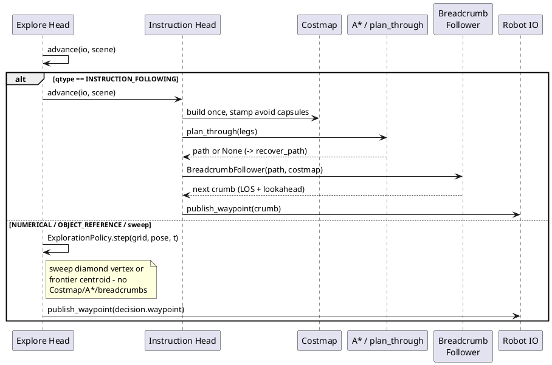

# Navigation and exploration

The deterministic geometry, occupancy grid, costmap/A*, and
frontier-exploration stack that grounds spatial language and
drives the vehicle.

## ELI10

Picture a robot with a notepad grid of the floor: each square
is "empty," "blocked," or "not looked at yet." A ruler-and-
protractor toolbox answers questions like "is the mug near the
table?" by measuring boxes. A pathfinder draws a route through
empty squares, and a waypoint-caller reads that route aloud one
short step at a time so the robot doesn't get lost. But only
one of the two robot behaviors - following an instruction -
actually uses the pathfinder. The other - exploring to find
things - just walks toward the nearest interesting unknown
square in a straight line and trusts the base stack not to hit
anything solid on the way.

## Geometry toolbox

[src/core/geometry/toolbox.py](../src/core/geometry/toolbox.py)
implements deterministic predicates over `InstanceRecord` AABBs
(map frame, metres). Every predicate returns a `PredResult`
(bool + graded score + signed margin + explanation string) built
on primitives in
[src/core/geometry/primitives.py](../src/core/geometry/primitives.py)
(`footprint_overlap_area`, `aabb_gap`, `point_to_segment_2d`,
`segments_intersect_2d`, `aabb_face_points_2d`).

Relation thresholds, all fields of the `Thresholds` dataclass
(`toolbox.py` around line 33), default `DEFAULT_THRESHOLDS`:

| Constant | Value | Used by |
|---|---|---|
| `near_floor` | 1.2 m | `near`: floor of `near_thresh = max(near_floor, near_scale * footprint_diag(b))` |
| `near_scale` | 0.6 | `near`: slope term above |
| `next_to_gap` | 0.75 m | `next_to`: max AABB gap counted as adjacent |
| `on_vert_tol` | 0.15 m | `on`: `a.bottom` vs `b.top` tolerance |
| `on_min_overlap_frac` | 0.30 | `on`: min footprint-overlap fraction |
| `in_containment_frac` | 0.60 | `in_`: min footprint fraction of `a` inside `b` |
| `in_vert_slack` | 0.10 m | `in_`: z-span slack |
| `above_gap_max` | 3.0 m | declared on `Thresholds`, **not read** by `above`/`under` (grep confirms no reference in either function body) |
| `with_feature_pad` | 0.30 m | `with_feature`: possession-test pad |
| `avoid_inflate` | 0.25 m | `avoid_capsule`: capsule/disc inflation |
| `superlative_margin_frac` | 0.25 | early-answer winner-margin gate (read by the answer path, not this module) |

Predicates implemented: `on`, `in_`, `near`, `next_to`,
`between` (capsule around the b1-b2 centroid segment, radius =
max anchor half-width), `above`, `under` (footprint overlap +
strict vertical gap, no contact required), `with_feature`
(possession). Superlative ranking: `closest_to` /
`farthest_from` via `_rank`, tie-broken deterministically on
`instance_id`, returning a `Ranked` with `margin` and
`margin_frac` (winner vs runner-up gap). `counting` is
set-cardinality over `resolve()` survivors filtered by
`n_obs >= min_obs`.

`resolve(target, index, th)` runs the fallback ladder used by
every answer head: hard-filter by noun + attributes, AND over
non-superlative clauses, then on empty results: (1)
`relax_attributes`, (2) `drop_relation` (drop the least-
selective clause, one at a time, while >= 2 remain), (3)
`category_only` (all instances of the noun). Every relaxation
is appended to a `Relaxation` audit trail. Negated clauses flip
via `_apply_negation` (passed/score/margin all inverted).

Corridor/avoid geometry:

- `corridor_gate(b1, b2)` builds a `Gate` from the two anchors'
  closest AABB faces (`aabb_face_points_2d`); `midpoint` is the
  mandatory via-point, `width` the gate length.
- `threading_check(trajectory, gate)` requires a proper segment
  crossing of the gate line, not proximity to its midpoint.
- `avoid_capsule(spec, index, th)` builds a `Capsule`: a stadium
  along the between-anchors' centroid segment (radius = max
  anchor half-width + `avoid_inflate` = 0.25 m) for
  `AvoidSpec.between`, or a disc of radius
  `near_thresh(anchor) + avoid_inflate` for `AvoidSpec.near`.
  Raises `ValueError` if anchors are unresolved or the spec sets
  both/neither of `between`/`near`.
- `capsule_violated(trajectory, capsule)` samples trajectory
  vertices plus 3 interior points per edge (`s in (0.25, 0.5,
  0.75)`) against the capsule radius.

`AvoidSpec` only exists on instruction-following plans
(`plan_schema.py` line 6: "penalty-scored `avoid` in
instruction-following"); see "Which motion path" below for what
that means for NUMERICAL/OBJECT_REFERENCE questions.

## Occupancy grid

[src/core/nav/occupancy.py](../src/core/nav/occupancy.py):
`OccupancyGrid` is a lazily-growing world-frame array fed by
`/terrain_map(_ext)` XYZI patches. Cell resolution `CELL_M =
0.10` m. Per cell it keeps the max terrain intensity ever seen
(`integrate_patch`, around line 173) and classifies
`intensity < FREE_MAX (0.15) -> FREE`, else `OBSTACLE` (states
`UNKNOWN=0, FREE=1, OBSTACLE=2`). Growth pads by
`GROW_PAD_CELLS = 8` and shifts `origin_x/origin_y` so cell
centres stay on a stable world lattice. `mark_pose(x, y)` carves
the vehicle's own cell FREE unconditionally and flags every cell
within `OBSERVE_RADIUS_M = 8.0` m as `observed` (the mask
frontier detection treats as "seen," distinct from `FREE`).

### Overhead-clearance layer

The base autonomy stack's `terrainAnalysis.cpp` filters
`/registered_scan` to a thin slab before publishing
`/terrain_map`: `maxRelZ = 0.2` m above the vehicle
(`terrainAnalysis.cpp:57,60,61`, per
[docs/upstream_notes.md](../docs/upstream_notes.md) around line
154; the slab-filter check itself is verified at
`terrainAnalysis.cpp:172` per the session-9 LOG entry below).
Anything above that slab - a bar-height tabletop, a shelf, a
stool seat, roughly 0.25-1.2 m off the floor - never reaches
`/terrain_map`, so the cells directly under it read `FREE`: the
base stack thinks the space under a table is open floor.

`integrate_scan_overhead` re-reads the raw, unfiltered
`/registered_scan` and flags cells separately. For each scan
point, height above local ground is `zs - ground_z`, where
`ground_z` is the terrain-derived minimum z seen in that cell
(a running min across patches, `occupancy.py` around line 194),
or the fallback `vehicle_z - vehicle_sensor_height` (0.60 m)
when no terrain point has landed there yet - so an overhang over
still-`UNKNOWN` floor is caught before the floor itself is ever
classified. A cell is flagged `OVERHEAD` when
`overhead_min (0.25 m) <= height <= overhead_max (1.20 m)` for
at least `min_points_per_cell = 3` points (noise reject). These
are the `OverheadConfig` fields (`occupancy.py` around line 39),
kept as a boolean layer separate from `state` so terrain-derived
FREE/OBSTACLE classification stays pure.

Per-tick wiring (`integrate_scan_overhead_decimated`) clips scan
points to the grid's current world bounds (an overhang far
outside the mapped area is skipped rather than growing the grid)
and strides down to `OVERHEAD_SCAN_MAX_PTS = 12000` points,
deterministically.

`Costmap` treats `overhead`-flagged cells as obstacles and
inflates them the same as terrain `OBSTACLE`, unless constructed
with `allow_overhead=True` (an explicit opt-out that restores
terrain-only behaviour; see `costmap.py` around line 46).

**Real-data validation** (jingfan fixtures, 40 keyframes,
[src/tests/nav/test_overhead.py](../src/tests/nav/test_overhead.py)
`test_real_data_overhead_flags_more_than_terrain_alone`):
overhead flagging caught cells the terrain analysis had called
`FREE` floor under actual tabletops. Per the session-9 LOG
entry: "73 cells of terrain-FREE floor under actual tabletops
now blocked (+10.1 m^2 total)." The test asserts three
non-trivial facts on real data, not just synthetic fixtures:
`n_overhead > 0`, `delta > 0` (costmap-blocked area strictly
grows with the layer enabled), and `over_free > 0` (some of that
growth is specifically over floor the terrain state called
`FREE`) - the failure mode the layer exists to close.

## Costmap + A*

[src/core/nav/costmap.py](../src/core/nav/costmap.py):
`Costmap` is a per-question snapshot over an `OccupancyGrid` -
stamping never mutates the shared grid. `base_blocked` =
terrain `OBSTACLE` (+ `overhead` unless `allow_overhead`)
dilated by a disc of `VEHICLE_RADIUS_M = 0.4` m
(`r_cells = ceil(radius_m / cell_m)`). `capsule_blocked` starts
empty and only grows: `stamp_capsule(seg, radius_m)` marks every
cell within `radius_m + vehicle_radius_m` of a segment as
hard-blocked, cumulative and never relaxed for the life of the
question (a goal made unreachable by a capsule stays
unreachable - relaxing it would reintroduce the violation it
exists to prevent). `UNKNOWN` cells are tracked separately and
stay traversable; only `passable = not blocked` gates A*, so
unexplored space is a *cost*, not a wall.

`nearest_reachable_point(goal, start)` is the recovery path when
capsules make the literal goal unreachable: BFS over passable
cells from `start`, returns the reachable cell closest
(Euclidean) to `goal`.

[src/core/nav/planner.py](../src/core/nav/planner.py): `astar`
is 8-connected (orthogonal cost 1, diagonal `sqrt(2)`, octile
heuristic). `UNKNOWN` cells cost `UNKNOWN_COST_MULT = 3.0x` a
`FREE` cell; hard-blocked cells are impassable. `plan_through`
executes an ordered leg list - `goto` / `via_near` (plain A* to
a point) and `corridor_between` (must physically cross a gate
segment): it first plans to the gate midpoint, checks
`path_crosses_gate`, and if the direct plan missed the gap,
replans on a local "pinch" overlay (`_pinch_costmap`) that
blocks everything within `PINCH_DISC_M = 3.0` m of the gate
outside a `PINCH_CORRIDOR_HALF_W_M = 0.5` m-wide corridor around
it, forcing A* through the opening.

**When planning runs:** `astar`/`plan_through` are called
exactly twice in the live composition path, both from
`InstructionHead._build_route`
([src/core/heads/instruction.py](../src/core/heads/instruction.py)
around line 208) - once for the happy-path route
(`plan_through`), and once for the recovery path when that
returns `None` (`InstructionHead._recover_path` calls `astar`
directly against `nearest_reachable_point`, never a raw
straight segment, so the recovery leg is still capsule-
validated). `_build_route` runs once per question: it is gated
on `self._follower is None`, so replanning does not happen every
tick, only on the tick where all leg geometries first become
groundable (and once more if `CP3` demotes an anchor and clears
the follower - see below).

## Frontier exploration

[src/core/nav/frontiers.py](../src/core/nav/frontiers.py):
`frontier_mask` marks `FREE` cells 4-adjacent to an `UNKNOWN`
cell (grid-array edges count as bordering `UNKNOWN` too).
`_cluster` groups the mask 8-connected; clusters smaller than
`MIN_CLUSTER_SIZE = 5` cells are discarded as noise. Each
surviving cluster's centroid is snapped to its nearest actual
member cell, then scored:

```
score = W_SIZE * size
      - W_DIST * path_distance
      + W_AFFINITY * affinity(xy)
```

with `W_SIZE = 1.0`, `W_DIST = 0.5`, `W_AFFINITY = 4.0`.
`path_distance` is an 8-connected BFS over `FREE` cells from the
vehicle position (`_bfs_distances`, grid-cell units) - a cheap
geometric proxy, explicitly not A*: "exact planning uses A* on
the costmap, not this" (`frontiers.py` line 96). `affinity` is
an injected `(x, y) -> float` hook; the default
(`uniform_affinity`) returns 0, i.e. purely geometric scoring
unless a caller supplies a semantic bias.

[src/core/nav/exploration.py](../src/core/nav/exploration.py):
`ExplorationPolicy.step` is the per-tick decision:

1. **Opening sweep**, first `SWEEP_S = 60.0` s. In-place rotation
   is impossible this year (heading on `/way_point_with_heading`
   is ignored), so the policy instead drives a 4-point diamond
   of side `SWEEP_SIDE_M = 1.0` m around the start pose
   (vertices at `+/-0.5` m along x and y from `start_xy`) - the
   short loop exposes the panorama from four headings and seeds
   the occupancy grid from every yaw. The policy advances to the
   next diamond vertex once within a hardcoded `tol = 0.4` m of
   the current one (`_near`, `exploration.py` line 108 - a
   literal, not a named/tunable constant, so it does not appear
   in `docs/calibration.md`'s inventory). A `budget_state`
   dict's `force_frontier` key can cut the sweep short under
   clock pressure.
2. **Frontier pursuit** thereafter: the first `detect_frontiers`
   result (already sorted best-first) whose `score >=
   MIN_FRONTIER_SCORE (0.0)` becomes the next waypoint.
3. **Complete**: no frontier clears the bar ->
   `ExplorationStatus.COMPLETE`. `COVERAGE_SATURATED_FREE_FRAC =
   0.0` is declared but unused (`docs/calibration.md`: "reserved
   / unused" - frontier absence is the actual completion gate).

## Breadcrumb emission

[src/core/nav/breadcrumbs.py](../src/core/nav/breadcrumbs.py):
`BreadcrumbFollower` turns a planned path into a stream of
near-vehicle `WaypointCmd`s, because a distant waypoint can
strand the vehicle at a dead end. `advance(pose, t)` is called
by the FSM at 5 Hz. `_select_crumb` picks the *farthest* path
point that is both `<= LOOKAHEAD_M (2.5 m)` ahead of the pose
and in clear line-of-sight (`line_of_sight`, a Bresenham raster
over the costmap's own blocked mask - conservatively `blocked`
for any cell outside the mask's snapshotted shape, since the
grid can grow after the costmap snapshot was taken). The
follower advances its progress index to the next crumb once the
vehicle is within `REACH_M (0.8 m)` of it, or has provably
overshot it, or the `/way_point_reached`-equivalent signal
fires.

Stall detection: if the pose moves less than `STALL_MOVE_M (0.3
m)` over the trailing `STALL_WINDOW_S (10.0 s)` window,
`replan_flag` is set. **This flag is set but never read
anywhere else in the codebase** - a grep for `replan_flag`
outside `breadcrumbs.py` returns nothing. The FSM does not poll
it and no head consumes it: a stalled instruction-following
drive currently has no automatic recompute, despite the
docstring's stated intent ("we raise a replan flag so the FSM
can recompute").

## Which motion path routes through A*

Only one of the two live motion paths ever touches
`Costmap`/`astar`/`plan_through`/`BreadcrumbFollower`.

**Instruction-following** (`QType.INSTRUCTION_FOLLOWING`):
`ExploreHead.advance` (`explore_step.py` line 107) detects the
qtype and delegates entirely to
`InstructionHead.advance(io, scene)`. That head builds a
`Costmap` once (`_build_route`), stamps every `AvoidSpec`
capsule into it (`_stamp_avoids`, hard, never relaxed), plans
with `plan_through`/`astar`, and drives through a
`BreadcrumbFollower`. Avoid capsules and inflation therefore
only ever apply to instruction-following legs - `AvoidSpec`
does not exist on any other plan type.

**Everything else** (`NUMERICAL`, `OBJECT_REFERENCE`, and any
non-IF question during exploration): `ExploreHead._explore`
calls `self._policy.step(...)` and then publishes
`decision.waypoint` **directly** -
`io.publish_waypoint(decision.waypoint)` at `explore_step.py`
line 148 - with no `Costmap`, no `astar`, no
`BreadcrumbFollower` in between. The waypoint is either a raw
sweep-diamond vertex or a raw frontier-cluster centroid in map
frame. The same is true of the two seam-driven overrides in this
path: the CP2 miss-recovery provisional target
(`self.provisional_xy`, line 140) and the CP5 frontier-selector
choice (`_maybe_cp5_frontier`, line 151) are both published the
same direct way. The occupancy grid's `FREE` classification
means a frontier centroid sits on floor the terrain stack has
seen, and `frontiers.py`'s BFS `path_distance` is a reachability
proxy, but no vehicle-radius inflation, no hard-avoid capsule,
and no A*-validated path is applied before the waypoint is
handed to the base stack's own waypoint follower. There is no
`AvoidSpec` mechanism for exploration questions in the first
place, so this gap is about obstacle inflation and overhead
clearance, not about a missing avoid feature.



## Design rationale

Avoid capsules are IF-only and never relax because the spec
treats a capsule violation as a hard constraint, not a soft
penalty (`costmap.py` line 5: "a capsule NEVER shrinks or
relaxes... instead `nearest_reachable_point(goal)` returns the
least-bad legal cell"). Exploration bypassing A* is not
documented as a deliberate trade-off anywhere in the source; it
follows from `ExploreHead._explore` simply never constructing a
`Costmap`. Treat it as an implementation gap (tracked further in
[09-gaps-and-risks.md](09-gaps-and-risks.md)), not an intended
design choice.

## References

- [src/core/geometry/toolbox.py](../src/core/geometry/toolbox.py) -
  predicates, thresholds, `resolve`, avoid/corridor geometry
- [src/core/geometry/primitives.py](../src/core/geometry/primitives.py) -
  AABB/segment primitives
- [src/core/nav/occupancy.py](../src/core/nav/occupancy.py) -
  `OccupancyGrid`, `OverheadConfig`, overhead-clearance layer
- [src/core/nav/costmap.py](../src/core/nav/costmap.py) -
  `Costmap`, inflation, capsule stamps, recovery
- [src/core/nav/planner.py](../src/core/nav/planner.py) -
  `astar`, `plan_through`, gate threading, pinch corridor
- [src/core/nav/frontiers.py](../src/core/nav/frontiers.py) -
  frontier extraction and scoring
- [src/core/nav/exploration.py](../src/core/nav/exploration.py) -
  `ExplorationPolicy`, sweep, frontier-pursuit gate
- [src/core/nav/breadcrumbs.py](../src/core/nav/breadcrumbs.py) -
  `BreadcrumbFollower`, line-of-sight crumb selection, stall
  detection
- [src/core/heads/instruction.py](../src/core/heads/instruction.py) -
  the only caller of `Costmap`/`astar`/`plan_through` in the
  live composition path
- [src/core/heads/explore_step.py](../src/core/heads/explore_step.py) -
  the raw-waypoint exploration path; CP2/CP5 seams
- [src/tests/nav/test_overhead.py](../src/tests/nav/test_overhead.py) -
  overhead-clearance unit and real-data validation tests
- [docs/calibration.md](../docs/calibration.md) - full tunable
  inventory and wiring status for every constant above
- [docs/upstream_notes.md](../docs/upstream_notes.md) - upstream
  `terrainAnalysis.cpp` gotchas (`maxRelZ`, waypoint lookahead)
- [02-core-loop.md](02-core-loop.md) - the FSM tick that calls
  `ExploreHead.advance` / `InstructionHead.advance`
- [06-answer-heads.md](06-answer-heads.md) - how `resolve()` and
  `counting()` feed the per-type answer heads
