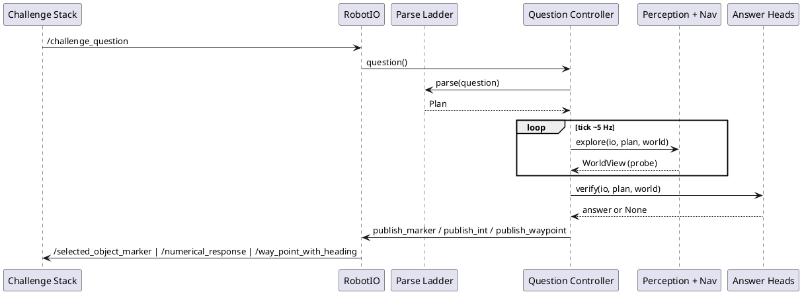

# ai_module architecture

This folder documents the CURRENT implemented system under
[src/core/](../src/core/) and
[src/ros_adapter/](../src/ros_adapter/).
[docs/architecture.md](../docs/architecture.md) is the 10 Jul
2026 design/debate record (three proposals + adjudication
table); this folder tracks what is actually built and tested,
and will diverge from that record as implementation proceeds -
see [09-gaps-and-risks.md](09-gaps-and-risks.md) for the known
gaps between the two.

## ELI10

A robot is dropped into a building it has never seen and gets
one question, once, like "how many red chairs are in the
room?". It has 10 minutes. It has to look around with a camera
and a laser scanner, keep a running list of the objects it has
spotted, decide for itself when it has looked enough, and then
either say a number, draw a box around an object, or drive a
specific path. If the clock runs out before it is sure, it must
still say *something* rather than stay silent.

## How it runs

The core is pure Python with no ROS imports
([src/README.md](../src/README.md)); an external driver calls
`QuestionController.tick(io)` at roughly 5 Hz
([src/core/fsm/controller.py](../src/core/fsm/controller.py)
around line 95), and every sensor read or actuation goes
through the `RobotIO` protocol
([src/core/interfaces.py](../src/core/interfaces.py) around
line 157) - the one seam that lets the same FSM run against
`MockRobotIO`, bag replay, or the drafted (Ubuntu-only, not yet
executed) `ros_adapter` node
([src/ros_adapter/adapter_node.py](../src/ros_adapter/adapter_node.py))
without touching core logic. LLM/VLM calls enter at exactly two
kinds of edge: the parse ladder's API tier turning question
text into a typed `Plan`
([src/core/plan_schema.py](../src/core/plan_schema.py)), and
four timeout-guarded checkpoints (CP2 miss-recovery, CP3
anchor-confirm, CP4 verification, CP5 frontier-select) capped
by a `CallLedger`
([src/core/fsm/budget.py](../src/core/fsm/budget.py) around
line 116). By default both fall back to deterministic tiers
(regex parse, no checkpoint call) unless `VLA_LLM_<SLOT>_*` env
vars are set
([src/core/llm/config.py](../src/core/llm/config.py) around
line 25) and a caller passes `chat_fns` into the runner
([src/core/runner/single.py](../src/core/runner/single.py)
around line 256) - nothing in the live composition path wires
a real provider in automatically. Every other tick is
deterministic geometry, tracking, and FSM code.

## Overview

## Reading order

| # | Doc | Hook |
|---|-----|------|
| 01 | [01-context-and-contracts.md](01-context-and-contracts.md) | The six allowed topics and the frozen dataclasses that stand in for them. |
| 02 | [02-core-loop.md](02-core-loop.md) (core loop) | One tick of `QuestionController.tick()`, state by state. |
| 03 | [03-time-budgeting.md](03-time-budgeting.md) (core loop) | Where the 600 s clock lives and what fires at T-90 and T-30. |
| 04 | [04-parsing-and-checkpoints.md](04-parsing-and-checkpoints.md) (core loop) | How a question string becomes a typed `Plan`, and the only two places an LLM gets to speak. |
| 05 | [05-perception.md](05-perception.md) (core loop) | How a 2D detection becomes a 3D instance with a confidence-bearing observation count. |
| 06 | [06-answer-heads.md](06-answer-heads.md) (core loop) | What each head actually publishes, and what the floor publishes if it can't. |
| 07 | [07-navigation-and-exploration.md](07-navigation-and-exploration.md) | The occupancy grid, A*, frontier scoring, and the overhead-clearance layer that stock terrain analysis misses. |
| 08 | [08-runtimes-testing-deployment.md](08-runtimes-testing-deployment.md) (condensed) | Which `RobotIO` the code runs against on which machine, and how the ground-truth battery scores it. |
| 09 | [09-gaps-and-risks.md](09-gaps-and-risks.md) | What exists but is not wired into the live path yet, and where the design doc and the code have diverged. |

Docs 02-06 are the core loop: read them in order for the
question-in-to-answer-out path. 01, 07-09 are supporting
context you can read in any order.

## Glossary

- **Frontier** - a cluster of FREE cells adjacent to UNKNOWN
  cells, scored and ranked as an exploration target
  ([src/core/nav/frontiers.py](../src/core/nav/frontiers.py)).
- **Instance map** - the fused set of tracked 3D objects
  (`InstanceRecord`) that heads query through `SceneIndex`
  ([src/core/interfaces.py](../src/core/interfaces.py) around
  line 113).
- **Floor answer** - the always-computable degraded answer per
  qtype, recomputed every tick from whatever the map currently
  holds and published unconditionally once the watchdog fires
  ([src/core/fsm/floors.py](../src/core/fsm/floors.py)).
- **Checkpoint** - one of four bounded, timeout-guarded LLM/VLM
  calls (CP2-CP5) injected into a head's callable set
  ([src/core/checkpoints/__init__.py](../src/core/checkpoints/__init__.py)).
- **Breadcrumb** - the single near-vehicle `WaypointCmd` emitted
  from a planned path each tick, capped by `LOOKAHEAD_M` so the
  vehicle is never sent farther than it can see
  ([src/core/nav/breadcrumbs.py](../src/core/nav/breadcrumbs.py)).
- **Head** - the per-qtype `{parse, explore, verify, probe}`
  callable set that `QuestionController` drives
  ([src/core/heads/factory.py](../src/core/heads/factory.py)).
- **Plan DSL** - the typed, JSON-(de)serialisable `Plan` the
  parse ladder produces from question text
  ([src/core/plan_schema.py](../src/core/plan_schema.py)).
- **Keyframe** - one distinct camera observation counted toward
  an instance's `n_obs`; an instance needs `n_obs >= 3` before a
  confident answer can use it
  ([src/core/interfaces.py](../src/core/interfaces.py) around
  line 114).
- **Frustum fusion** - lifting a 2D detection to a 3D centroid
  by casting its bbox corners into map-frame rays and
  depth-clustering the lidar points that fall inside that
  frustum
  ([src/core/perception/fusion.py](../src/core/perception/fusion.py)).
- **Marker box** - the axis-aligned `MarkerBox` published to
  `/selected_object_marker`; its center also serves as a nav
  goal
  ([src/core/interfaces.py](../src/core/interfaces.py) around
  line 87).
- **Call ledger** - `CallLedger`, which stops issuing checkpoint
  calls once `remaining() < LEDGER_RESERVE_S` (45 s), reserving
  the tail of the budget for the watchdog floor path
  ([src/core/fsm/budget.py](../src/core/fsm/budget.py) around
  line 23).
- **Overhead clearance** - a costmap layer that blocks cells
  with lidar returns in the 0.25-1.2 m band, catching
  under-furniture floor space the stock terrain analysis reads
  as free (`maxRelZ = 0.2`)
  ([src/core/nav/occupancy.py](../src/core/nav/occupancy.py)).
- **Tiling** - reprojecting the 1920x640 equirectangular
  panorama into four overlapping 90deg-HFOV gnomonic tiles so an
  open-vocab detector sees ordinary pinhole frames
  ([src/core/perception/tiling.py](../src/core/perception/tiling.py)).
- **qtype** - the `QType` enum (`numerical`,
  `object_reference`, `instruction_following`) that selects a
  question's head, exploration budget, and floor behavior
  ([src/core/interfaces.py](../src/core/interfaces.py) around
  line 189).
- **Stable count** - the numerical-answer gate: a count is
  "stable" iff `winner_margin >= 0.25` and
  `min_contrib_n_obs >= 3`
  ([src/core/fsm/controller.py](../src/core/fsm/controller.py)
  `StabilitySignal`, around line 50).

## References

- Entry point: `QuestionController.tick()` in
  [src/core/fsm/controller.py](../src/core/fsm/controller.py)
- Contracts: [src/core/interfaces.py](../src/core/interfaces.py)
- Head wiring: [src/core/heads/factory.py](../src/core/heads/factory.py)
- Module map and conventions: [src/README.md](../src/README.md)
- Challenge rules and scoring: [docs/challenge_brief.md](../docs/challenge_brief.md)
- Historical design record: [docs/architecture.md](../docs/architecture.md)
- Tests mirror the module layout under `src/tests/`; run with
  `python -m pytest` from `src/`
