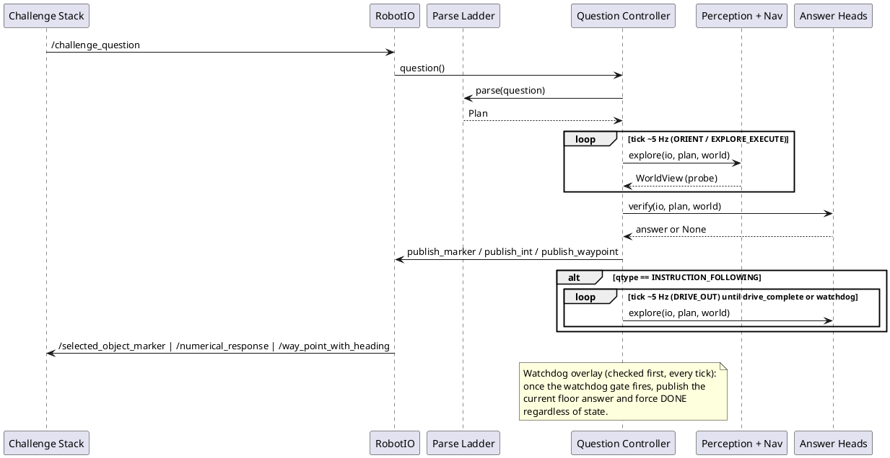

# architecture

This folder documents the CURRENT implemented system under
[src/core/](../src/core/) and [src/ros_adapter/](../src/ros_adapter/), as
of **19 Jul 2026**. [docs/architecture.md](../docs/architecture.md) is the
10 Jul 2026 design/debate record (three proposals + adjudication table);
this folder tracks what is actually built and tested against today's
`main`, and supersedes the `architecture/` snapshot on branch
`origin/archive/2026-07-11-architecture-snapshot` — that branch was taken
11 Jul 2026 and has since drifted out of sync with the code (the FSM
gained an `INSTRUCTION_FOLLOWING`-only `DRIVE_OUT` state, tighter default
time-budget gates, an injected logger, and more — see
[02-core-loop.md](02-core-loop.md) and
[03-time-budgeting.md](03-time-budgeting.md) for the specifics). Where this
folder and the code disagree, the code wins; see
[10-gaps-and-risks.md](10-gaps-and-risks.md) for known open gaps.

## ELI10

A robot is dropped into a building it has never seen and gets one
question, once, like "how many red chairs are in the room?". It has 10
minutes. It has to look around with a camera and a laser scanner, keep a
running list of the objects it has spotted, decide for itself when it has
looked enough, and then either say a number, draw a box around an object,
or drive a specific path. If the clock runs out before it is sure, it must
still say *something* rather than stay silent — and if the question is
"drive to X", handing in that first answer doesn't stop the robot; it
keeps walking the route with whatever time is left, because the walk
itself earns points.

## How it runs

The core is pure Python with no ROS imports
([src/README.md](../src/README.md) line 24); an external driver calls
`QuestionController.tick(io)` at roughly 5 Hz
([src/core/fsm/controller.py](../src/core/fsm/controller.py) around line
122), and every sensor read or actuation goes through the `RobotIO`
protocol ([src/core/interfaces.py](../src/core/interfaces.py) around line
230) — the one seam that lets the same FSM run against `MockRobotIO`, bag
replay, or the `ros_adapter` node
([src/ros_adapter/adapter_node.py](../src/ros_adapter/adapter_node.py))
without touching core logic. LLM/VLM calls enter at exactly two kinds of
edge: the parse ladder's API tier turning question text into a typed
`Plan` ([src/core/plan_schema.py](../src/core/plan_schema.py)), and the
handful of timeout-guarded checkpoints (parse, verification, and the
per-head checkpoints such as anchor-confirm/frontier-select) capped by a
`CallLedger` ([src/core/fsm/budget.py](../src/core/fsm/budget.py) around
line 168). By default both fall back to deterministic tiers (regex parse,
no checkpoint call) unless an LLM ladder is configured and wired into the
composition path — see
[09-runtimes-and-deployment.md](09-runtimes-and-deployment.md) for exactly
what is and isn't wired as of 19 Jul. Every other tick is deterministic
geometry, tracking, and FSM code.

A question ends one of three ways, all funnelled through the same
exactly-once publish latch
([src/core/fsm/controller.py](../src/core/fsm/controller.py) around line
374): the normal path (explore budget exhausted, or an early-answer gate
opens, then `VERIFY` -> `ANSWER`); a forced-assembly overlay that yanks
any non-terminal state into `VERIFY` once the run is deep into its
budget; or a watchdog overlay that publishes whatever degraded "floor"
answer the map currently supports and forces `DONE`, unconditionally,
checked before anything else on every tick. For instruction-following
questions only, publishing the answer waypoint in `ANSWER` does not end
the run — the FSM enters a `DRIVE_OUT` state and keeps driving the route
with the injected explore callable until the head reports the drive
complete or the watchdog fires. See
[02-core-loop.md](02-core-loop.md) for the full state-by-state account and
[03-time-budgeting.md](03-time-budgeting.md) for exactly which second each
of those gates fires on.

## Reading order

| # | Doc | Hook |
|---|-----|------|
| 01 | [01-context-and-contracts.md](01-context-and-contracts.md) | The challenge I/O contract and the frozen dataclasses/typed plan DSL that stand in for it. |
| 02 | [02-core-loop.md](02-core-loop.md) | One tick of `QuestionController.tick()`, state by state — including the IF-only `DRIVE_OUT` continue-drive state. |
| 03 | [03-time-budgeting.md](03-time-budgeting.md) | Where the question clock lives, the tightened forced-assembly/watchdog gates, and the call-ledger admission bound. |
| 04 | [04-parsing.md](04-parsing.md) | How a question string becomes a typed `Plan`. |
| 05 | [05-perception.md](05-perception.md) | How a 2D detection becomes a 3D tracked instance. |
| 06 | [06-answer-heads.md](06-answer-heads.md) | What each per-qtype head actually publishes, and what the floor publishes if it can't. |
| 07 | [07-navigation-and-exploration.md](07-navigation-and-exploration.md) | The occupancy grid, A*, frontier scoring, and exploration policy. |
| 08 | [08-evaluation-and-calibration.md](08-evaluation-and-calibration.md) | How tuning decisions are validated and how the ground-truth battery scores runs. |
| 09 | [09-runtimes-and-deployment.md](09-runtimes-and-deployment.md) | Which `RobotIO` the code runs against on which machine, and the Docker/launch layer. |
| 10 | [10-gaps-and-risks.md](10-gaps-and-risks.md) | What exists but isn't fully wired into the live path yet, and where docs and code have diverged. |

Docs 02–07 are the core question-in-to-answer-out loop: read them in order.
01, 08–10 are supporting context you can read in any order.

## Overview

## Glossary

- **Checkpoint** — a bounded, timeout-guarded LLM/VLM call gated by the
  `CallLedger` (parse, verification, and per-head checkpoints such as
  anchor-confirm/frontier-select)
  ([src/core/fsm/budget.py](../src/core/fsm/budget.py)).
- **Floor answer** — the always-computable degraded answer per qtype,
  recomputed every tick from whatever the map currently holds and
  published unconditionally once the watchdog fires
  ([src/core/fsm/floors.py](../src/core/fsm/floors.py)).
- **Call ledger** — `CallLedger`, which stops issuing checkpoint calls once
  the remaining budget can no longer absorb the floor reserve plus one
  worst-case call
  ([src/core/fsm/budget.py](../src/core/fsm/budget.py) around line 204).
- **Watchdog overlay** — the tick-zero check for `budget.watchdog_floor`
  that preempts every per-state handler once the (tightened, default
  540 s) gate fires
  ([src/core/fsm/controller.py](../src/core/fsm/controller.py) around line
  244).
- **DRIVE_OUT** — the instruction-following-only FSM state entered after
  `ANSWER` that keeps driving the route with the remaining budget instead
  of ending the question immediately (issue-tagged `IF-F4` in code
  comments)
  ([src/core/fsm/controller.py](../src/core/fsm/controller.py) around line
  329).
- **Instance map** — the fused set of tracked 3D objects (`InstanceRecord`)
  that heads query through `SceneIndex`
  ([src/core/interfaces.py](../src/core/interfaces.py) around line 154).
- **Head** — the per-qtype `{parse, explore, verify, probe}` callable set
  that `QuestionController` drives, wired by
  [src/core/heads/factory.py](../src/core/heads/factory.py).
- **Plan DSL** — the typed, JSON-(de)serialisable `Plan` the parse ladder
  produces from question text
  ([src/core/plan_schema.py](../src/core/plan_schema.py)).
- **Keyframe** — one distinct camera observation counted toward an
  instance's `n_obs`; an instance needs `n_obs >= 3` before a confident
  answer can use it
  ([src/core/interfaces.py](../src/core/interfaces.py) around line 160).
- **Marker box** — the axis-aligned `MarkerBox` published to
  `/selected_object_marker`; its center also serves as a nav goal
  ([src/core/interfaces.py](../src/core/interfaces.py) around line 87).
- **Color bin** — one dominant-colour quantisation bucket
  (`ColorBin.name`/`rgb`/`fraction`) attached to an `InstanceRecord`,
  carrying enough of the raw colour to apply luminance/dominance cutoffs
  the closed 15-scheme name alone can't express
  ([src/core/interfaces.py](../src/core/interfaces.py) around line 114).

## What to trust when docs and code disagree

This folder is re-derived from the code on `main` as of 19 Jul 2026, with
every factual claim carrying a `file:line` anchor into the current source
tree. If a later change to `src/` makes a claim here stale, the source
file is authoritative — treat a mismatch as a signal this chapter needs a
refresh, not as a reason to trust the doc over the code. See
[10-gaps-and-risks.md](10-gaps-and-risks.md) for gaps already known at
write time.
